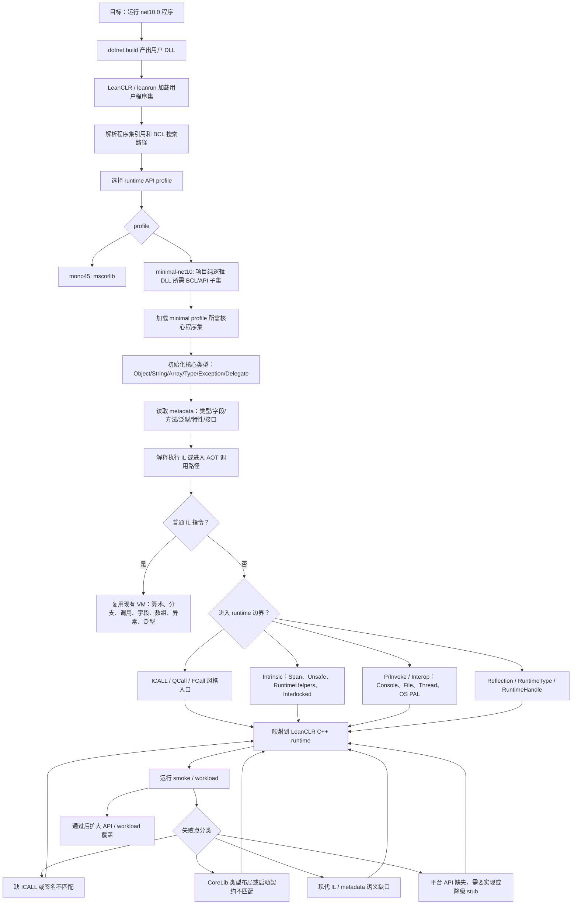
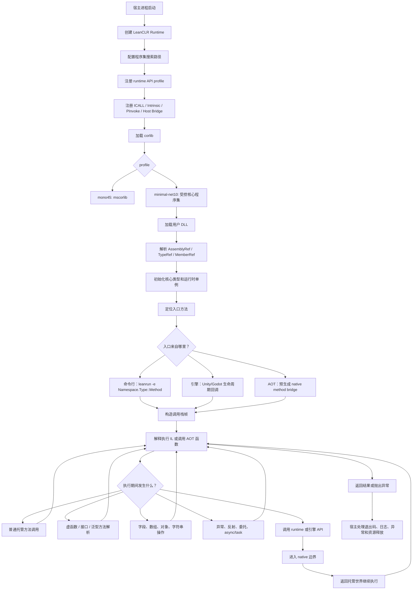
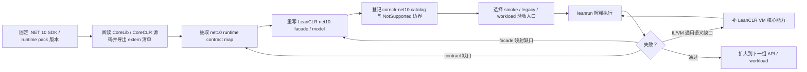
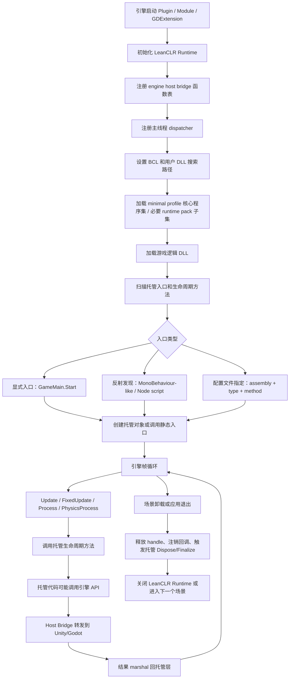
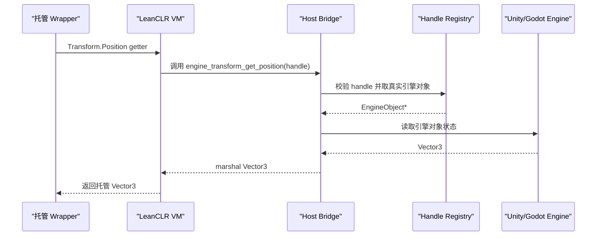
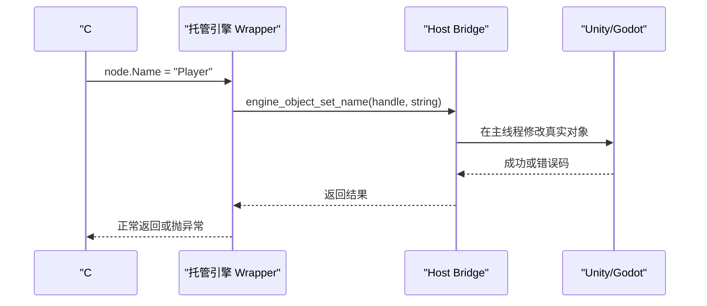
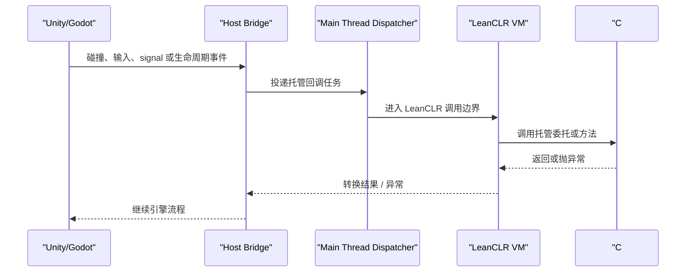
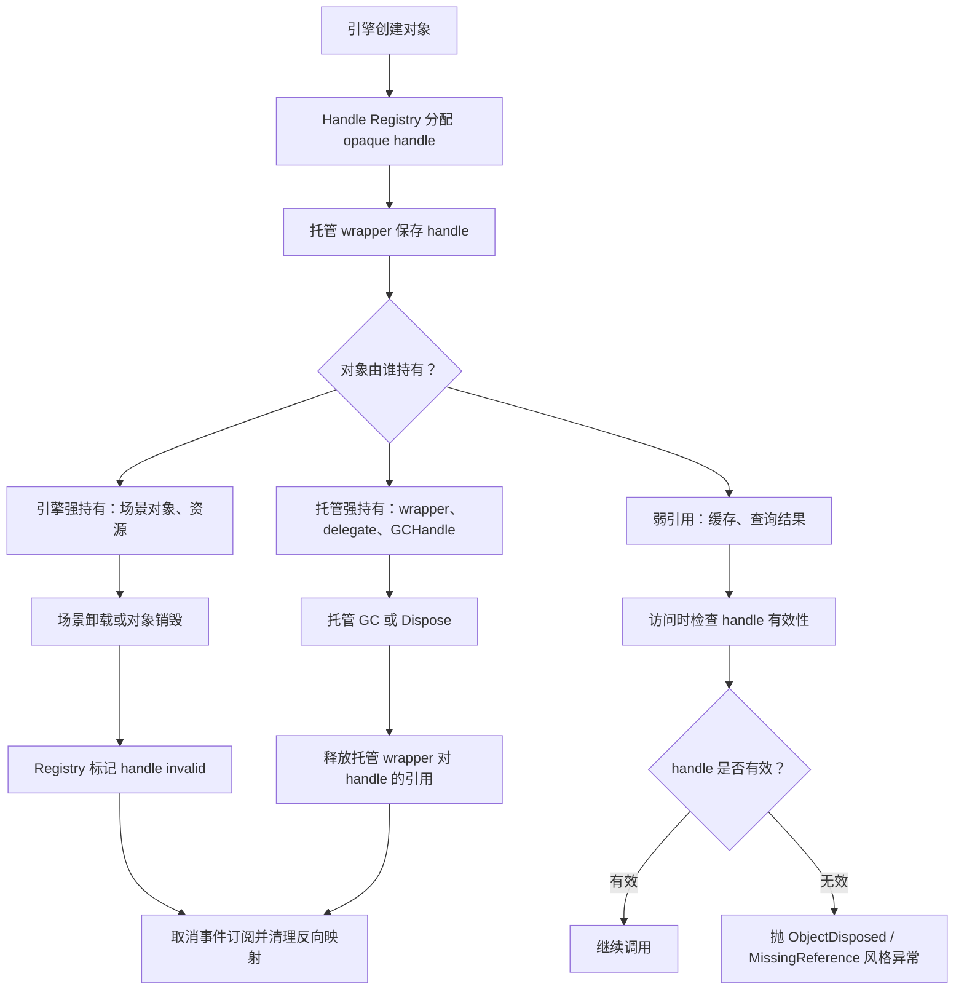

# LeanCLR .NET 10 Runtime 与 Unity/Godot 接入流程

日期：2026-06-26

本文档用于说明 LeanCLR 兼容 .NET 10 时真正需要完成的工作，以及后续接入 Unity / Godot 时，从加载 DLL、执行托管代码、调用引擎 API 到宿主与托管层隐形交互的整体流程。

## 结论

LeanCLR 对接 .NET 10 不是从零重新实现一套 CLR，也不是把元数据、解释器、GC 和对象系统全部重写一遍。但当前实现计划已经从“跑旧测试、遇到一个缺口补一个缺口”调整为 **先重写 .NET 10 主路径的 runtime contract / model，再用测试验收**。

更准确的说法是：LeanCLR 已经有自己的 VM、元数据加载、类型系统、对象模型、解释器、AOT、GC、反射框架、ICALL/Intrinsic 注册表。当前 `.NET 10` 适配的主线已经收敛为 **LeanCLR minimal net10 profile**：运行项目自己的、受控的、纯逻辑 `net10.0` DLL，而不是完整承接 `System.Private.CoreLib` / `Microsoft.NETCore.App`。

这里的 `minimal` 只定义近期支持边界，不缩减最终测试门槛。原作者已经设计好的 managed / Mono 测试资产仍应分阶段迁移，并最终全量跑通；同时用 `C:\study\wqaetly\new\NKGGameFramework` 作为第一批真实框架 workload，验证纯逻辑 DLL、async、轻量反射、序列化和后续引擎 bridge 在真实项目结构下是否成立。

因此工作重点是：

- 保留独立的 `coreclr-net10` / `minimal-net10` profile 边界，不污染现有 `mono45` / Unity profile。
- 基于 .NET 10 `System.Private.CoreLib` / CoreCLR VM 源码抽取 contract map，先定义 RuntimeType、RuntimeHandle、Assembly、Module、CustomAttribute、Span/Unsafe、Monitor/Task 等 net10 façade；执行基准见 [`docs/net10-runtime-contract.md`](net10-runtime-contract.md)。
- 重写 `coreclr-net10` 活跃路径的 model/façade，外部满足 CoreLib 期待，内部映射到 LeanCLR 自己的 `RtClass` / `RtMethodInfo` / `RtFieldInfo` / metadata cache / interpreter。
- 只支持项目纯逻辑 DLL 实际使用到的核心类型、基础 IL、泛型、异常、委托、少量反射、必要 Span/Unsafe 和 host bridge API。
- 不再以完整 `Microsoft.NETCore.App` 或剩余 extern diff 归零作为近期目标。
- 对白名单外的 BCL、反射、线程、IO、网络、动态代码生成等能力，优先给出清晰诊断，而不是隐式尝试兼容。
- 通过 `leanrun`、`ManagedNet10.Smoke`、legacy 测试子集和真实纯逻辑 DLL smoke 验证能力边界；测试后置为验收，不再驱动架构形状。

当前仓库中已有相关基础：

- `src/runtime/vm`：VM、类型系统、对象、方法调用、反射、异常、GC 等核心运行时。
- `src/runtime/icalls`：托管 BCL 调 native runtime 的 ICALL 实现。
- `src/runtime/intrinsics`：解释器 / AOT 特殊识别的 intrinsic 实现。
- `src/leanaot/LeanAOT/runtime-apis/coreclr-net10`：面向 .NET 10 的 runtime API profile。
- `scripts/dotnet10/interp-smoke.ps1`：解释执行 .NET 10 smoke 的脚本入口。
- `src/tools/leanrun`：直接加载 DLL 并解释执行指定入口的 native runner。

## .NET 10 适配总流程



## 不同模块应该如何理解

| 模块 | 是否重写 | 工作方式 |
| --- | --- | --- |
| Metadata | 不从零重写 | 继续从程序集读取 metadata，但要覆盖 .NET 10 会触发的新组合，例如 `System.Private.CoreLib`、泛型约束、接口静态成员、反射句柄等 |
| Reflection | 不从零重写，但要校准 | 复用现有反射框架，补齐 `RuntimeType`、`RuntimeMethodInfo`、`RuntimeFieldInfo`、Attribute、Handle 与 CoreLib 的契约 |
| ICALL / Intrinsic / PInvoke | 需要 profile 化重建契约 | 不直接复用 Mono 的表；为 `coreclr-net10` 建独立 catalog，并按 BCL 实际调用逐步映射 |
| BCL | 不建议重写整套 | 直接使用 .NET 10 runtime pack 的托管程序集；LeanCLR 只实现这些程序集依赖的 native runtime 入口 |
| AOT | 后续阶段推进 | 先让解释执行证明 runtime contract 正确，再扩大 AOT codegen 和 native runner 覆盖 |

## 从加载 DLL 到执行完成的程序流向

下面是 LeanCLR 作为独立 runtime 或被引擎宿主嵌入时的通用流程。



在 `.NET 10` 场景里，最容易出问题的不是普通 IL，而是用户 DLL 间接触发的基础库/runtime 边界。例如 `Object.GetType()`、`RuntimeType.Name`、`Span<T>` 构造、`Unsafe.AsPointer<T>`、`Thread.CurrentThread`、`Monitor`、`Task.Yield()`、Attribute 读取、反射字段访问等。当前只应按真实纯逻辑 DLL 的需求补齐这些路径。

## Runtime API contract 的落地循环



本循环的执行清单以 [`docs/net10-runtime-contract.md`](net10-runtime-contract.md) 为准。当前第一批执行切片已经从单一 `RuntimeType` 身份扩展为 RuntimeType / RuntimeFieldHandle / RuntimeModule / ValueType / delegate `MethodTable*` façade 的统一边界：所有 CoreLib 传入的 handle 或 `System.Runtime.CompilerServices.MethodTable*` 都必须先解析成 net10 façade，再映射到 LeanCLR 自己的 `RtClass`、`RtMethodInfo` 或 `RtFieldInfo`。下一阻塞点是 `MulticastDelegate.NewMulticastDelegate` 触发的 `RuntimeTypeHandle.InternalAllocNoChecks_FastPath(MethodTable*)` 分配路径。建议每个新增 contract 都满足四个条件：

- 能被 `coreclr-net10` profile 独立描述。
- 能在 [`net10-runtime-contract`](net10-runtime-contract.md) 中说明它来自 CoreLib 哪条真实调用链。
- 能被一个小 smoke 子入口稳定触发。
- 缺失或签名不匹配时能输出具体方法名，而不是只表现为 `BadImageFormatException` 或启动失败。

## Unity / Godot 接入的角色边界

Unity 和 Godot 接入时，不建议让托管代码直接持有引擎对象的真实内存指针。更稳妥的方式是建立一层 Host Bridge：

| 角色 | 职责 |
| --- | --- |
| 引擎宿主 | Unity player / Godot runtime，负责场景、资源、节点、主线程、事件循环和平台 API |
| LeanCLR Runtime | 加载并执行托管 DLL，维护托管对象、GC、反射、异常和方法调用 |
| Host Bridge | 用稳定 ABI 把托管调用转发到引擎，把引擎事件回调到托管 |
| Handle Registry | 保存引擎对象和托管 wrapper 之间的 opaque handle 映射 |
| Managed Wrapper | C# 层看到的 `GameObject`、`Node`、`Transform`、`Resource` 等薄封装 |

## Unity / Godot 中从 DLL 加载到运行的流程



## 调用引擎 API 接口

引擎 API 建议通过一组稳定的 C ABI 或函数表暴露给 LeanCLR，而不是让托管层绑定具体 C++ 类布局。

接口应按能力分组：

| API 组 | 典型能力 |
| --- | --- |
| Object / Handle | 创建、查找、引用计数、判断有效、释放引擎对象 handle |
| Scene / Node / GameObject | 查找节点、添加子节点、移除对象、启用禁用、获取路径 |
| Component / Transform | 读写位置、旋转、缩放，获取组件，调用组件方法 |
| Resource / Asset | 加载资源、异步加载、释放资源、查询资源类型 |
| Logging / Diagnostics | 打印日志、错误、托管异常栈、性能计数 |
| Time / Input | delta time、帧号、按键、鼠标、触摸、手柄输入 |
| Event / Signal | 订阅、取消订阅、派发事件、连接 Godot signal |
| Scheduler | 主线程投递、延迟调用、协程/Task continuation 转发 |

推荐调用形态：



托管层可以长得像普通 C# API：

```csharp
public sealed class EngineObject
{
    internal IntPtr Handle { get; }
}

public sealed class Transform : EngineObject
{
    public Vector3 Position
    {
        get => EngineApi.TransformGetPosition(Handle);
        set => EngineApi.TransformSetPosition(Handle, value);
    }
}
```

但真正执行时，`Handle` 只是 opaque id。它不能假设 Unity / Godot 对象的内存布局，也不能跨线程随意访问真实引擎对象。

## 隐形交互流程

这里的“隐形交互”指的是：C# 层看起来在操作普通对象、属性、事件和委托，但背后其实通过 handle、bridge、dispatcher、GCHandle 和主线程队列完成引擎交互。

### 属性访问



### 引擎事件回调托管代码



### 生命周期与 GC



生命周期规则建议：

- 托管对象不直接拥有引擎对象内存，只拥有 opaque handle。
- 引擎对象销毁时，必须让 registry 失效对应 handle。
- 托管 wrapper 被 GC 时，只释放托管侧引用，不应直接在非主线程销毁引擎对象。
- 所有引擎对象访问默认走主线程 dispatcher，除非某个 API 明确声明线程安全。
- 引擎事件保存托管 delegate 时，应使用可追踪的 GCHandle，并在取消订阅或对象销毁时释放。

## Unity 与 Godot 的差异点

| 方向 | Unity | Godot |
| --- | --- | --- |
| 宿主形态 | Native plugin / player 集成 / 替代部分 IL2CPP 发布流程 | GDExtension / module / 自定义 runtime 集成 |
| 对象模型 | GameObject + Component + Transform | Node + Resource + SceneTree |
| 生命周期 | Awake / Start / Update / FixedUpdate / OnDestroy | _Ready / _Process / _PhysicsProcess / _ExitTree |
| 事件系统 | C# event、UnityEvent、SendMessage、输入/碰撞回调 | Signal、notification、input event |
| API 桥接重点 | GameObject/Component handle、资源加载、主线程调用 | NodePath、Variant、Signal、Resource handle |

两者底层原则一致：不要把引擎对象真实布局暴露给托管层；托管层只通过稳定 API 和 opaque handle 操作宿主。

## 推荐阶段划分

| 阶段 | 目标 | 验收方式 |
| --- | --- | --- |
| 1. minimal net10 解释执行基线 | `ManagedNet10.Smoke` 和最小真实纯逻辑 DLL 的核心入口稳定通过 | `scripts/dotnet10/interp-smoke.ps1 -Configuration Release` 加真实 DLL smoke |
| 2. 原作者测试资产迁移 | 将已有 managed / Mono 测试按能力分层迁入 `.NET 10` 验证路径 | 每批迁移测试通过；最终全量跑通才算 LeanCLR 自身能力合格 |
| 3. API 白名单与静态扫描 | 定义允许的 BCL/API 集合，并扫描 `AssemblyRef` / `TypeRef` / `MemberRef` | 白名单外 API 在构建或加载阶段给出明确错误 |
| 4. NKGGameFramework 真实 workload | 用 `C:\study\wqaetly\new\NKGGameFramework` 的核心 `net10.0` 逻辑库验证真实项目 | NKG core smoke 通过，且不依赖完整 `Microsoft.NETCore.App` |
| 5. Host Bridge ABI | 定义 Unity/Godot 共用的对象 handle、函数表、dispatcher、异常返回协议 | native mock host 可调用托管入口并返回 |
| 6. 引擎 API Wrapper | 托管层提供 GameObject/Node/Resource/Transform 等薄封装 | 用 mock 或真实引擎跑属性、方法、事件、生命周期 |
| 7. 隐形交互闭环 | 完成事件回调、生命周期、GCHandle、主线程投递、对象销毁 | 场景加载/卸载、事件订阅/取消、异常传播测试通过 |
| 8. AOT 扩展 | 在解释执行和 bridge 稳定后扩大 AOT 生成和 native runner 覆盖 | 对相同真实 smoke 跑解释和 AOT 双路径 |

## 设计原则

- profile 必须隔离：`mono45`、Unity、`coreclr-net10` 不应混用同一份 runtime API catalog。
- 先解释执行，再 AOT：解释路径更适合证明 BCL/runtime contract 正确。
- 先小入口，再真实纯逻辑 workload：每个缺口都用可复现 smoke 固定住，不按完整 BCL 面积扩张。
- 测试资产不缩水：原作者已有 managed / Mono 测试可以分阶段迁移，但最终要全量跑通，不能以精选通过替代合格线。
- 白名单优先于兼容幻想：不支持的 BCL/API 应尽早诊断，而不是在运行中随机失败。
- 引擎桥接使用 opaque handle：托管层不能依赖 Unity/Godot 内部对象布局。
- 所有跨边界调用要可诊断：缺 API、签名不匹配、线程错误、对象已销毁都应给出清晰错误。
- 主线程规则要前置设计：引擎对象访问、事件派发、Task continuation 都需要明确调度策略。

## 一句话理解

`.NET 10` 适配的近期目标不是做一个小 CoreCLR，而是让 LeanCLR 稳定运行项目自己的纯逻辑 `net10.0` DLL；Unity/Godot 接入则是在 LeanCLR 和引擎之间加一层稳定 host bridge，让托管代码像操作普通 C# 对象一样操作引擎，而背后通过 handle、dispatcher 和 runtime API 完成所有真实交互。
