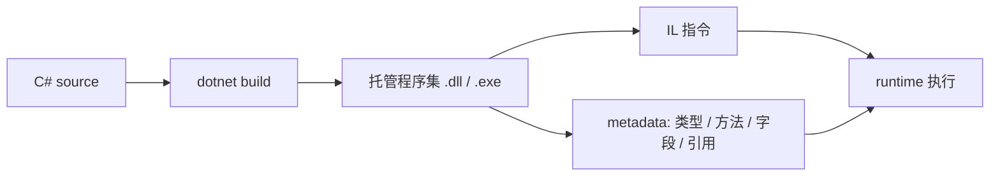
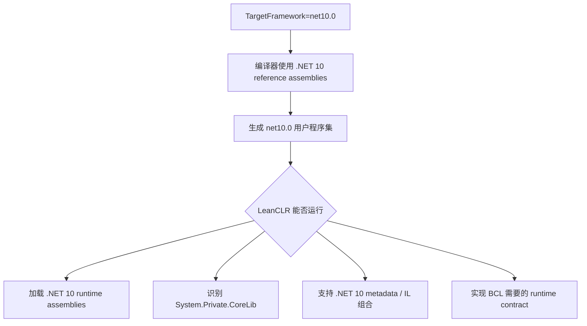
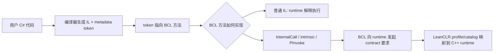
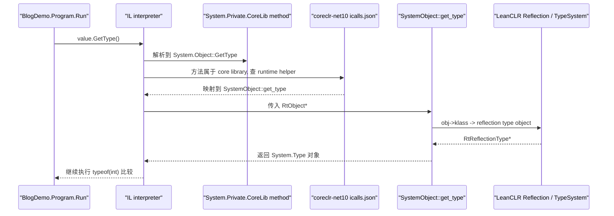
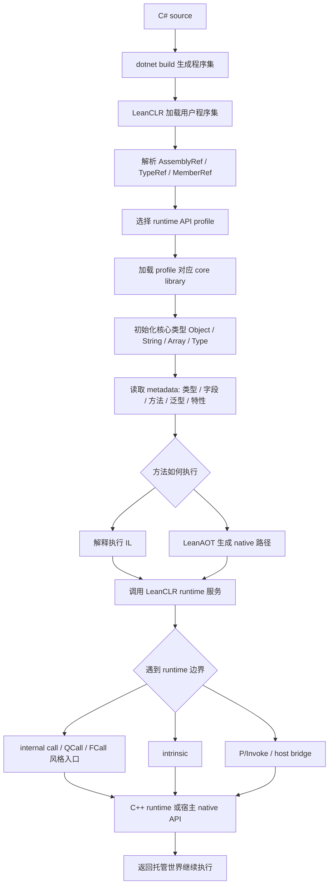
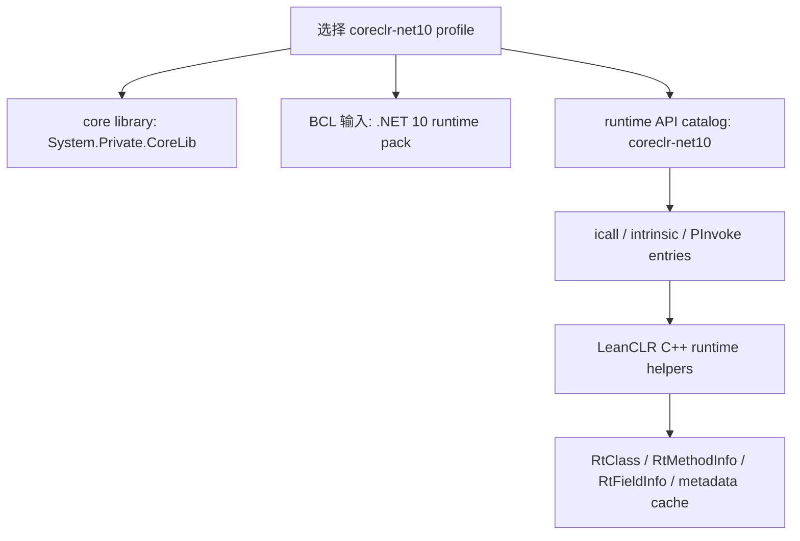
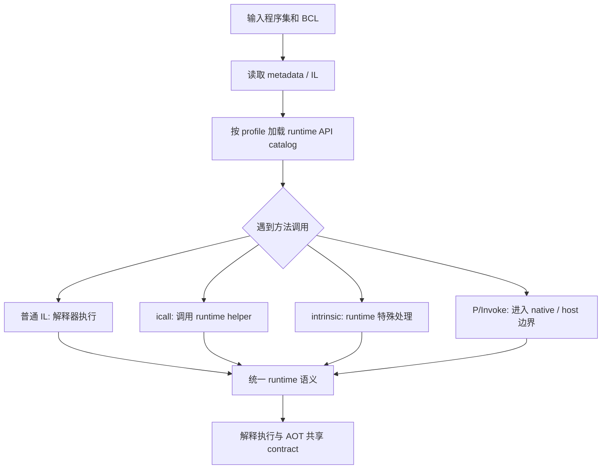
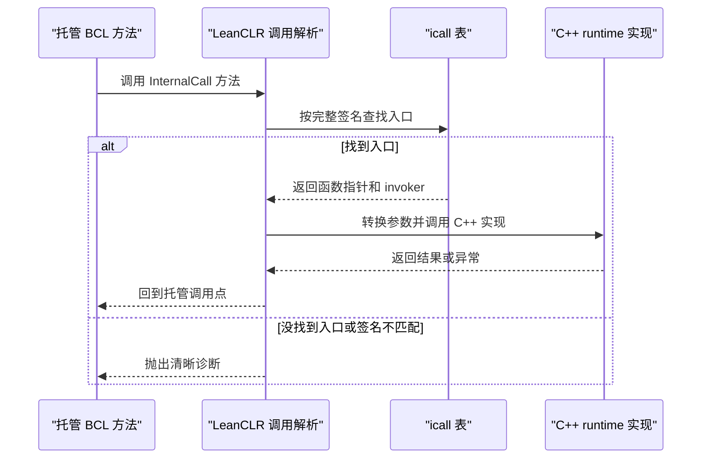
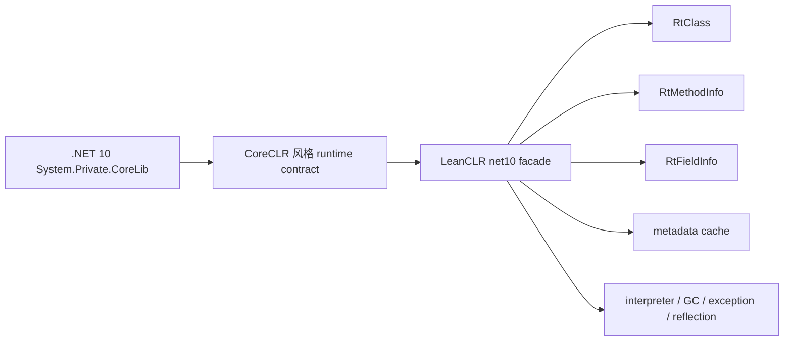
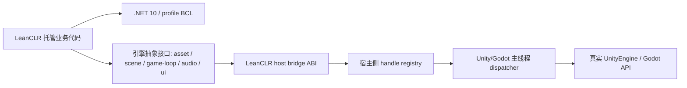

# 点亮CLR技能树：LeanCLR 全面接入 .NET 10 开发笔记

对普通 C# 项目来说，切换运行时通常意味着“用新的 SDK 编译”。但对 LeanCLR 这类自研 runtime 来说，问题会下沉到更底层：它不只是要看懂用户写的代码，还要看懂 `.NET 10` 基础类库对运行时的要求。

LeanCLR 已经有自己的 metadata loader、类型系统、对象模型、解释器、GC、异常、委托、泛型、基础反射和 AOT 生成框架。因此，接入 `.NET 10` 不应被理解为重写一个完整 CLR。更准确地说，这是一次 **BCL 与 runtime contract 的 profile 化适配**：让 LeanCLR 能在明确边界内运行受控的 `net10.0` 纯逻辑程序集，同时把不支持的 BCL 能力暴露为清晰诊断。

如果你平时主要写业务层 C#，下面这几个基础概念先铺一下，会更容易理解后面的架构设计。

## C# 程序不是直接变成机器码

C# 源码经过 `dotnet build` 后，通常会生成 `.dll` 或 `.exe` 托管程序集。这个程序集里最重要的两类内容是：

- `IL`：Intermediate Language，中间语言。它不是 CPU 机器码，而是一组面向 .NET runtime 的指令。
- `metadata`：描述类型、字段、方法、泛型、特性、程序集引用等信息的数据表。

可以把程序集理解成“代码指令 + 自我描述”。runtime 加载程序集后，会先读 metadata，知道里面有哪些类型和方法，再按 IL 指令去执行方法体。



所以 LeanCLR 要运行一个 C# 程序，最基础的能力不是“认识 C# 语法”，而是能加载程序集、读取 metadata、解释或编译 IL、创建对象、调用方法，并维护异常、GC、反射等运行时状态。

## Runtime 和 BCL 分别负责什么

日常写 C# 时，我们会直接用 `object`、`string`、`List<T>`、`Task`、`File`、`Console`、`Type` 这些类型。它们大多来自 .NET 的基础类库，也就是 BCL。

但 BCL 不是完全独立运行的普通库。很多底层能力必须找 runtime 帮忙。例如：

- `object.GetType()` 需要 runtime 知道某个对象真实的运行时类型。
- `new string(...)` 需要 runtime 按字符串对象布局分配和初始化内存。
- `Array.GetLength()` 需要 runtime 读取数组对象头里的长度。
- `Type.GetMethods()` 需要 runtime 能把 metadata 转成反射对象。
- `GC.Collect()` 需要 runtime 真的执行对象扫描和回收。
- `FileStream`、`Console` 这类 API 可能需要进入操作系统或宿主平台。

两者的分工大致是：

| 层次 | 负责什么 | 例子 |
| --- | --- | --- |
| 用户程序集 | 项目自己的业务逻辑 | 游戏逻辑、工具代码、框架核心 DLL |
| BCL | .NET 基础类型和库 API | `System.String`、`System.Collections`、`System.Reflection` |
| runtime | 执行 IL，管理对象、类型、GC、异常、线程、反射和 native 边界 | LeanCLR、CoreCLR、自研托管运行时 |
| 宿主 / OS | 提供平台能力 | 文件、控制台、Unity/Godot 主线程 API |

这也是为什么“能编译”不等于“能运行”。编译器只需要 reference assemblies 来检查 API 是否存在；runtime 运行时必须真的满足 BCL 的底层假设。

## corlib 是整个世界的地基

.NET 里有一个最核心的基础库，通常叫 `corlib`。它包含 `System.Object`、`System.String`、`System.Array`、`System.Type`、`System.Exception`、`System.Delegate` 等最基础类型。

在 `.NET 10` 里，这个 core library 是 `System.Private.CoreLib`。LeanCLR 要承载 `.NET 10`，首先就要能把 `System.Private.CoreLib` 当作地基加载起来，并理解它对 runtime 的要求。

这不是改个文件名那么简单。`System.Private.CoreLib` 里的核心类型、私有字段、内部方法、反射对象、句柄模型和 runtime 调用方式共同定义了 `.NET 10` BCL 期待的运行时形状。LeanCLR 需要重新确认：

- 核心类型从哪里加载。
- 对象、数组、字符串、异常等基础对象如何初始化。
- `RuntimeType`、`RuntimeMethodInfo`、`RuntimeFieldInfo` 等反射对象如何和 runtime 内部结构对应。
- BCL 里没有 IL 方法体的底层方法，应该由哪个 native helper 实现。

这就是后文反复出现的 `runtime contract`：BCL 期待 runtime 暴露出来的形状、入口和语义。

## TFM、runtime pack 和真正的运行支持

`TargetFramework=net10.0` 里的 TFM 是 Target Framework Moniker。它告诉 SDK：“请按 .NET 10 的 API 面来编译这个项目”。

但运行时还涉及另一组东西：

- reference assemblies：给编译器看的 API 声明。
- runtime assemblies：运行时真正加载的 BCL 实现。
- runtime pack：包含目标平台所需的 runtime assemblies 和 native 组件。
- runtime contract：BCL 运行时调用 native helper 时，runtime 必须提供的入口和语义。



所以，对 LeanCLR 来说，`.NET 10` 支持不是一个项目文件属性，而是一套从程序集加载、corlib 识别、metadata 解析到 BCL/native 边界的完整适配。

## 什么是 runtime contract

BCL 里有些方法是普通 C# 写的，有 IL 方法体，runtime 只要照着 IL 执行即可。还有一些方法没有普通 IL，或者需要 runtime 特殊处理，这些就是 contract 最密集的地方。

常见边界包括：

| 名词 | 可以先这样理解 |
| --- | --- |
| internal call / icall | BCL 方法没有 IL 方法体，实际实现写在 C++ runtime 里 |
| intrinsic | runtime 或 AOT 对某个方法做特殊识别，不按普通方法调用处理 |
| P/Invoke | 托管代码调用 native 函数，例如操作系统 API 或宿主 API |
| runtime handle | BCL 用来代表类型、方法、字段、模块等 runtime 对象的轻量句柄 |
| reflection | 托管代码在运行时查询类型、方法、字段、特性等 metadata 的能力 |

LeanCLR 适配 `.NET 10` 的核心，就是让 `System.Private.CoreLib` 和必要 BCL 在这些边界上看到它们期待的 contract；LeanCLR 内部则继续映射到自己的类型系统、metadata cache、解释器、GC 和反射框架。

## BCL contract 是从哪里发起的

这里容易产生一个误解：好像 LeanCLR 自己先定义了一套“BCL 接口协议”，然后让 BCL 来配合它。实际顺序正好相反。

**contract 的源头是当前选择的 BCL assemblies。** 编译器会把用户代码里的 `object.GetType()`、`typeof(int)`、`new string(...)`、`GC.Collect()` 等调用编码成 metadata token 和方法引用。LeanCLR 加载用户程序集后，会继续解析这些 token 指向哪个 BCL 类型、哪个 BCL 方法。只要这些方法来自 core library 或 runtime pack，它们就会反过来要求 runtime 提供某些能力。

可以把发起路径理解成：



所以 `runtime API catalog` 不是 contract 的源头，它只是 LeanCLR 对这套 contract 的登记表。真正的源头是：

- 当前 profile 选择的 BCL assemblies。
- 这些 assemblies 里的 metadata、IL、方法签名和 P/Invoke 声明。
- 对 `.NET 10` 来说，还要参考 `System.Private.CoreLib` 和 CoreCLR VM 源码理解语义。

这也是为什么 profile 很关键。本文只讨论 `coreclr-net10`：它表示 LeanCLR 当前面向 `.NET 10` runtime pack 和 `System.Private.CoreLib` 建立一套独立的 BCL/runtime contract。

对 `coreclr-net10` 来说，关键假设是：

- core library 是 `System.Private.CoreLib`。
- BCL contract 来源是 `.NET 10` runtime assemblies 里的 metadata、IL、方法签名和 P/Invoke 声明。
- native 边界按 `.NET 10` 的 internal call、intrinsic、generated P/Invoke 和 runtime handle 形态登记。
- LeanCLR 内部仍然映射到自己的 `RtClass`、`RtMethodInfo`、`RtFieldInfo`、metadata cache 和解释器。

从仓库结构上看，这个选择已经被显式写进 `coreclr-net10` profile：

```json
{
  "name": "coreclr-net10",
  "coreLibraryModules": [
    "System.Private.CoreLib",
    "System.Runtime",
    "System.Console",
    "System.Collections",
    "System.Linq",
    "System.Threading",
    "System.Runtime.InteropServices",
    "System.Reflection",
    "System.Private.Uri",
    "netstandard",
    "LeanCLR"
  ]
}
```

这段配置来自 `src/leanaot/LeanAOT/runtime-apis/coreclr-net10/profile.json`。它告诉 LeanCLR 的工具链：这些模块属于当前 `.NET 10` profile 的核心 BCL 面，后续判断 icall、intrinsic、P/Invoke 时要按这套世界来解释。

runtime 侧也有对应入口。`src/runtime/vm/assembly.cpp` 中的 `Assembly::load_corlib()` 当前会加载 `System.Private.CoreLib`：

```cpp
RtResult<metadata::RtAssembly*> Assembly::load_corlib()
{
    metadata::RtAssembly* loaded_corlib = get_corlib();
    if (loaded_corlib)
    {
        RET_OK(loaded_corlib);
    }

    return load_by_name(STR_SYSTEM_PRIVATE_CORELIB_NAME);
}
```

这就是 BCL 对齐的本质：不是把所有 API 都实现一遍，而是先选定 BCL 世界，再让 LeanCLR 的类型系统、metadata、解释器和 native helper 能够满足这个世界发起的 contract。

## 一个 C# 方法如何走到 LeanCLR runtime

下面用一个很小的例子把路径串起来。用户代码只是做 boxing、取类型、比较类型、再拆箱：

```csharp
using System;

namespace BlogDemo;

public static class Program
{
    public static int Run()
    {
        object value = 123;
        Type type = value.GetType();
        return type == typeof(int) ? (int)value + 1 : -1;
    }
}
```

项目文件选择 `.NET 10`：

```xml
<Project Sdk="Microsoft.NET.Sdk">
  <PropertyGroup>
    <TargetFramework>net10.0</TargetFramework>
  </PropertyGroup>
</Project>
```

编译后，`Run()` 里不会保存“C# 源码语义”，而是变成类似下面的 IL 和 metadata 引用。这里是简化后的形态：

```il
ldc.i4.s 123
box        [System.Private.CoreLib]System.Int32
stloc.0

ldloc.0
callvirt   instance class [System.Private.CoreLib]System.Type
           [System.Private.CoreLib]System.Object::GetType()
stloc.1

ldloc.1
ldtoken    [System.Private.CoreLib]System.Int32
call       class [System.Private.CoreLib]System.Type
           [System.Private.CoreLib]System.Type::GetTypeFromHandle(
               valuetype [System.Private.CoreLib]System.RuntimeTypeHandle)
call       bool [System.Private.CoreLib]System.Type::op_Equality(
               class [System.Private.CoreLib]System.Type,
               class [System.Private.CoreLib]System.Type)
```

注意几个细节：

- `box System.Int32` 要求 runtime 知道 value type 如何装箱成对象。
- `System.Object::GetType()` 来自 `System.Private.CoreLib`。
- `RuntimeTypeHandle`、`System.Type`、`Type.GetTypeFromHandle()` 都是 core library 的反射 contract。
- 这些引用的归属都是 `[System.Private.CoreLib]`，因此 runtime 必须按 `.NET 10` 的核心库形态解释。

如果用 `leanrun` 执行这个入口，命令大致长这样：

```powershell
leanrun `
  -l out\dotnet\BlogDemo\Release\net10.0 `
  -l <dotnet10-runtime-pack-dir> `
  -e BlogDemo.Program::Run `
  BlogDemo
```

`leanrun` 内部路径可以简化成这样，对应 `src/tools/leanrun/main.cpp`：

```cpp
vm::Runtime::initialize();

auto ass = vm::Assembly::load_by_name(dll_name.c_str());
metadata::RtModuleDef* mod = ass.unwrap()->mod;

const metadata::RtMethodInfo* entry_method =
    find_entry_method(mod, "BlogDemo.Program::Run");

vm::Runtime::invoke_array_arguments_with_run_cctor(
    entry_method,
    nullptr,
    nullptr);
```

进入解释器后，普通 IL 比如 `ldc.i4`、`stloc`、条件分支可以由 LeanCLR 自己执行。但当解释到 `System.Object::GetType()` 时，事情变成 BCL contract：这个方法来自 `System.Private.CoreLib`，它要求 runtime 返回当前对象的真实运行时类型。

在 `coreclr-net10` profile 里，LeanCLR 用 catalog 登记这个入口。摘自 `src/leanaot/LeanAOT/runtime-apis/coreclr-net10/icalls.json`：

```json
{
  "name": "System.Object::GetType",
  "func": "SystemObject::get_type",
  "header": "icalls/system_object.h"
}
```

这个登记表达的是：

- BCL 侧调用的是 `System.Object::GetType`。
- LeanCLR runtime 侧用 `SystemObject::get_type` 实现。
- 这个入口属于 `coreclr-net10` profile 的 native helper 边界。

对应 C++ 实现在 `src/runtime/icalls/system_object.cpp`：

```cpp
RtResult<vm::RtReflectionType*> SystemObject::get_type(vm::RtObject* obj) noexcept
{
    if (obj == nullptr)
        RET_ERR(RtErr::NullReference);

    return vm::Reflection::get_klass_reflection_object(obj->klass);
}
```

这个函数做的事很直接：

1. 从托管对象指针 `obj` 取出 LeanCLR 内部的 `klass`。
2. 把 `klass` 映射成托管世界可见的 reflection type 对象。
3. 返回给 `System.Private.CoreLib` 的 `Object.GetType()` 调用点。

用链路图表示就是：



现在就能直观看到为什么整条链路必须落在同一个 `coreclr-net10` contract 下：

- 如果用户程序集引用的是 `[System.Private.CoreLib]System.Object::GetType()`，runtime API catalog 里就必须有 `.NET 10` 视角下的这个入口。
- 如果 `.NET 10` BCL 期待返回的是它能识别的 `RuntimeType` / `RuntimeTypeHandle` 形态，LeanCLR 就必须把内部 `RtClass` 映射成对应的托管反射对象。
- 如果某个入口只按短名宽松匹配，不按完整签名匹配，就可能把 `.NET 10` 的包装方法、不同参数形态或不兼容 native helper 误连到一起。

所以，LeanCLR 对齐 BCL 的核心工作不是“实现一个叫 `GetType` 的函数”这么简单，而是要保证整条链路都在同一个 profile 下成立：

```text
用户 IL token
  -> System.Private.CoreLib 方法
  -> coreclr-net10 catalog
  -> LeanCLR native helper
  -> LeanCLR 类型系统 / metadata / reflection 对象
  -> 返回给 .NET 10 BCL 可理解的对象形态
```

## minimal net10 profile 的边界

直接承载完整 `Microsoft.NETCore.App` 相当于把 LeanCLR 推向“小型 CoreCLR”。这会把 ThreadPool、网络、文件系统、反射全量语义、动态代码生成、平台 PAL、COM/Interop 等大量子系统全部拉进当前范围。

更稳妥的边界是 **minimal net10 profile**：

- 运行项目自己的、受控的、纯逻辑 `net10.0` DLL。
- 支持基础对象模型、数组、字符串、异常、委托、泛型、基础反射和必要 Span/Unsafe 路径。
- 使用 `.NET 10` runtime pack 作为托管 BCL 输入，但只承诺当前 profile 白名单内的 runtime API。
- 对越界的 BCL、ThreadPool、Timer、I/O、网络、动态代码生成等能力给出可诊断失败，而不是静默 stub。
- Unity/Godot 等引擎 API 通过宿主 bridge 暴露，不把引擎程序集当作普通 BCL 直接加载进 runtime。

这个边界的关键是：LeanCLR 不是复刻整个 CoreCLR，而是实现 `.NET 10` BCL 在当前 profile 下真正跨 native 边界所需的 contract。

## 托管代码在 LeanCLR 中如何执行

一个 C# 程序进入 LeanCLR 后，大致会经过以下路径：



对 `coreclr-net10` 来说，图里的 profile 选择会把 core library 固定到 `System.Private.CoreLib`，把 BCL runtime API 固定到 `.NET 10` runtime pack 导出的入口和签名。如果这些入口没有被登记，或者登记后返回的对象形态不符合 `.NET 10` BCL 的预期，失败通常会出现在 core library 加载、核心类型初始化、反射句柄解析或 BCL runtime API 调用处。

## profile 是隔离边界

profile 决定当前 runtime 面向哪套 BCL 和 runtime API contract。本文只讨论 `coreclr-net10`，它的作用是把 `.NET 10` core library、runtime pack、runtime API catalog 和 LeanCLR native helper 绑定在同一条解释规则下。



正确做法是让 corlib 识别、required type 表、internal call 表、intrinsic 表、P/Invoke facade 和诊断逻辑都跟随 `coreclr-net10`。这样读者看到某个 BCL 入口时，可以一路追到它在 `.NET 10` runtime pack 中的来源、catalog 中的登记，以及 LeanCLR C++ runtime 里的实现。

## runtime API catalog 的作用

`.NET 10` BCL 中有不少方法没有普通 IL 方法体，或者需要 runtime 特殊处理。它们通常落在几类边界上：

| 边界 | 含义 | LeanCLR 需要做的事 |
| --- | --- | --- |
| internal call / QCall / FCall | 托管 BCL 直接调用 runtime native helper | 按完整类型名、方法名和签名注册 C++ 实现 |
| intrinsic | 解释器或 AOT 对特定方法做特殊识别 | 为 `Span<T>`、`RuntimeHelpers`、`Interlocked` 等建立 profile 内映射 |
| P/Invoke / LibraryImport | 托管代码调用 native 动态库或 generated P/Invoke stub | 映射到 LeanCLR 平台层、host bridge 或明确 NotSupported |
| runtime implemented method | 方法语义由 runtime 提供，不适合按普通 IL 执行 | 在解释器和 AOT 中共享同一 contract |

runtime API catalog 是这些边界的索引。它告诉 LeanCLR：在当前 profile 下，哪些托管方法需要 runtime 提供实现，签名是什么，应该走 icall、intrinsic 还是 P/Invoke 路径。

即使 AOT 暂时后置，这张表仍然重要。解释器遇到 BCL 内部方法时同样需要解析 runtime helper；未来 AOT codegen 也应复用同一套 catalog，而不是维护另一份语义。



## icall 为什么不能宽松匹配

internal call 是 BCL 和 runtime 之间最直接的通道。托管侧可能长这样：

```csharp
[MethodImpl(MethodImplOptions.InternalCall)]
private static extern RuntimeType InternalGetType(object obj);
```

方法没有 IL 方法体，运行时需要根据“类型名 + 方法名 + 签名”找到 native 实现：

```cpp
{"System.Type::internal_from_handle", (vm::InternalCallFunction)&SystemType::internal_from_handle}
```

调用流程可以理解为：



这里最容易出错的是“宽松匹配”。如果 runtime 只按 `System.RuntimeFieldHandle::GetToken` 这种短名称匹配，而不校验完整签名，就可能把 `.NET 10` 托管侧的包装方法误认为 native 入口，甚至把托管对象指针当作 native 字段句柄传入。

因此 `coreclr-net10` profile 需要偏向精确签名：

- icall 注册以完整方法签名为主。
- 不属于 `coreclr-net10` catalog 的入口不应在 `System.Private.CoreLib` 路径下隐式兜底。
- 找不到匹配项时应 fail fast，并输出 profile、方法签名和调用来源。

## CoreCLR contract 应映射到 LeanCLR 模型

适配 `.NET 10` 不等于把 CoreCLR VM 代码照搬进 LeanCLR。CoreCLR 源码能提供非常重要的参考：BCL 调用链、QCall/FCall/InternalCall 名称、签名、异常语义和 runtime handle 预期。但 LeanCLR 的对象布局、GC、metadata loader、method table、exception、reflection handle 和解释器调用协议是自己的。

更合理的架构是：外部暴露 CoreCLR BCL 期待的形状，内部映射到 LeanCLR 自身模型。



典型例子包括：

- `RuntimeType` / `RuntimeTypeHandle` 映射到 LeanCLR 的类型系统。
- `RuntimeMethodHandle` 映射到 `RtMethodInfo` 和解释器可调用方法描述。
- `RuntimeFieldHandle` 映射到 `RtFieldInfo`、字段布局和静态字段存储。
- `RuntimeModule`、`MetadataImport` 和 token 查询映射到 LeanCLR metadata cache。
- `CustomAttributeData`、`Activator`、泛型实例化和私有成员访问落到 LeanCLR 反射框架。

这样做的目标是把 `.NET 10` BCL 的外部 contract 和 LeanCLR 内部实现解耦。BCL 看到的是它熟悉的 CoreCLR 风格 facade；LeanCLR 内部仍保持自己的 VM 架构。

## BCL 兼容和引擎 bridge 是两件事

`.NET 10` BCL 兼容解决的是 `System.*`、`System.Private.CoreLib` 和 `Microsoft.NETCore.App` 能不能在 LeanCLR 上运行。Unity/Godot 接入解决的是引擎对象、资源、场景、主线程 API 和异步结果如何暴露给托管业务代码。

这两件事不应该混在一起。



比较稳的引擎接入方式是：

- LeanCLR 只运行引擎无关核心逻辑、业务程序集和必要 `.NET 10` BCL 子集。
- Unity/Godot 进程作为宿主，负责创建 LeanCLR runtime、装载程序集、驱动 frame pump。
- 引擎对象不直接跨 runtime 边界传递，而是用 `int`、`long`、`IntPtr` 或 opaque handle 表示。
- 宿主维护 handle registry，把 handle 映射到真实 Unity `Object`、Godot `Object`、Node、Resource 等。
- 所有必须主线程调用的引擎 API 都进入宿主主线程 dispatcher。
- 异步加载、场景切换、资源请求等结果通过 bridge 回填到 LeanCLR 的 continuation 或等价调度结构。

这种模型把 LeanCLR 放在“native CLR-like runtime”的位置，把 Unity/Godot 放在外部 service provider 的位置。业务代码看到的是抽象服务和 handle，不需要 LeanCLR 直接理解整套引擎对象模型。

## 单线程 runtime 的同步边界

如果 LeanCLR 的 Standard/Core 形态明确是单线程 runtime，那么 `.NET 10` profile 也应把同步语义写成架构边界。

这不代表完全不能执行 async/await。许多 async state machine、completed task、同步 continuation、next-frame continuation 都可以映射到单线程 frame scheduler 或宿主 dispatcher。真正需要谨慎的是 ThreadPool worker、Timer、WaitHandle、后台线程、I/O completion port 和跨线程调度。

推荐把同步能力分成三类：

| 类别 | 处理方式 |
| --- | --- |
| 单线程可表达 | async state machine、同步 continuation、frame scheduler、host dispatcher |
| 可降级或替代 | timer/next-frame、资源加载回调、主线程任务队列 |
| 不进入 profile | ThreadPool worker、后台线程、复杂 WaitHandle、跨线程 Monitor 语义 |

对第三类 API，清晰的 NotSupported 诊断比空实现更重要。空 stub 会让业务代码在更远的位置以更难定位的方式失败。

## 哪些 LeanCLR 能力应该复用

`.NET 10` 适配的主战场不是 LeanCLR VM 核心，而是 BCL/runtime contract 层。以下能力应尽量复用：

- 程序集与 metadata 解析。
- 类型系统和对象模型。
- IL 解释器。
- LeanAOT IL 到 C++ 的生成框架。
- GC 和对象扫描。
- 异常处理。
- 委托调用。
- 泛型与泛型共享。
- 基础反射框架。

需要重建或重新校准的是：

- corlib 名称和核心模块识别。
- `System.Private.CoreLib` 对核心类型、runtime handle 和反射对象的预期。
- `coreclr-net10` runtime API catalog。
- internal call、intrinsic、P/Invoke 和 runtime implemented method 的签名与行为。
- assembly resolver 对用户程序集、NuGet 依赖、runtime pack 和 adapter assembly 的搜索策略。
- 现代 C# / .NET metadata 与 IL 组合。
- 单线程 async、continuation、timer 与宿主调度的边界。
- 反射型序列化、private member access、attribute 查询等真实 workload 会组合触发的能力。

## 结语

LeanCLR 承载 `.NET 10` 的关键不是“追平 CoreCLR”，而是把目标拆成清晰的 contract：

- profile 隔离 BCL 语义。
- runtime API catalog 描述 native 边界。
- CoreCLR 风格 facade 对接 `.NET 10` BCL。
- LeanCLR 内部继续复用自己的 VM 模型。
- Unity/Godot 通过 host bridge 接入，而不是混入 BCL 兼容层。

只要这些边界保持清晰，`.NET 10` 支持就可以从一个开放式的兼容黑洞，收敛成可审查、可诊断、可演进的 runtime profile。
