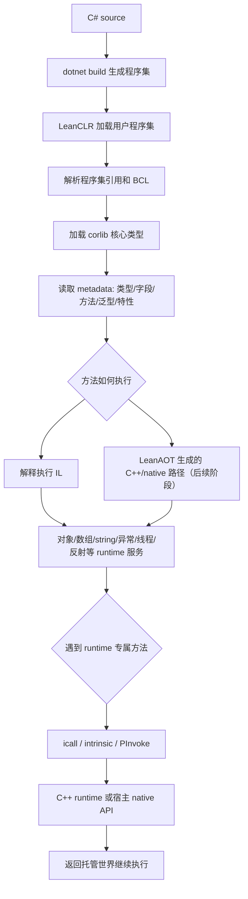
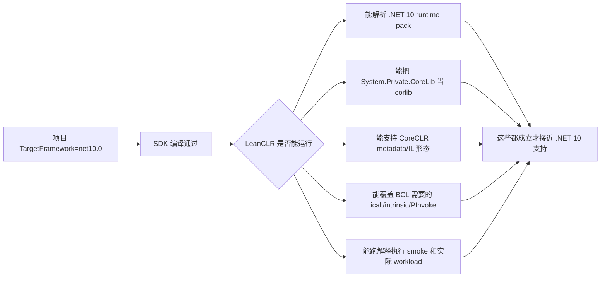
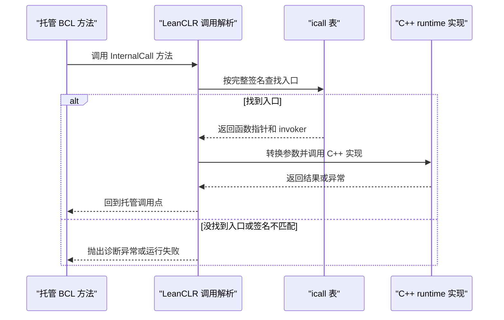
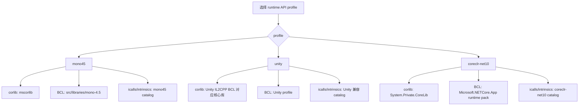
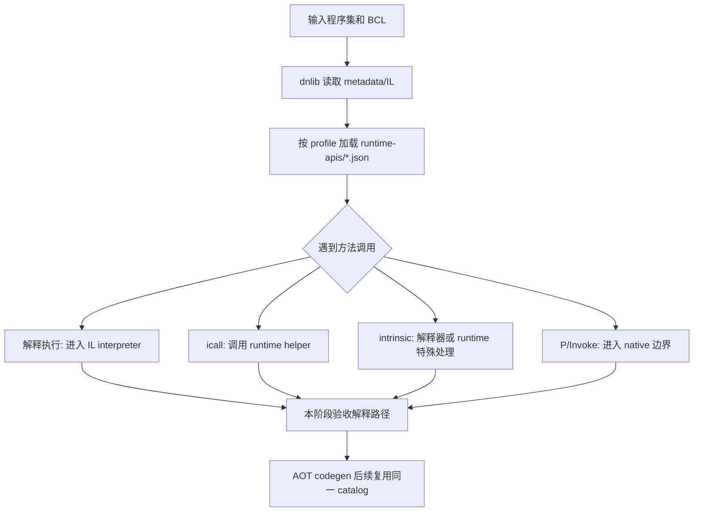
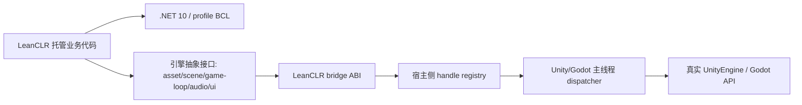

# LeanCLR .NET 10 支持审查

审查日期：2026-06-26

审查对象：`coreclr` 分支，HEAD `33e9194`（`doc: update core and standard edition status`）

## 结论摘要

2026-06-27 范围收敛决策：当前主线不再追求“完整承载 `System.Private.CoreLib` / `Microsoft.NETCore.App` 的 .NET 10 BCL 子集”。新的目标是 **LeanCLR minimal net10 profile**：让项目自己的、受控的、纯逻辑 `net10.0` DLL 能在 LeanCLR 上稳定运行。

2026-06-27 验收口径补充：`minimal net10 profile` 是近期工程边界，不代表只跑少量精选测试就宣告合格。原作者已经设计好的 managed / Mono 测试资产应作为 LeanCLR 自身能力的完整质量门槛：可以按优先级分阶段迁移、分批排缺口，但最终需要全量跑通，才能认为 `.NET 10` 接入是完整可靠的。

已经完成的 `.NET 10` 探路工作仍然有效：`coreclr-net10` profile 隔离、`System.Private.CoreLib` 识别、`leanrun` 解释执行 runner、`ManagedNet10.Smoke` 拆分与 53 个 `Test*` 子入口通过，证明 LeanCLR 已经具备运行受控 `net10.0` 纯逻辑程序集的基础。后续不应继续把目标扩大成小型 CoreCLR。

新的实施决策：

1. 保留 `net10.0` 用户程序集加载、基础 IL、泛型、异常、委托、少量反射、必要 Span/Unsafe 与清晰诊断。
2. 将 `System.Private.CoreLib` / `Microsoft.NETCore.App` 的完整或大子集承载后置，仅在真实纯逻辑 DLL 触发具体依赖时按需补齐。
3. 不再以剩余 extern diff 数量下降作为主线目标；`ExportExtern` / `dotnet/runtime` 源码只作为排障和定位工具。
4. 新增 API 白名单和 `AssemblyRef` / `TypeRef` / `MemberRef` 静态扫描，让不支持的 BCL 依赖在构建或加载阶段明确失败。
5. 将后续主线转向真实纯逻辑 DLL smoke、Unity/Godot host bridge ABI、opaque handle registry 和主线程 dispatcher。
6. 原作者 managed / Mono 测试资产采用“分阶段迁移、最终全量跑通”的策略；P0/P1/P2/P3 只用于排障排序，不用于缩减最终合格线。

2026-06-27 LCLR 作者建议评估：直接删除旧 `icalls` / `pinvokes` / `intrinsics` 对 `.NET 10` 适配有帮助，因为它能减少旧 Mono profile 语义对当前实现和 AI 辅助分析的干扰。但本仓库当前仍需要保留分派骨架、符号解析、错误诊断和部分已验证的运行时桥接，因此本阶段先把旧 Mono-only internal call 从 `System.Private.CoreLib` 查询路径中隔离出来：`.NET 10` 主路径命中 `Mono.*`、`System.IO.Mono*`、`System.Mono*`、`System.Reflection.Mono*`、`System.Runtime.Remoting*` 这类入口时直接视为未实现，让缺口 fail-fast，而不是继续调用可能带有 Mono 布局假设的旧实现。后续物理删除应按 profile catalog 分批推进，确保每批清理后都有 smoke 结果支撑。

本阶段验证命令：

```powershell
dotnet build src\tests\managed-net10\managed-net10.sln -c Release
powershell -ExecutionPolicy Bypass -File scripts\dotnet10\interp-smoke.ps1 -Configuration Release -AssemblyName ManagedNet10.LegacyTests -Entry "ManagedNet10.LegacyTests.Program::RunCorlibDiagnostics"
powershell -ExecutionPolicy Bypass -File scripts\dotnet10\interp-smoke.ps1 -Configuration Release
powershell -ExecutionPolicy Bypass -File scripts\dotnet10\interp-smoke.ps1 -Configuration Release -AssemblyName ManagedNet10.LegacyTests -Entry "ManagedNet10.LegacyTests.Program::RunAll"
```

以上命令均已通过，说明 Mono-only icall 隔离没有破坏当前 `ManagedNet10.Smoke` 主入口和已迁移的 legacy 反射扫描入口。

2026-06-27 RuntimeModule 反射迁移阶段：将旧 `CorlibTests.InternalCall.TC_System_Reflection_RuntimeModule` 作为素材接入 `ManagedNet10.LegacyTests`，新增 `RunCorlibReflectionRuntimeModule` 子入口并纳入 `RunAll` 反射扫描。运行时侧补齐 `.NET 10` `RuntimeModule` / `ModuleHandle` / `MetadataImport` / `RuntimeFieldHandle` / `RuntimeTypeHandle` 在该用例实际触发的桥接能力，包括模块 token、模块名称、签名 blob、token 有效性、类型/字段 token 解析、字段属性与名称、`RtFieldInfo` 句柄初始化和字段反射对象等价比较。

本阶段特别确认了旧宽松 icall 注册的风险：不能再用 `System.RuntimeFieldHandle::GetToken` 这类无签名泛匹配去承接 `.NET 10` 路径，否则会误命中托管侧 IL 包装方法并把 `RtFieldInfo` 对象指针错当 native 字段句柄。当前实现改为只注册 `System.RuntimeFieldHandle::GetToken(System.IntPtr)`，后续清理 `icalls` / `pinvokes` / `intrinsics` 时也应优先移除宽松命中路径，保留精确签名和清晰诊断。

本阶段补充验证命令：

```powershell
powershell -ExecutionPolicy Bypass -File scripts\dotnet10\interp-smoke.ps1 -Configuration Release -AssemblyName ManagedNet10.LegacyTests -Entry "ManagedNet10.LegacyTests.Program::RunCorlibReflectionRuntimeModule"
dotnet build src\tests\managed-net10\managed-net10.sln -c Release
powershell -ExecutionPolicy Bypass -File scripts\dotnet10\interp-smoke.ps1 -Configuration Release -AssemblyName ManagedNet10.LegacyTests -Entry "ManagedNet10.LegacyTests.Program::RunAll"
powershell -ExecutionPolicy Bypass -File scripts\dotnet10\interp-smoke.ps1 -Configuration Release
```

以上命令均已通过，说明 RuntimeModule 旧用例迁移后，`managed-net10` 主验证口和默认解释 smoke 仍保持绿色。

## 官方基线

本次审查按以下官方信息作为外部基线：

- .NET 10 是当前 LTS 线，`.NET 10.0.9` 为本机已安装 runtime patch。
- SDK 风格项目可使用 `net10.0` 作为目标框架名字（TFM）。
- .NET SDK 支持向下构建旧 TFM，但目标框架、引用程序集、runtime pack、workload 与 CI 环境仍要明确固定。

参考：

- [.NET 10 版本概览](https://learn.microsoft.com/en-us/dotnet/core/whats-new/dotnet-10/overview)
- [.NET target frameworks](https://learn.microsoft.com/en-us/dotnet/standard/frameworks)
- [.NET support policy](https://dotnet.microsoft.com/en-us/platform/support/policy/dotnet-core)
- [.NET 10 compatibility changes](https://learn.microsoft.com/en-us/dotnet/core/compatibility/10.0)
- [CoreLib BOTR](https://github.com/dotnet/runtime/blob/main/docs/design/coreclr/botr/corelib.md)
- [dotnet/runtime release/10.0](https://github.com/dotnet/runtime/tree/release/10.0)
- [dotnet/runtime v10.0.9 tag](https://github.com/dotnet/runtime/tree/v10.0.9)
- [source.dot.net System.Private.CoreLib](https://source.dot.net/#System.Private.CoreLib)

## 快速基建路线

联网确认后，最快的路线不是手工猜 `.NET 10` 所需 icall/intrinsic，而是直接复用三类现成输入：

| 输入 | 用法 | 当前落点 |
| --- | --- | --- |
| 本机/CI `Microsoft.NETCore.App 10.x` runtime pack | 作为实际 BCL 二进制输入，继续由 `ExportExtern` / diff 抽取 runtime API 需求 | `scripts/dotnet10/export-bcl-externs.ps1`、`artifacts/dotnet10-externs` |
| `dotnet/runtime` `release/10.0` / `v10.0.9` 源码 | 对照 `System.Private.CoreLib`、`coreclr/vm` 的 QCall/FCall/InternalCall 命名、签名和行为 | 后续可增加只拉 `src/coreclr`、`src/libraries/System.Private.CoreLib`、`docs/design/coreclr` 的 sparse checkout 脚本 |
| `source.dot.net` | 快速查 CoreLib 类型和方法源码，不必每次 clone 全仓库 | 用于定位 `Object.GetType()`、`RuntimeType.Name`、reflection、delegate、async 的真实托管调用链 |

本轮已确认远端存在 `refs/heads/release/10.0` 和 `refs/tags/v10.0.9`，可以把它们作为 `.NET 10.0.9` 参考源码基线。后续如果 CI 或开发机 runtime patch 变化，应在文档里同时记录 runtime pack 版本和源码 tag/commit，避免用 `main` 分支源码误判当前 .NET 10 行为。

仓库内已经有 `src/tools/leanrun`，它支持 `-l` 指定程序集搜索目录、`-e` 指定入口方法，并走解释执行路径。因此下一步不需要从零写 runner；应优先把 `leanrun` 包装成 `.NET 10` smoke 脚本，再补错误诊断和 CI 门禁。新增 `scripts/dotnet10/interp-smoke.ps1` / `.bat` 后，可用下面命令直接跑最小解释入口：

```powershell
powershell -ExecutionPolicy Bypass -File scripts\dotnet10\interp-smoke.ps1 -Configuration Release -Entry "ManagedNet10.Smoke.Program::TestPairArithmetic"
```

当前脚本已经能让最小 `TestPairArithmetic` 子入口在解释路径跑绿，但这尚不等于完整 `.NET 10` 解释 smoke 已经跑通；其它子入口如果失败，应把失败点作为 `coreclr-net10` contract / icall / method resolution 的下一轮输入。

### 源码参考的使用边界

拉取 `dotnet/runtime` 精简源码有必要，但它的角色是提速参考，不是免测试依据。CoreCLR 源码能告诉我们 `.NET 10` BCL 的真实调用链、QCall/FCall/InternalCall 名称、签名和大致语义；但 LeanCLR 的对象布局、GC、metadata loader、method table、exception、reflection handle、interpreter 调用协议都不是 CoreCLR 原样实现，不能把 CoreCLR VM 代码批量照搬。

建议按“批量建图 + 小切片验证”的方式使用源码：

| 可批量处理 | 不应盲批处理 |
| --- | --- |
| 从 `System.Private.CoreLib` / `coreclr/vm` 批量抽取调用链、QCall/FCall/InternalCall 清单 | `Object.GetType()`、boxing、unboxing、`RuntimeType` 等依赖对象布局和 type handle 的语义 |
| 生成 `coreclr-net10` catalog、missing/extra/signature_changed 报告 | `Span<T>`、byref-like、stackalloc、RVA data 等依赖解释器栈和受管布局的语义 |
| 批量加 NotSupported/diagnostic stub，让失败点可定位 | reflection private field/method/attribute、delegate invoke、exception filter、async continuation |
| 批量建立 smoke matrix，记录每个子入口通过/失败/失败码 | generic method resolution、interface static abstract、generic math、threading、P/Invoke 等跨 runtime 子系统行为 |

推荐循环：

1. 固定本机 runtime pack 版本和 `dotnet/runtime` tag，例如 `.NET 10.0.9` 对应 `v10.0.9`。
2. 从失败子入口开始，例如 `TestBoxingMetadata` 或 `TestSpan`。
3. 用源码追 CoreLib 托管调用链和 native contract。
4. 只实现该入口实际需要的 LeanCLR runtime 行为。
5. 跑 `scripts\dotnet10\interp-smoke.ps1 -Entry ...`。
6. 通过后再扩展同类 API，并把新增 contract 写回 `coreclr-net10` profile 和验证记录。

因此，源码可以大幅减少定位时间，也可以批量生成清单和诊断骨架；但核心 runtime 语义必须由解释执行 smoke 分批验收。后续不要把剩余数千个 extern diff 一次性填入 runtime API catalog 并视为支持完成。

## 当前项目结构

仓库大致分成这些区域：

| 区域 | 现状 | .NET 10 影响 |
| --- | --- | --- |
| `src/runtime` | C++11 LeanCLR runtime，CMake 构建 | 运行时是否支持 .NET 10 BCL 的核心区域 |
| `src/leanaot` | SDK 风格 `net8.0`，LeanAOT 代码生成工具 | 可在 .NET 10 SDK 下构建；本阶段只复用 metadata/profile/catalog 基础设施，不把 AOT 代码生成作为验收目标 |
| `src/tools/exportextern` | SDK 风格 `net8.0`，依赖 `dnlib` | 可用于导出 .NET 10 BCL 入口清单 |
| `src/tools/pgo2aot` | SDK 风格 `net8.0`，带 `RollForward=LatestMajor` | 工具可在 .NET 10 runtime 上 roll forward |
| `src/libraries/mono-4.5` | 内置 Mono 4.5 BCL 及 targets | 当前测试和部分 runtime 假设的主要 BCL 来源 |
| `src/libraries/LeanCLR` | 旧式 `.NET Framework v4.8`，引用 `mono-4.5` | profile 库仍绑定 `mscorlib` 模型 |
| `src/tests/managed` | 旧式 `.NET Framework v4.8` 测试，很多项目 `NoStandardLib` | 主要验证 Mono 4.5 BCL，不验证 .NET 10 BCL |
| `.github/workflows/ci.yml` | workflow 只有手动触发且 job `if: false` | CI 当前没有实际保护作用 |

## 目标框架与依赖

SDK 风格项目：

| 项目 | 当前 TFM | 备注 |
| --- | --- | --- |
| `src/leanaot/LeanAOT/LeanAOT.csproj` | `net8.0` | `RollForward=LatestMajor` |
| `src/leanaot/LeanAOT.Core/LeanAOT.Core.csproj` | `net8.0` | 依赖 `dnlib 4.5.0`、`NLog 6.0.7` |
| `src/leanaot/LeanAOT.ToCpp/LeanAOT.ToCpp.csproj` | `net8.0` | 引用 Core 和 GenerationPlan |
| `src/leanaot/LeanAOT.GenerationPlan/LeanAOT.GenerationPlan.csproj` | `net8.0` | 引用 Core |
| `src/tools/exportextern/ExportExtern.csproj` | `net8.0` | 依赖 `dnlib 4.5.0` |
| `src/tools/pgo2aot/Pgo2Aot.csproj` | `net8.0` | `RollForward=LatestMajor` |

旧式项目：

- `src/libraries/LeanCLR/LeanCLR.csproj`：`.NET Framework v4.8`，`NoStandardLib=true`，引用 `src/libraries/mono-4.5`。
- `src/tests/managed/*/*.csproj`：大多为 `.NET Framework v4.8`，其中 `CoreTests`、`CorlibTests`、`GcTests`、`ILTests`、`RefNetstandard` 等直接绑定 `mono-4.5`。
- `ILTests` 依赖 `ILAsm 9.4.0` NuGet 包。

依赖审查结果：

- `dotnet list src/leanaot/LeanAOT.sln package --outdated`：仅 `NLog 6.0.7 -> 6.1.3` 有更新。
- `dotnet list src/leanaot/LeanAOT.sln package --vulnerable`：无漏洞包。
- `ExportExtern` 和 `Pgo2Aot` 当前无更新包。
- `managed.sln` 的 `dotnet list package` 被旧式项目阻断，CLI 报这些项目不适用于该命令。

## 原理速览

这一节用于把后文反复出现的 VM、BCL、profile、icall、intrinsic、AOT 等名词串起来。LeanCLR 要跑一个 C# 程序，首先要加载程序集、理解元数据、创建运行时对象、调度方法调用，并在托管代码碰到运行时专属能力时跳到 C++ runtime。AOT 是后续优化和发布形态，本阶段先验证解释执行路径。

### 关键名词

| 名词 | 在 LeanCLR 里的意思 | 为什么 .NET 10 适配会碰到它 |
| --- | --- | --- |
| VM / runtime | 负责加载程序集、维护类型系统、对象布局、GC、异常、线程、反射和方法调用的 C++ 运行时 | `.NET 10` BCL 会依赖新的类型布局、元数据形态和 runtime API |
| BCL | Base Class Library，`System.*`、`System.Private.CoreLib`、`System.Runtime` 等基础类库 | LeanCLR 必须匹配所选 BCL 的内部调用和行为契约 |
| corlib | 核心库，保存 `System.Object`、`System.String`、`System.Array`、`System.Type` 等最核心类型 | Mono profile 是 `mscorlib`，CoreCLR/.NET 10 是 `System.Private.CoreLib` |
| profile | 一组 BCL 与 runtime API 兼容目标，例如 `mono45`、`unity`、`coreclr-net10` | 不同 profile 的 corlib 名称、icall 名称、签名和语义都可能不同 |
| assembly | `.dll` 或 `.exe` 托管程序集，里面有 IL、metadata、资源和引用关系 | `.NET 10` runtime pack 带来新的程序集拆分和引用关系 |
| metadata | 程序集里的类型、字段、方法、泛型、特性、接口实现等描述信息 | 反射、泛型、AOT 生成和方法解析都依赖 metadata |
| IL | C# 编译后的中间语言指令 | 解释器和 AOT 都要支持实际 workload 触发的 IL 指令 |
| AOT | Ahead-of-Time，把 IL 提前生成 C++/native 调用路径 | 本阶段后置；等解释执行证明 BCL/runtime contract 正确后再处理 codegen |
| icall | internal call，托管方法没有 IL 方法体，真正实现写在 C++ runtime 里 | BCL 中大量底层方法靠 icall 访问对象头、数组布局、线程、GC、反射等 |
| intrinsic | 由 AOT/VM 特殊识别并直接生成更高效或更底层实现的方法 | `Span<T>`、`Interlocked`、`Volatile`、部分 `Math` 和数组操作常走 intrinsic |
| P/Invoke | 托管代码调用外部 native 动态库函数 | CoreCLR BCL、平台 PAL、宿主 bridge 都可能使用 P/Invoke 边界 |
| smoke test | 很小的端到端验证入口 | 用来把巨大兼容目标拆成可定位、可验收的小切片 |

### 托管程序在 LeanCLR 中的执行流程

下面是最简化的运行路径。真正的实现会有更多缓存、泛型实例化、异常处理和 AOT fallback，但本阶段只把解释执行路径作为验收主线：



如果 corlib 仍按 `mscorlib` 假设启动，而实际输入是 `.NET 10` 的 `System.Private.CoreLib`，上图会在“加载 corlib 核心类型”和“读取 metadata”附近出问题。当前 `ManagedNet10.Smoke` 的完整入口失败，就是这类问题正在被逐步定位到 boxing metadata、反射、delegate/exception 和 async 等子路径。

### 为什么 `TargetFramework=net10.0` 不等于支持 .NET 10

`net10.0` 只是告诉 SDK 如何编译托管程序集。LeanCLR 真正要承载 `.NET 10`，还要能加载和执行 `.NET 10` BCL 本身。



因此本仓库里 `src/leanaot` 能用 .NET 10 SDK 构建，只能说明工具链可运行；它不能证明 LeanCLR runtime 已经兼容 `System.Private.CoreLib` 或 `Microsoft.NETCore.App`。

### icall 的工作方式

icall 是 BCL 和 runtime 之间的一条直接通道。托管侧通常长这样：

```csharp
[MethodImpl(MethodImplOptions.InternalCall)]
private static extern RuntimeType InternalGetType(object obj);
```

这类方法没有 IL 方法体。运行时遇到调用时，会用“类型名 + 方法名 + 签名”去 icall 表里找 C++ 实现：

```cpp
{"System.Type::internal_from_handle", (vm::InternalCallFunction)&SystemType::internal_from_handle}
```

流程可以理解为：



这也是为什么 `.NET 10` 适配不能直接复用 Mono/Unity 的所有 icall。不同 BCL 可能会改方法名、签名、所在类型、对象布局和异常语义。`coreclr-net10` 需要独立 catalog，并用 `.NET 10` runtime assemblies 实际导出的 extern 清单持续对比。

### profile、BCL 和 runtime API catalog 的关系

profile 是本次改造里最重要的隔离边界。它决定当前 AOT 和 runtime 以哪一套 BCL 为目标。



正确的方向是 profile 化隔离，而不是把 `.NET 10` 缺口直接混进现有 `mono45` 表。否则很容易修好 CoreCLR 路径，却破坏已经稳定的 Mono/Unity 路径。

### AOT 后置时 runtime API 表仍有用

虽然当前计划先不处理 AOT，runtime API 表仍然有价值：它定义了当前 profile 下哪些 BCL 方法必须由 runtime 提供。解释器遇到这些方法时同样需要能解析到 runtime helper；后续 LeanAOT 生成代码时也会复用同一套 catalog。



如果 runtime API 表缺条目，解释执行会在调用 BCL 内部方法时找不到 runtime 入口；如果表里有条目但 C++ runtime 行为不符合当前 BCL，解释路径也会失败。AOT 后续只是把同一批语义再搬到 codegen 路径。

### Unity/Godot bridge 和 BCL 兼容不是同一件事

`.NET 10` BCL 兼容解决的是 `System.*` 和 `Microsoft.NETCore.App` 能不能运行。Unity/Godot 接入解决的是游戏引擎对象和主线程 API 怎么暴露给 LeanCLR。两者边界应分开：



第一阶段不建议让 LeanCLR 直接加载完整 `UnityEngine.dll` 或 Godot 托管 API。更稳妥的做法是：LeanCLR 只运行引擎无关核心和必要 BCL，宿主进程通过 bridge 提供资源、场景、主线程调度和异步结果回传。

## 本机验证记录

本机环境：

- OS：Windows `10.0.26200`
- .NET SDK：`10.0.301`
- MSBuild：`18.6.4`
- Runtime：`Microsoft.NETCore.App 10.0.9`
- `global.json`：已固定 SDK `10.0.301`，`rollForward=latestFeature`
- CMake：`4.3.3`，验证时通过 `C:\Program Files\CMake\bin` 加入 PATH

命令结果：

| 命令 | 结果 | 说明 |
| --- | --- | --- |
| `dotnet --info` | 成功 | 只有 .NET 10 SDK/runtime |
| `dotnet build src\leanaot\LeanAOT.sln -c Debug` | 成功 | 0 warning / 0 error，输出到 `out/dotnet/*/Debug/net8.0` |
| `dotnet build src\tools\exportextern\ExportExtern.csproj -c Release` | 成功 | 0 warning / 0 error |
| `dotnet build src\tools\pgo2aot\Pgo2Aot.csproj -c Debug` | 成功 | 0 warning / 0 error |
| `scripts\runtime\build.bat Debug x64` | 成功 | CMake + VS Build Tools 构建 `leanclr.lib` |
| `scripts\test\build-all.bat Debug x64` | 成功 | CMake basic tester + 旧式 managed tests 全部构建 |
| `scripts\test\run.bat Debug x64` | 成功 | 5164 个 unit tests、164 个 GC tests 全部通过 |
| `scripts\dotnet10\aot-smoke.ps1 -Configuration Release` | 成功 | `ManagedNet10.Smoke` 使用 `coreclr-net10` profile 生成 C++ |
| `scripts\dotnet10\aot-smoke.ps1 -Configuration Release -NativeBuild` | 成功 | 生成 C++ 后用 CMake/VS 2022 编译并链接 `aot-tester.exe` |
| `aot-tester.exe ... -e ManagedNet10.Smoke.Program::TestPairArithmetic ManagedNet10.Smoke` | 成功 | record struct 基础算术子入口通过 |
| `aot-tester.exe ... -e ManagedNet10.Smoke.Program::TestThreadingSubset ManagedNet10.Smoke` | 成功 | `Interlocked.Increment`、`Volatile.Read/Write` 子入口通过 |
| `aot-tester.exe ... -e ManagedNet10.Smoke.Program::TestSpanStackalloc ManagedNet10.Smoke` | 成功 | `Span<T>(void*, int)` + `Span<T>.get_Item` / `set_Item` stackalloc 路径通过 |
| `aot-tester.exe ... -e ManagedNet10.Smoke.Program::TestSpanStackallocInitializer ManagedNet10.Smoke` | 成功 | `RuntimeHelpers.CreateSpan<T>(RuntimeFieldHandle)` + RVA 初始化路径通过 |
| `aot-tester.exe ... -e ManagedNet10.Smoke.Program::TestSpan ManagedNet10.Smoke` | 成功 | Span 两个子场景合并入口通过 |
| `aot-tester.exe ... -e ManagedNet10.Smoke.Program::TestBoxingMetadata ManagedNet10.Smoke` | 失败 | `object boxed = pair; boxed.GetType().Name` 路径仍抛 `System.BadImageFormatException` |
| `aot-tester.exe ... -e ManagedNet10.Smoke.Program::TestGenericsDelegatesAndExceptions ManagedNet10.Smoke` | 失败 | 泛型 record class、delegate、异常包装/过滤路径仍未通过 |
| `aot-tester.exe ... -e ManagedNet10.Smoke.Program::TestReflection ManagedNet10.Smoke` | 失败 | `GetCustomAttribute`、private field lookup/read 路径仍未通过 |
| `aot-tester.exe ... -e ManagedNet10.Smoke.Program::TestAsync ManagedNet10.Smoke` | 失败 | `Task.Yield` / `Task.FromResult` async 路径仍未通过 |
| `aot-tester.exe -l <net10 smoke dir> -l <dotnet10 runtime dir> ManagedNet10.Smoke` | 失败 | runtime 初始化已通过；入口方法调用阶段抛出 `System.BadImageFormatException`，runner 随后异常退出 |
| `scripts\dotnet10\interp-smoke.ps1 -Configuration Release -BuildOnly` | 成功 | `ManagedNet10.Smoke` 和 `src/tools/leanrun` 解释执行 runner 构建通过 |
| `scripts\dotnet10\interp-smoke.ps1 -Configuration Release -Entry "ManagedNet10.Smoke.Program::TestPairArithmetic"` | 成功 | `leanrun` 解释执行路径可加载 `ManagedNet10.Smoke` 和 `.NET 10.0.9` runtime pack，并执行最小 record struct 算术子入口 |
| `scripts\dotnet10\interp-smoke.ps1 -Configuration Release -Entry "ManagedNet10.Smoke.Program::TestBoxingMetadata"` | 成功 | boxed value type 的 `Object.GetType()` / `RuntimeType.Name` 解释执行路径已通过 |
| `scripts\dotnet10\interp-smoke.ps1 -Configuration Release -Entry "ManagedNet10.Smoke.Program::TestSpan"` | 成功 | Span stackalloc / RVA initializer 解释执行路径已通过 |
| `scripts\dotnet10\interp-smoke.ps1 -Configuration Release -Entry "ManagedNet10.Smoke.Program::TestAsync"` | 成功 | `Task.Yield` / `Task.FromResult` async 解释执行路径已通过；当前 `Task.Yield` 以单线程同步 continuation intrinsic 处理 |
| `scripts\dotnet10\interp-smoke.ps1 -Configuration Release` | 成功 | 完整 `ManagedNet10.Smoke` 解释执行入口输出 `ok!` |
| `leanrun.exe` 逐项执行 `ManagedNet10.Smoke.Program::Test*` | 成功 | 本机 53 个 `Test*` 子入口全部退出 `0` |
| `cmake --version` | 成功 | CMake `4.3.3` |

这些结果说明：

- SDK 工具链目前可用 .NET 10 SDK 构建现有 `net8.0` 项目。
- 旧式托管测试需要 .NET Framework 4.8 Developer Pack；本机已安装后可通过 VS MSBuild 构建。
- 原生构建和测试 runner 需要安装/定位 CMake；本机已用 CMake `4.3.3` 验证。
- .NET 10 native smoke 已经不再卡在 runtime 初始化；拆分子入口后，基础值类型算术、线程同步最小子集和 Span stackalloc/RVA initializer 已可执行，下一批阻断点集中在 boxing metadata、反射、delegate/exception 和 async。
- .NET 10 解释执行 smoke 已经可以加载 `ManagedNet10.Smoke` 和本机 `.NET 10.0.9` runtime pack，并让完整入口与 53 个 `Test*` 子入口通过；这可以作为第一阶段解释执行门禁的当前绿色基线。

### 复现当前 .NET 10 smoke 状态

先重新生成托管 smoke、LeanAOT C++ 和 native runner：

```powershell
dotnet build src\leanaot\LeanAOT.sln -c Release
dotnet build src\tests\managed-net10\managed-net10.sln -c Release
powershell -ExecutionPolicy Bypass -File scripts\dotnet10\aot-smoke.ps1 -Configuration Release -NativeBuild
```

本机验证使用的路径：

```powershell
$runner = "out\cmake\tests\net10-aot-smoke\Release-x64\bin\Release\aot-tester.exe"
$smokeDir = "out\dotnet\ManagedNet10.Smoke\Release\net10.0"
$runtimeDir = "C:\Program Files\dotnet\shared\Microsoft.NETCore.App\10.0.9"
```

当前应通过的 native 子入口：

```powershell
& $runner -l $smokeDir -l $runtimeDir -e "ManagedNet10.Smoke.Program::TestPairArithmetic" ManagedNet10.Smoke
& $runner -l $smokeDir -l $runtimeDir -e "ManagedNet10.Smoke.Program::TestThreadingSubset" ManagedNet10.Smoke
& $runner -l $smokeDir -l $runtimeDir -e "ManagedNet10.Smoke.Program::TestSpanStackalloc" ManagedNet10.Smoke
& $runner -l $smokeDir -l $runtimeDir -e "ManagedNet10.Smoke.Program::TestSpanStackallocInitializer" ManagedNet10.Smoke
& $runner -l $smokeDir -l $runtimeDir -e "ManagedNet10.Smoke.Program::TestSpan" ManagedNet10.Smoke
```

当前已通过的解释执行入口：

```powershell
powershell -ExecutionPolicy Bypass -File scripts\dotnet10\interp-smoke.ps1 -Configuration Release -Entry "ManagedNet10.Smoke.Program::TestPairArithmetic"
powershell -ExecutionPolicy Bypass -File scripts\dotnet10\interp-smoke.ps1 -Configuration Release -Entry "ManagedNet10.Smoke.Program::TestBoxingMetadata"
powershell -ExecutionPolicy Bypass -File scripts\dotnet10\interp-smoke.ps1 -Configuration Release -Entry "ManagedNet10.Smoke.Program::TestSpan"
powershell -ExecutionPolicy Bypass -File scripts\dotnet10\interp-smoke.ps1 -Configuration Release -Entry "ManagedNet10.Smoke.Program::TestAsync"
powershell -ExecutionPolicy Bypass -File scripts\dotnet10\interp-smoke.ps1 -Configuration Release
```

当前预期失败的 native 入口：

```powershell
& $runner -l $smokeDir -l $runtimeDir -e "ManagedNet10.Smoke.Program::TestBoxingMetadata" ManagedNet10.Smoke
& $runner -l $smokeDir -l $runtimeDir -e "ManagedNet10.Smoke.Program::TestGenericsDelegatesAndExceptions" ManagedNet10.Smoke
& $runner -l $smokeDir -l $runtimeDir -e "ManagedNet10.Smoke.Program::TestReflection" ManagedNet10.Smoke
& $runner -l $smokeDir -l $runtimeDir -e "ManagedNet10.Smoke.Program::TestAsync" ManagedNet10.Smoke
& $runner -l $smokeDir -l $runtimeDir ManagedNet10.Smoke
```

如果本机 runtime patch 不是 `10.0.9`，把 `$runtimeDir` 替换为 `dotnet --list-runtimes` 中最新的 `Microsoft.NETCore.App 10.x` 目录。native/AOT 入口当前仍是后置阶段输入；解释执行入口已经作为第一阶段绿色基线。

## 关键风险

### 1. BCL 模型已开始 profile 化，但 runtime contract 仍偏 `mscorlib`

第一批改造已经解除了一部分硬编码：

- `src/leanaot/LeanAOT/runtime-apis/mono45` 和 `coreclr-net10` 已拆成独立 profile。
- `RuntimeApiCatalog` 已从 `profile.json` 读取 core library module 集合。
- LeanAOT CLI 已支持 `--leanaot-runtime-api-profile` 和 `LEANCLR_RUNTIME_API_PROFILE`。
- runtime 侧 corlib 识别已允许 `System.Private.CoreLib`，并在 `Assembly::load_corlib()` 中优先尝试加载它。

剩余风险在于 runtime 内部类型契约仍大量按 Mono-era `mscorlib` 假设组织。例如 `System.Runtime.Remoting.Contexts.Context`、`System.Threading.InternalThread` 等类型在 .NET 10 `System.Private.CoreLib` 中不存在，Mono 4.5 的对象布局完整性校验也不能直接套用到 CoreCLR BCL。第一轮降级后 native run 已能通过 `Runtime::initialize()`，并且部分子入口已经可执行；完整入口仍在 `TestBasics()` 的 boxing metadata 路径附近抛出 `System.BadImageFormatException`。

下一步重点：

- 将 runtime 的 corlib required-type 表按 profile 拆分，避免 `coreclr-net10` 继续要求 Mono 专用类型。
- 区分“LeanCLR VM 必需类型”和“某个 BCL profile 的兼容类型”。
- 对 .NET 10 不存在的类型建立 adapter、替代路径或明确的 NotSupported 诊断。

### 2. Runtime API 表需要按 .NET 10 重建

当前 LeanAOT runtime API JSON 已拆为 profile。`mono45` 保留原有表，`coreclr-net10` 从现有实现里筛出与 .NET 10 extern 精确匹配的保守基线：

| 文件 | 条目数 |
| --- | ---: |
| `src/leanaot/LeanAOT/runtime-apis/mono45/icalls.json` | 550 |
| `src/leanaot/LeanAOT/runtime-apis/mono45/intrinsics.json` | 45 |
| `src/leanaot/LeanAOT/runtime-apis/mono45/icalls_newobj.json` | 8 |
| `src/leanaot/LeanAOT/runtime-apis/mono45/intrinsics_newobj.json` | 1 |
| `src/leanaot/LeanAOT/runtime-apis/mono45/pinvokes.json` | 1 |
| `src/leanaot/LeanAOT/runtime-apis/coreclr-net10/icalls.json` | 95 |
| `src/leanaot/LeanAOT/runtime-apis/coreclr-net10/intrinsics.json` | 38 |
| `src/leanaot/LeanAOT/runtime-apis/coreclr-net10/icalls_newobj.json` | 8 |
| `src/leanaot/LeanAOT/runtime-apis/coreclr-net10/intrinsics_newobj.json` | 0 |
| `src/leanaot/LeanAOT/runtime-apis/coreclr-net10/pinvokes.json` | 0 |

C++ icall 覆盖集中在：

- `system_threading_thread.cpp`：52 个
- `interop.cpp`：51 个
- `system_runtime_interopservices_marshal.cpp`：42 个
- `system_math.cpp`：26 个
- `system_environment.cpp`：23 个
- `system_appdomain.cpp`：23 个
- `system_runtimetype.cpp`：23 个
- `system_threading_interlocked.cpp`：22 个

这些名称混合了 Mono、CoreCLR PAL/Interop、Unity 兼容需求。第一批 .NET 10 extern 导出已经跑通，但 diff 显示仍有大量缺口。支持 .NET 10 时需要持续从 .NET 10 runtime assemblies 实际导出并分批补齐：

- `InternalCall`
- runtime implemented methods
- P/Invoke / `LibraryImport` / `DllImport`
- intrinsic 候选
- `System.Private.CoreLib` 与其他 runtime assemblies 的引用关系

已建立和后续需要维护的产物：

- `artifacts/dotnet10-externs/*.txt`：从 .NET 10 BCL 导出的需求清单。
- `src/leanaot/LeanAOT/runtime-apis/coreclr-net10/*.json`：独立于现有 Mono/Unity 的 API catalog。
- `scripts/generator/check_runtime_api_signatures.*` 支持传入 profile 和多组 externs。

### 3. 现有托管测试不能证明 .NET 10 BCL

当前旧测试项目主要通过旧式 `.NET Framework v4.8` 项目引用 `src/libraries/mono-4.5`。这对 Mono 4.5 兼容测试是合理的，但无法覆盖完整 .NET 10 BCL。第一批改造已经新增 `src/tests/managed-net10/managed-net10.sln`，用于覆盖最小 `net10.0` 编译和 SDK runtime 执行。

仍未覆盖：

- `System.Private.CoreLib` 元数据。
- .NET 10 BCL 内部方法签名。
- LeanCLR runtime 实际执行 `System.Private.CoreLib`。
- 更完整的 C# 14 / .NET 10 SDK 现代 IL 和属性形态。

下一步重点：

- 保留 `src/tests/managed` 作为 Mono profile 测试，不要直接替换。
- 抽出共享测试基础设施，避免 `Common` 被 `.NET Framework v4.8` 锁死。
- 新增 `CoversIcall`/coverage 报告对 `coreclr-net10` profile 独立统计。

### 4. CI 已恢复手动基线，但还不是完整发布门禁

`.github/workflows/ci.yml` 已移除 job 顶层 `if: false`，并拆出：

- `sdk-tools-and-net10`：固定 .NET 10 SDK，构建 SDK 工具，导出 .NET 10 extern，运行 net10 smoke；已存在的 LeanAOT C++ 生成 smoke 保留为后续 AOT 参考，不作为第一阶段门禁。
- `native-linux`：构建 Linux native basic tester。
- `legacy-managed-windows`：用 MSBuild 构建旧式 managed tests。

剩余风险：

- 仍只启用 `workflow_dispatch`，push/pull_request 触发尚未恢复。
- Windows job 只构建旧式 managed tests，尚未跑完整 `scripts\test\run.bat`。
- .NET 10 AOT native run 当前预期失败，且 AOT 已后置；第一阶段 CI 应新增解释执行 smoke 作为绿色门禁。

### 5. 解释器仍需验证现代 IL / metadata 形态

现代 C# / .NET 10 workload 会触发一些尚未完整验证的 IL、metadata 和调用解析路径。由于当前阶段不处理 AOT，这些风险先收敛到解释器和 runtime method resolution：

- `arglist`、`endfilter`、`leave`、`endfinally` 未实现。
- `jmp`、部分 prefix instruction 未支持。
- 静态 RVA field、const field address、字符串常量 field 等通用路径仍不完整；`RuntimeHelpers.CreateSpan<T>(RuntimeFieldHandle)` 的 RVA 初始化 smoke 已有定向支持。
- CoreCLR 对 ECMA-335 的扩展仍需要单独验证，尤其是接口 `static abstract` / `static virtual` 成员对应的 metadata、method resolution、interface method implementation 和解释器调用路径。
- P/Invoke marshal 支持面有限，部分 `NativeType`、calling convention、array/string builder 场景不支持。
- `System.Span<T>` 相关 intrinsic 已覆盖最小 stackalloc/RVA initializer smoke，但仍只是 `Span<T>(void*, int)`、`RuntimeHelpers.CreateSpan<T>` 和已登记 intrinsic 查找修正的窄路径，不等于完整 Span/Memory 支持。

这些缺口不一定全部阻断 .NET 10，但接口静态虚函数应从泛泛的“现代 IL”里前移为 CoreCLR profile 的前置能力；其余缺口通过 .NET 10 BCL 和用户程序集的实际解释执行 smoke test 来排序。

### 6. 线程和同步语义需要明确支持边界

README 声明 Standard 仍是单线程，多线程规划中。与此同时 runtime 已有大量 `System.Threading.*` icall stub 和测试覆盖。对于 .NET 10 BCL，线程、ThreadPool、Timer、Monitor、WaitHandle、async 相关路径更容易被间接触发。

建议：

- 文档层明确 `.NET 10 profile` 是否支持多线程。
- 对不支持的 threading API 建立可诊断失败策略，而不是静默 stub。
- 将单线程可运行的 BCL 子集与多线程 API 支持分开验收。

## 已确认的架构结论与改造边界

### 1. `coreclr` 分支定位

`coreclr` 分支的目标应是引擎无关的 CoreCLR/.NET 10 BCL profile，不是 Unity 专用版本。Unity 支持应继续位于 `unity` 分支或 `leanclr-unity` 插件侧；Godot 支持也应以宿主插件/bridge 的方式接入。`coreclr` 主线不应继续把 Unity/Godot API 当作运行时内建依赖。

因此，NKGGameFramework 的推荐接入模型是：

```text
Unity/Godot host
  -> load LeanCLR native runtime
  -> register engine bridge APIs
  -> load NKGGameFramework and game assemblies
  -> drive RuntimeContext.Update every frame
```

从引擎侧看，LeanCLR 是一个 native CLR-like runtime；从 NKG 侧看，Unity/Godot 是外部 service provider。

### 2. LeanCLR VM 核心应复用

本次迁移不应理解为重写整个 LeanCLR。以下能力属于 LeanCLR 自身 VM 核心，应尽量复用并只做针对 .NET 10 的兼容补强：

- 元数据解析。
- 类型系统。
- IR 解释器。
- LeanAOT IL -> C++ 转译框架。
- GC。
- 异常处理。
- 委托。
- 泛型与泛型共享。
- 基础反射框架。

`unity` / `mono` / `coreclr` 分支的主要差异不是这些 VM 核心能力，而是 BCL 来源、runtime API catalog、internal call/intrinsic 覆盖、平台宿主集成和测试资产。

### 3. 需要大改的是 BCL 与 runtime contract 层

支持 .NET 10 的工作本质上是让 LeanCLR 成为一套 `.NET 10-compatible runtime`，而不是重新实现完整 .NET 10。可以复用 .NET 10 的托管 BCL assemblies，但 LeanCLR 必须实现这些 assemblies 期待的 runtime contract。

重点改造项：

- `System.Private.CoreLib` / `System.Runtime` / `Microsoft.NETCore.App` 的 BCL profile。
- corlib 名称和 core module 识别，从固定 `mscorlib` 改为 profile 化。
- assembly resolver，支持用户程序集、NuGet 依赖、runtime pack 与 adapter assembly。
- runtime API catalog，按 profile 拆分 `mono45`、`unity`、`coreclr-net10`。
- `.NET 10` BCL 的 internal call、intrinsic、P/Invoke、runtime implemented method 覆盖。
- runtime handle、reflection、custom attribute、generic instantiation、Activator 等 CoreCLR BCL 常用服务。
- async/await、UniTask、timer、continuation、cancellation 的单线程 frame scheduler 或宿主调度器映射。
- Odin 等反射型序列化库所需的 private member access 和 attribute/metadata 能力。
- 解释器对现代 C# / .NET 10 输出 IL、metadata 和 attribute 形态的覆盖；AOT 覆盖后置。
- `net10.0` 托管测试资产和 `coreclr-net10` coverage 报告。

### 4. 当前 `coreclr` 分支状态判断

当前分支已经具备第一批 minimal net10 基础设施：SDK 工具链可在 .NET 10 SDK 下构建，runtime API catalog 已 profile 化，`coreclr-net10` extern diff 和最小 `net10.0` smoke 已建立，`ManagedNet10.Smoke` 完整入口和 53 个 `Test*` 子入口已作为解释执行绿色基线。

以“运行项目自己的纯逻辑 `net10.0` DLL，并最终跑通原作者测试资产”为标准，当前没有整体跑偏，但还缺少正式的能力边界、测试全量迁移和真实 workload 验收。主要缺口：

- 尚未定义 `minimal-net10` API 白名单。
- 尚未实现 `AssemblyRef` / `TypeRef` / `MemberRef` 静态扫描，无法在构建或加载阶段阻止越界 BCL 依赖。
- 原作者 managed / Mono 测试资产尚未完成 `net10.0` profile 迁移和全量执行；当前只迁入少量 legacy cases，不能把精选通过作为最终完成。
- `ManagedNet10.Smoke` 仍混有 BCL 探路性质的测试，需要整理为阶段性定位集，并和 legacy 测试全量迁移计划对齐。
- 项目真实纯逻辑 DLL smoke 尚未接入；`C:\study\wqaetly\new\NKGGameFramework` 应作为第一批真实框架 workload。
- Unity/Godot bridge、opaque handle registry、主线程 dispatcher 和 mock host 尚未纳入验收。

以“完整承载 `.NET 10` BCL / Microsoft.NETCore.App”为标准，当前仍未完成；但该目标已经后置，不再作为近期计划主线。

## 建议实施计划

### 2026-06-27 contract-first 实施计划转向

当前推进方式正式从“跑旧测试、遇到一个缺口补一个缺口”调整为 **先重写 .NET 10 主路径的 runtime contract / model，再用测试验收**。旧 managed / Mono 测试资产仍然保留为回归和最终质量门槛，但不再作为设计来源；设计来源改为 .NET 10 `System.Private.CoreLib` / CoreCLR VM 源码、runtime pack extern 清单、真实纯逻辑 DLL workload 和 LeanCLR 自身 VM 边界。

本轮转向的目标不是重写整个 LeanCLR。应保留 metadata loader、类型系统、对象模型、解释器、GC、异常、委托、泛型、基础反射框架和已有 profile/catalog 基建；需要重写的是 `.NET 10` 活跃路径上的 **BCL/runtime contract 层**，也就是 CoreLib 期望看到的 type handle、method handle、field handle、assembly/module/custom attribute、Span/Unsafe、Monitor/Thread/Task 等 façade 结构和调用边界。

新的执行顺序：

1. **冻结当前补丁式推进**：记录当前能过/不能过的 smoke、legacy 子入口和真实 workload；只处理阻塞 contract 重建的 P0，暂停继续按旧 Mono 用例逐点补丁。
2. **抽取 .NET 10 contract map**：基于 `.NET 10` 源码和 runtime pack 导出清单，整理 `RuntimeType`、`RuntimeTypeHandle`、`RuntimeMethodHandle`、`RuntimeFieldHandle`、`RuntimeAssembly`、`RuntimeModule`、`CustomAttribute`、`RuntimeHelpers`、`Unsafe/Span`、`Thread/Monitor/Task` 的最小 contract、入口签名、私有字段/handle 访问形状和 NotSupported 边界。
3. **重写 net10 model / façade**：定义 LeanCLR 自己的 `net10` façade 层，外部满足 CoreLib 期待，内部映射到 `RtClass`、`RtMethodInfo`、`RtFieldInfo`、metadata cache、interpreter 和现有 runtime 服务；不要照搬 CoreCLR 的完整 MethodTable / loader / GC / ThreadPool 实现。
4. **隔离旧 Mono-era 适配**：将 `Mono.*`、`System.IO.Mono*`、`System.Runtime.Remoting*`、旧 `mscorlib` 布局假设和无签名宽松匹配从 `coreclr-net10` 活跃路径移走；旧实现可暂留 `mono45` profile 或对照分支。
5. **按领域替换桥接层**：优先顺序为 type/reflection handles -> assembly/module/custom attribute -> Span/Unsafe/RuntimeHelpers -> exception/delegate -> threading/Monitor/async -> host bridge。每个领域完成后再接对应 smoke。
6. **测试后置为验收门禁**：contract/model 重写完成一个领域后，再跑 `ManagedNet10.Smoke` 定位入口、`ManagedNet10.LegacyTests` 对应子集、最终 `RunAll` 和真实纯逻辑 DLL smoke。测试只验证 contract 是否成立，不再驱动架构形状。

阶段性完成标准也随之调整：第一阶段不是“所有已迁移旧用例立即跑绿”，而是先产出可审查、可版本化的 [`net10-runtime-contract`](net10-runtime-contract.md) 文档和 façade 骨架，并保证白名单内入口失败时有明确诊断。随后每个领域以测试验收收口。

### 2026-06-28 当前执行计划更新

当前计划继续坚持 contract-first，但执行焦点从“先写完整大模型”收敛为“按 CoreLib 实际会跨 native 边界读取的 façade 逐批替换”。第一批不再只看 `RuntimeType` 身份，而是把 `RuntimeType`、`RuntimeFieldHandle`、`RuntimeModule`、`ValueType` 和 delegate 相关的 `MethodTable*` 入口放在同一条 P0 线上处理：外部满足 .NET 10 CoreLib 的 handle / MethodTable 形状，内部统一落到 LeanCLR 自己的 `RtClass` / `RtMethodInfo` / `RtFieldInfo`。

当前已验证的切片：

- `RunLegacyDiscoverySmoke` 通过，说明 `RuntimeType` 身份、`System.Type` 相等性和 legacy 反射发现入口已具备第一道 gate。
- `RunCorlibReflectionRuntimeModule` 通过，说明 `RuntimeModule.ResolveField`、`RuntimeFieldHandleInternal` 解码、field reflection stub 和 declaring MethodTable façade 已经能支撑当前字段反射切片。
- `RunCorlibValueTypeEqualsStructValueTypes` 与 `RunCorlibValueTypeGetHashCodeStructIsStable` 通过，说明 `ValueType` 的 `MethodTable*` native 边界已经不再按 raw `RtClass*` 解释。
- delegate multicast allocation 切片已通过：`RuntimeTypeHandle.InternalAllocNoChecks_FastPath(System.Runtime.CompilerServices.MethodTable*)` 已按 net10 MethodTable façade 解析到 LeanCLR `RtClass`，`RunRuntimeDelegateDynamicInvoke` 通过，且未发现 `[delegate-dyn]` 临时定位输出残留。
- `ManagedNet10.LegacyTests.Program::RunAll` 通过，当前 P0 legacy 回归基线已恢复；后续失败不再来自这一批 P0 façade 阻塞。
- `ManagedNet10.Smoke.Program::TestCustomAttributeDataOnly` 已纳入默认 smoke，覆盖 assembly / module / type / field / method / parameter / property / event target 上 `CustomAttributeData` metadata-only 路径的 constructor arguments、property named argument 和 field named argument；默认 `ManagedNet10.Smoke` 通过。
- `ManagedNet10.Smoke.Program::TestCustomAttributeDataOnly` 已继续扩展 Odin/NKG 常见 attribute blob 形状：enum、Type、int[]、Type[]、object、object[]、named enum/type/array/object；默认 `ManagedNet10.Smoke` 通过且 0 warning / 0 error。

更新后的短期顺序：

1. 把默认 `ManagedNet10.Smoke`、`ManagedNet10.LegacyTests.Program::RunAll` 和 `RunRuntimeDelegateDynamicInvoke` 保留为 P0 回归 gate。
2. 把新增的 bool 返回槽、field handle/stub、MethodTable façade、delegate allocation contract 和 `CustomAttributeData` metadata-only gate 写回 [`net10-runtime-contract`](net10-runtime-contract.md) 和 `coreclr-net10` catalog 检查。
3. 继续推进 P1：method/field/type/module handle decode helper 收敛，以及 NKG/Odin 轻量反射 workload。

### 2026-06-27 范围收敛后的支撑计划

在确认实际目标是“导出并运行项目自己的纯逻辑 `net10.0` DLL”后，`coreclr` 分支近期方向收敛为四条新主线：

1. **minimal net10 profile**：保留 `net10.0` 用户程序集加载、基础 IL、核心类型、异常、委托、泛型、少量反射和必要 Span/Unsafe；完整 `Microsoft.NETCore.App` 承载后置。
2. **API 白名单与静态扫描**：建立允许的 BCL/API 表，并扫描 `AssemblyRef` / `TypeRef` / `MemberRef`，让白名单外 API 在构建或加载阶段明确失败。
3. **原作者测试资产全量迁移**：把已有 managed / Mono 测试按能力分层迁移到 `.NET 10` 验证路径；分层只决定顺序，最终门槛是全量跑通。
4. **NKGGameFramework 真实 workload 与 Unity/Godot bridge**：用 `C:\study\wqaetly\new\NKGGameFramework` 的核心逻辑库验证真实项目可运行性，同时启动 host bridge ABI、opaque handle registry 和主线程 dispatcher 设计。

因此当前计划不再是“先让最小 .NET 10 corlib + CoreCLR metadata 扩展 + BCL runtime API 全面跑通”，也不再是“继续按旧测试失败点逐个补丁”。新的主线是：先重建 `.NET 10` contract/model，让 LeanCLR 稳定运行受控纯逻辑 `net10.0` DLL，并对越界 API 做清晰诊断；随后用测试资产和真实 workload 验收。最终合格线仍应提升为：原作者测试资产全量通过、NKGGameFramework 核心 workload 通过、API 白名单无越界。AOT、完整 BCL、完整 resolver、generic math、ThreadPool、Hosting/Web Debug 和历史资产清理都按真实 workload 与全量测试缺口排序。

### 阶段 0：定义支持范围

输出一页设计决策：

- 支持目标明确为 `LeanCLR minimal net10 profile`：运行项目自己的纯逻辑 `net10.0` DLL。
- 明确不承诺完整 `System.Private.CoreLib` / `Microsoft.NETCore.App` / CoreCLR BCL 兼容。
- 是否支持单线程-only；完整 ThreadPool 和复杂 async continuation 后置。
- 当前阶段明确只支持解释执行；AOT 作为后续阶段，不进入第一阶段验收口。
- 支持平台优先级：Windows x64、Linux x64、wasm、移动端。
- 明确 `coreclr` 分支是引擎无关 runtime 主线，Unity/Godot 通过宿主插件和 bridge 接入。
- 明确 VM 核心复用边界，禁止把 .NET 10 支持误拆成重写 metadata/type system/interpreter/GC。
- 明确测试验收口径：原作者 managed / Mono 测试资产必须分阶段迁移并最终全量跑通；阶段标签只表示优先级，不表示缩减最终范围。
- 明确近期四主线：API 白名单/静态扫描、原作者测试资产迁移、NKGGameFramework 真实 workload、Unity/Godot host bridge。

### 阶段 1：构建与 CI 基线

任务：

- 增加 `global.json` 或 CI 固定 SDK，避免开发机 SDK 漂移。
- 安装/定位 CMake，确保 `scripts/runtime/build.*` 和 `scripts/test/basic-tester/build.*` 可运行。
- 恢复 GitHub Actions，不再 `if: false`。
- Windows CI 安装 .NET Framework 4.8 Developer Pack 或调整旧测试项目以不依赖系统 reference assemblies。
- 把 `dotnet build src/leanaot/LeanAOT.sln`、`ExportExtern`、`Pgo2Aot` 纳入 CI。

### 阶段 2：minimal net10 API 白名单与差异诊断

任务：

- 定义 minimal profile 允许的 assembly、type 和 member 白名单。
- 新增 `AssemblyRef` / `TypeRef` / `MemberRef` 静态扫描，识别用户 DLL 是否越界引用 BCL/API。
- `ExportExtern` 和 runtime pack diff 仅作为排障工具，用于解释“为什么某个真实 workload 失败”，不作为持续归零指标。
- 输出 `unsupported_api / missing_runtime_api / signature_changed` 等面向用户的诊断报告。

### 阶段 3：BCL profile 化

任务：

- 将 runtime API JSON 从单套文件拆成 profile 目录。
- `RuntimeApiCatalog.LoadFromDirectory` 支持按 profile 加载。
- `MetaUtil.IsCorlibOrSystemOrSystemCore` 和 `_coreLibModules` 配置化。
- runtime 的 corlib 名称识别支持 `System.Private.CoreLib`。
- 保留 `mono45` 和 `unity` 现有行为。

### 阶段 4：新增 minimal net10 与真实纯逻辑测试资产

任务：

- 新增 SDK 风格 `net10.0` smoke tests。
- 覆盖真实纯逻辑 DLL 会用到的基础类型、泛型、异常、反射、数组、delegate、string、span 和必要 unsafe 路径。
- 迁移原作者 managed / Mono 测试资产：先迁移核心 IL、对象模型、泛型、委托、异常、反射边界等高频能力，再继续补齐 threading、P/Invoke、深层 reflection、I/O 等后续能力；最终不以“精选通过”为完成标准。
- 接入 `C:\study\wqaetly\new\NKGGameFramework` 作为第一批真实框架 workload，先跑核心逻辑，再扩展到 async、轻量反射、序列化和引擎 bridge。
- 复用 `src/tools/leanrun`，解释执行 smoke 脚本应能加载 `net10.0` 用户程序集和 minimal profile 所需程序集。
- AOT smoke 只作为已有历史验证和后续阶段目标，不作为第一阶段门禁。

### 阶段 5：按真实 workload 实现高优先级 runtime API

任务：

- 按真实纯逻辑 DLL 和 minimal smoke 优先补齐 runtime API。
- 优先模块：string、array、object、runtime handles、少量 reflection、exception、delegate、span/unsafe、math。
- marshal、interop、threading、environment 等仅在真实 DLL 或 Unity/Godot bridge 需要时补齐。
- 对暂不支持 API 输出明确 NotSupported/NotImplemented 诊断。
- 每个新增 icall/intrinsic 都必须由真实 smoke 或白名单内 API 证明需求来源，不为 AOT 或完整 BCL 预补大而全入口。

### 阶段 6：解释器与现代 IL 兼容

任务：

- 用 .NET 10 SDK 编译 fixture，统计实际出现的 IL opcode、metadata table、custom attributes。
- 先补解释器需要的 IL opcode、method resolution、interface dispatch、generic sharing/instantiation、exception handling 和 delegate invoke 路径。
- 对 `LibraryImport`、`UnmanagedCallersOnly`、function pointer、byref-like、InlineArray 等建立解释执行测试或明确 NotSupported 诊断。
- AOT codegen 缺口暂不纳入本阶段，只在解释路径跑通后重新排序。

### 当前下一轮验收切片

当前不要把“完整 .NET 10 BCL”作为下一步验收口，也不要再用 AOT native run 或旧测试 `RunAll` 作为第一阶段主门禁。下一轮先交付 `net10-runtime-contract` 和对应 façade/model 骨架，再用 API 白名单、静态扫描、原作者测试资产迁移、NKGGameFramework 真实 workload 和 Unity/Godot bridge mock host，把 minimal profile 压成可独立通过的切片。注意：这些切片是验收顺序，不是设计来源；最终仍要全量跑通原作者测试资产。

| 主线 | 最小验证入口 | 通过证据 | 说明 |
| --- | --- | --- | --- |
| net10 contract/model | [`docs/net10-runtime-contract.md`](net10-runtime-contract.md) 或同等设计文档，覆盖 RuntimeType/Handle/Assembly/Module/Attribute/Span/Monitor 等 façade | contract 可审查、入口签名可追踪、NotSupported 边界明确 | 下一轮最优先；先定结构再跑测试 |
| 解释执行 runner 基线 | `scripts/dotnet10/interp-smoke.ps1` 复用 `src/tools/leanrun`，可指定程序集目录和入口方法 | 能构建 `ManagedNet10.Smoke` 和 `leanrun`，最小定位入口退出 `0` | 作为 contract 领域验收工具，不再驱动设计 |
| API 白名单 | minimal profile 允许的 assembly/type/member 清单 | 白名单可审查、可版本化 | 作为“支持什么”的正式边界 |
| 静态扫描 | 扫描项目纯逻辑 DLL 的 `AssemblyRef` / `TypeRef` / `MemberRef` | 白名单外 API 给出明确错误 | 防止用户无意把完整 BCL 生态拉进来 |
| 原作者测试资产迁移 | `src/tests/managed` / shared legacy cases 分批迁入 `managed-net10` | 每批迁移后解释执行或 runner 退出 `0` | 分层推进，最终全量通过才算 LeanCLR 自身能力合格 |
| NKGGameFramework smoke | 解释执行 `C:\study\wqaetly\new\NKGGameFramework` 实际导出的 `net10.0` 核心逻辑 DLL | 核心入口输出 `ok!`，退出码 `0` | 作为真实项目 workload 的第一验收口 |
| Unity/Godot bridge mock | mock host 驱动托管入口、对象 handle、事件回调和主线程投递 | mock host 端到端通过 | 证明引擎接入路径，而不是扩大 BCL 面积 |

每完成一个切片，都应同步更新三处：本机验证记录、近期任务清单、实施记录。不要只把失败点从一个子入口推到另一个子入口就标记 `.NET 10 支持` 完成。

### 阶段 7：发布与文档

任务：

- README 的 `.NET 10 BCL` 状态从“开发中”细化为 profile 能力矩阵。
- 文档站补充 `.NET 10` 构建、BCL 输入、支持 API、限制和测试命令。
- 版本发布前给出已验证 SDK/runtime patch。

## 全切 .NET 10 后的历史资产清理

如果项目决策是完全切到 CoreCLR/.NET 10 BCL，不再维护 Mono/Unity/mono-4.5 profile，那么可以把大量历史兼容资产纳入清理范围。这个清理应发生在 `coreclr-net10` profile 和 `net10.0` 测试资产跑绿之后，而不是作为第一步执行；否则会丢掉当前唯一稳定的 Mono profile 回归基线。

可清理候选：

- `src/libraries/mono-4.5` BCL 资产。
- `src/libraries/mono-4.5` 下的旧 MSBuild targets。
- `src/libraries/LeanCLR` 里绑定 `mono-4.5/mscorlib` 的旧式 `.NET Framework v4.8` profile 项目。
- `src/tests/managed` 中仅服务 Mono profile 的旧式 `.NET Framework v4.8` 测试项目，或将其迁移/替换为 SDK 风格 `net10.0` 测试资产。
- `scripts/test/*`、`scripts/test/aot-tester/*`、示例脚本中复制或加载 `src/libraries/mono-4.5` 的逻辑。
- runtime 中固定 `mscorlib` 的识别逻辑，以及与 `System.Private.CoreLib` 不兼容的 corlib 判断。
- LeanAOT 中 `RuntimeApiCatalog`、`MetaUtil.IsCorlibOrSystemOrSystemCore` 等只识别 `mscorlib`、`System`、`System.Core` 的硬编码。
- 明确只服务 Mono BCL 的 internal call 入口，例如 `Mono.*`、`System.IO.MonoIO`、旧 `ConsoleDriver` 兼容层等。
- README、脚本文档和测试文档中关于 mono 分支、mono-4.5 BCL 的过时说明。

建议清理顺序：

1. 给当前 Mono profile 打 tag 或保留维护分支，确保历史行为可追溯。
2. 增加 `coreclr-net10` profile，并让最小启动、基础 BCL、解释执行 smoke test 跑绿。
3. 建立 `.NET 10` icall/intrinsic coverage 报告，确认被删入口没有被新 profile 依赖。
4. 迁移或替换旧托管测试，移除 `.NET Framework v4.8` reference assemblies 依赖。
5. 删除 `mono-4.5` BCL 资产和相关脚本分支。
6. 清理 `mscorlib` / `Mono.*` 命名遗留和文档描述。

如果仍要维护 Unity 或 Mono profile，则不要删除这些资产；应改为 profile 化隔离，例如 `profiles/mono45`、`profiles/unity`、`profiles/coreclr-net10`，让构建、测试和 runtime API catalog 按 profile 选择。

## NKGGameFramework 接入 LeanCLR 的改造范围

`C:\study\wqaetly\new\NKGGameFramework` 当前主包是 SDK 风格 `net10.0`，并直接依赖 `UniTask 2.5.11` 与 `OdinSerializerNetCore`。Unity/Godot adapter 项目目前主要是接口契约：`IUnityGameLoopDriver` / `IGodotGameLoopDriver`、asset service、scene service 等，没有把引擎程序集反向引入核心包。这个结构适合 LeanCLR 分阶段接入：先跑引擎无关核心，再通过宿主桥接访问 Unity/Godot API。

NKGGameFramework 应作为 `.NET 10` 接入的第一批真实 workload：它不是替代原作者测试资产，而是补足“真实项目会怎样组合这些能力”的验证。原作者测试资产负责证明 VM/语言/runtime 底座完整，NKGGameFramework 负责证明项目自己的纯逻辑 DLL、异步、轻量反射、序列化和后续引擎 bridge 可以按真实结构跑起来。

### 推荐运行边界

不建议第一阶段让 LeanCLR 直接加载 `UnityEngine.dll` 或 Godot 的完整托管 API，并在 LeanCLR 内部任意调用引擎对象。更稳妥的边界是：

1. LeanCLR 只加载 `NKGGameFramework`、业务程序集、`UniTask`、`OdinSerializerNetCore` 和必要的 `.NET 10` BCL 子集。
2. Unity/Godot 进程作为宿主，负责创建 LeanCLR runtime、装载程序集、驱动每帧 `RuntimeContext.Update`。
3. 引擎对象不直接跨 LeanCLR 边界传递；使用 `int`、`long`、`IntPtr` 或自定义 handle 表示资源、节点、场景、GameObject、Control 等对象。
4. 引擎 API 通过 LeanCLR profile 的 internal call、P/Invoke、host function table 或统一 bridge ABI 暴露。
5. 所有必须主线程调用的 Unity/Godot API 都通过宿主主线程队列调度，LeanCLR 侧只发请求并接收结果。

### LeanCLR 必做改造

为跑 NKGGameFramework 核心，LeanCLR 至少需要：

- `coreclr-net10` BCL profile：支持 `System.Private.CoreLib`、`System.Runtime`、`Microsoft.NETCore.App` 相关 runtime assemblies，而不是继续假设 `mscorlib`。
- 程序集解析器：能从 NKG 输出目录、NuGet 缓存、`externals/odin-serializer` 输出、`.NET 10` runtime pack 中解析依赖程序集。
- 现代 C# / .NET metadata 支持：record、record struct、`init`、`required`、collection expression、nullable attribute、custom attribute、泛型约束和接口默认方法等都要能被加载、解释执行和反射识别。
- 基础反射能力：`Activator`、字段/属性/方法枚举、attribute 查询、泛型类型构造、private field 访问、`MetadataToken` 等。Odin 和调试链路都会用到这些能力。
- UniTask/async 支持：async state machine、struct awaiter、continuation 调度、cancellation、timer/next-frame 等能力需要落到 LeanCLR 的单线程 frame scheduler 或宿主调度器上。
- Odin 序列化支持：如果完全支持 Odin runtime reflection 成本过高，需要为 LeanCLR 增加预生成 serializer 或限制序列化策略的 profile。
- 解释器覆盖：NKG 代码大量使用泛型集合、record/value type、delegate、interface dispatch、异常、`TimeSpan`、`Dictionary`/`List`/`HashSet` 等，需要先以实际 NKG 程序集作为解释执行 smoke test 排缺口。

### Unity/Godot Bridge 改造

为调用 Unity/Godot API，LeanCLR 需要新增一个引擎宿主 bridge 层，而不是把引擎 API 当普通 .NET 10 BCL 处理：

- 统一 bridge ABI：例如 `lc_host_call(functionId, argsBuffer)` 或按模块拆分的 internal call 表。
- 对象 handle registry：宿主侧维护 handle 到 Unity `Object` / Godot `Object`、Node、Resource 的映射，并处理生命周期失效。
- 主线程 dispatcher：资源加载、场景切换、节点树修改、UI 操作、音频播放等请求必须回到引擎主线程执行。
- Frame pump：Unity `Update/LateUpdate/FixedUpdate` 或 Godot `_Process/_PhysicsProcess` 驱动 LeanCLR 的 `RuntimeContext.Update`，并把 `GameFrameTime` 传入。
- 资源与场景服务：优先实现 NKG 已抽象的 `IAssetService`、`ISceneService`、audio、UI、config、localization、MVVM binding，而不是暴露整套引擎对象模型。
- 异步结果回传：Unity/Godot 的异步加载结果应回填到 LeanCLR 侧 UniTask completion source 或等价 continuation。
- 错误与诊断：bridge 调用需要把引擎异常、缺失 handle、线程错误转换成 LeanCLR 可诊断异常。

### 暂缓纳入的部分

`NKGGameFramework.Hosting` / Web Debug 依赖 `System.Net`、socket、HTTP/SSE、`System.Threading.Channels`、压缩、`System.Text.Json` 和更多反射 API。它适合放到后续阶段；第一阶段不应把 Hosting 作为 LeanCLR 支持 NKG 的验收标准。

### 建议验收顺序

1. 先在官方 `.NET 10` SDK 下构建并测试 `C:\study\wqaetly\new\NKGGameFramework`，建立真实项目的绿色基线。
2. LeanCLR 能运行最小 `net10.0` Hello/Smoke 程序。
3. LeanCLR 能加载并执行 `NKGGameFramework` 核心最小样例，不包含 Hosting、Unity、Godot。
4. `RuntimeContext.Update`、事件、ECS、Timer、基础 GameplayTag/Skill/Buff 路径跑通。
5. UniTask 的 completed/result/canceled、timer、next-frame、WhenAll/WhenAny 跑通。
6. Odin 对 NKG 常见组件、Buff、Skill、BehaviorTree 数据结构序列化/反序列化跑通，或明确切到预生成 serializer profile。
7. Unity bridge 实现 asset/scene/game-loop 三个最小服务，并用 opaque handle 调用真实 Unity API。
8. Godot bridge 按同样 ABI 实现 process、resource、scene/node 服务。
9. 最后再评估是否把 Hosting/Web Debug 搬进 LeanCLR，或改成宿主进程提供调试传输。

## 不建议的做法

- 不建议直接把所有旧式 `.NET Framework v4.8` 测试项目改成 `net10.0`。它们承担的是 Mono profile 回归测试。
- 不建议只依赖 `RollForward=LatestMajor` 宣称支持 .NET 10。那只说明工具能在新 runtime 上跑，不说明 LeanCLR runtime 能承载 .NET 10 BCL。
- 不建议把 .NET 10 icall 覆盖直接合进现有 `icalls.json`。应先 profile 化，否则会破坏 Mono/Unity 分支的行为边界。
- 不建议在 `coreclr-net10` 测试跑绿前直接删除 `mono-4.5`；这会让迁移缺少对照基线。
- 不建议在 CI 继续关闭的状态下推进支持声明。

## 近期任务清单

- [x] 定稿架构边界：当前主线收敛为 `LeanCLR minimal net10 profile`，目标是运行项目自己的纯逻辑 `net10.0` DLL；Unity/Godot 只作为宿主插件和 bridge 接入。
- [x] 定稿复用边界：保留 LeanCLR VM 核心，保留 `.NET 10` 解释执行探路成果；完整 `Microsoft.NETCore.App` / 大型 BCL 承载后置。
- [x] 恢复 CI 手动基线：移除 `.github/workflows/ci.yml` 的 `if: false`，固定 .NET 10 SDK，补齐 Linux native 和 Windows legacy managed job。
- [x] 加入 `global.json`，pin 到当前验证过的 `10.0.301`，并允许 latest feature roll-forward。
- [x] 安装并验证 .NET Framework 4.8 Developer Pack，本机 `managed.sln` 已可构建。
- [x] 给 `ExportExtern` 增加一组 .NET 10 BCL 导出脚本；该工具后续仅作为排障和缺口定位输入，不作为主线验收指标。
- [x] 输出 `coreclr-net10` 的 extern diff 报告；剩余 diff 不再要求持续归零。
- [x] 将 `RuntimeApiCatalog` 和 corlib/module 判断 profile 化，拆出 `mono45`、`coreclr-net10`。
- [x] 新增最小 `net10.0` 测试解决方案。
- [x] 新增最小 `net10.0` LeanAOT C++ 生成 smoke test。
- [x] 将 `ManagedNet10.Smoke` 拆成可由 native runner 单独调用的子入口，便于定位最小 `net10.0` 运行时阻断点。
- [x] 补齐最小 Span stackalloc / RVA initializer smoke 所需的 codegen intrinsic 与 intrinsic 查找路径。
- [x] 接入解释执行 smoke runner 脚本：复用 `src/tools/leanrun`，支持指定用户程序集目录、`.NET 10` runtime pack 目录和入口方法，避免第一阶段依赖 AOT 生成/编译流程。
- [x] 跑通 `scripts\dotnet10\interp-smoke.ps1 -Entry "ManagedNet10.Smoke.Program::TestPairArithmetic"`，确认最小 .NET 10 解释入口可进入并退出 `0`。
- [x] 拉取 `dotnet/runtime` 参考源码到 gitignored `artifacts/dotnet10-runtime-src`，用于快速对照 .NET 10 CoreLib/QCall/InternalCall 调用链；后续不再作为常规主线步骤。
- [x] 定义 `minimal-net10` API 白名单第一版：`src/tools/net10apiscan/minimal-net10-whitelist.json` 覆盖当前 `ManagedNet10.Smoke`、`ManagedNet10.NkgSmoke` 和 NKG core/Odin/UniTask 轻量 workload；后续仍需按真实 workload 继续收紧。
- [x] 增加 `AssemblyRef` / `TypeRef` / `MemberRef` 静态扫描：`src/tools/net10apiscan` 读取程序集 metadata 并按白名单输出 `unsupported_api` 诊断；`scripts/dotnet10/api-scan.ps1` 已作为可复跑 gate，当前 managed smoke 与 NKG core 扫描均为 0 越界引用。
- [x] 新增 [`net10-runtime-contract`](net10-runtime-contract.md) 设计文档：从 .NET 10 `System.Private.CoreLib` / CoreCLR 源码抽取 RuntimeType、RuntimeTypeHandle、RuntimeMethodHandle、RuntimeFieldHandle、RuntimeAssembly、RuntimeModule、CustomAttribute、RuntimeHelpers、Unsafe/Span、Thread/Monitor/Task 的最小 contract。
- [ ] 重写 `coreclr-net10` 活跃路径的 model/façade：外部满足 CoreLib contract，内部映射到 LeanCLR `RtClass` / `RtMethodInfo` / `RtFieldInfo` / metadata cache / interpreter。
- [x] 优先完成 `RuntimeType` 身份与 `System.Type` 相等性 façade：统一 `typeof(T)`、`Object.GetType()`、`Type.GetTypeFromHandle()`、`Signature.Init` / `MethodInfo.ReturnType` 的 canonical `RuntimeType`，并用 `ManagedNet10.LegacyTests.Program::RunLegacyDiscoverySmoke` 验收。
- [x] 实现 `System.Reflection.RuntimeAssembly::GetFullName(System.Runtime.CompilerServices.QCallAssembly,System.Runtime.CompilerServices.StringHandleOnStack)` 的 .NET 10 QCall façade，并用 `ManagedNet10.Smoke.Program::TestAssemblyFullNameOnly` / `TestReflection` 验收。
- [x] 修复 `RuntimeModule.ResolveField` 相关字段反射 façade：`RuntimeFieldHandleInternal` 支持 direct field desc、栈槽、boxed handle、`RtFieldInfo` 与 runtime field info stub 解码，并用 `ManagedNet10.LegacyTests.Program::RunCorlibReflectionRuntimeModule` 验收。
- [x] 迁移旧 `TC_System_Reflection_AssemblyName` 反射素材：保留 `AssemblyName` 解析与 `CustomAttributeData` 参数读取，使用 net10 replacement 覆盖当前程序集名差异，并用 `RunCorlibReflectionAssemblyName` 验收。
- [x] 迁移旧 `TC_System_Reflection_Assembly` 反射素材：覆盖 Assembly.GetTypes、GetExecutingAssembly、GetCallingAssembly、GetReferencedAssemblies 和 .NET 10 当前程序集加载 replacement，并用 `RunCorlibReflectionAssembly` / `RunAll` 验收。
- [x] 迁移旧 `TC_System_Reflection_RuntimeAssembly` 反射素材：补齐 `GetImageRuntimeVersion`、`GetEntryPoint`、`GetManifestResourceNames` 三个 CoreCLR QCall façade，并用 `RunCorlibReflectionRuntimeAssembly` 验收。
- [x] 迁移旧 `TC_System_Reflection_RuntimeConstructorInfo` 反射素材：覆盖 constructor metadata token、constructor invoke 和重载 constructor token 区分，并用 `RunCorlibReflectionRuntimeConstructorInfo` / `RunAll` 验收。
- [x] 迁移旧 `TC_System_Reflection_RuntimeFieldInfo` 反射素材：补齐 `RuntimeFieldHandle.SetValue` QCall/PInvoke façade 与 `IsFastPathSupported` internal call，并用 `RunCorlibReflectionRuntimeFieldInfo` / `RunAll` 验收。
- [x] 迁移旧 `TC_System_Reflection_FieldInfo` 反射素材：覆盖 FieldInfo 名称、类型、DeclaringType、metadata token、custom modifiers、class/struct/private/static/nested field GetValue/SetValue 以及 GetValueDirect/SetValueDirect，并用 `RunCorlibReflectionFieldInfo` / `RunAll` 验收。
- [x] 迁移旧 `TC_System_Reflection_RuntimeMethodInfo` 反射素材：覆盖 method metadata token、MethodInfo.Invoke、泛型方法构造、GetBaseDefinition 和 MethodBody，并用 `RunCorlibReflectionRuntimeMethodInfo` / `RunAll` 验收。
- [x] 迁移旧 `TC_System_Reflection_RuntimeParameterInfo` 反射素材：覆盖参数 metadata token、参数类型/位置、默认值、构造函数参数、数组伪构造函数参数、泛型方法参数和返回参数，并用 `RunCorlibReflectionRuntimeParameterInfo` / `RunAll` 验收。
- [x] 迁移旧 `TC_System_Reflection_RuntimePropertyInfo` 反射素材：覆盖 property metadata token、PropertyType、CanRead/CanWrite、getter/setter、custom modifiers、GetValue/SetValue、泛型类型属性和索引参数，并用 `RunCorlibReflectionRuntimePropertyInfo` / `RunAll` 验收。
- [x] 迁移旧 `TC_System_Reflection_EventInfo` 反射素材：覆盖 event lookup 和 RuntimeEventInfo 名称读取，并用 `RunCorlibReflectionEventInfo` / `RunAll` 验收。
- [x] 迁移旧 `TC_System_Reflection_MonoMethodInfo` 反射素材：覆盖 MethodInfo.ReturnParameter、返回参数类型和返回值自定义特性读取，并用 `RunCorlibReflectionMonoMethodInfo` / `RunAll` 验收。
- [x] 迁移旧 `TC_System_TypedReference` 素材：覆盖 `__makeref` / `__refvalue` 和 `.NET 10` 托管 `TypedReference.ToObject`，并用 `RunCorlibTypedReference` / `RunAll` 验收。
- [x] 迁移旧 `TC_System_RuntimeTypeHandle` 素材：将旧 `HasInstantiation` 私有 API 断言替换为 `.NET 10` 当前 `System.RuntimeTypeHandle` / `System.Type.IsGenericType` 语义覆盖，并用 `RunCorlibRuntimeTypeHandle` / `RunAll` 验收。
- [x] 迁移旧 `TC_System_RuntimeType` 素材：覆盖 nested type name lookup、ignore-case lookup 和 nested type enumeration，并用 `RunCorlibRuntimeType` / `RunAll` 验收。
- [x] 迁移旧 `TC_System_AppDomain` 素材：覆盖 CurrentDomain、SetupInformation、GetAssemblies、GetData/SetData 和当前程序集加载 replacement，并用 `RunCorlibAppDomain` / `RunAll` 验收。
- [x] 迁移旧 `TC_System_Delegate` 素材：覆盖 delegate virtual method binding 和 `Delegate.Combine` 多播调用，并用 `RunCorlibDelegate` / `RunAll` 验收。
- [x] 迁移旧 `TC_System_IO_MonoIO` 素材：在 `.NET 10` 下覆盖 Path 常量、当前目录和 full path 解析，并用 `RunCorlibIO` / `RunAll` 验收；FileStream round-trip 拆到后续文件流节点。
- [ ] 收口 `.NET 10` `FileStream` / `System.IO` 跨平台文件 I/O：基础 `Interop/Kernel32::*` 文件句柄 façade 已接回 LeanCLR 既有平台层；后续继续盘点 `Interop/Sys::*` Unix/POSIX 入口，按 Windows 与 POSIX/Android/iOS 拆分 runtime API catalog，并用 create/read/write/seek/stat/delete/exception mapping 覆盖跨平台验收。
- [x] 迁移旧 `TC_System_Threading_Thread` 素材：覆盖 CurrentThread、Sleep/Yield、Priority、旧 `Thread.VolatileRead/Write` 和 `Thread.MemoryBarrier()`，并用 `RunCorlibThread` / `RunAll` 验收。
- [x] 迁移旧 `TC_System_Threading_OSSpecificSynchronizationContext` 素材：覆盖 `.NET 10` 下旧 Mono-only synchronization context 类型缺席时的安全跳过语义，并用 `RunCorlibOSSpecificSynchronizationContext` / `RunAll` 验收。
- [x] 收口 `.NET 10` `Interlocked.MemoryBarrier()` intrinsic：补齐 CoreLib 自递归 intrinsic stub 的精确 runtime 签名，让旧 `MemoryBarrier_NoThrow` 退出 net10 replacement 过滤。
- [x] 迁移旧 `TC_System_Console` 素材：覆盖重定向 I/O、标准流可用性、Console terminal replacement 和窗口尺寸读取，并用 `RunCorlibConsoleTerminal` / `RunCorlibConsole` / `RunAll` 验收。
- [x] 修复 `ValueType` 的 `MethodTable*` contract：`MethodTable_CanCompareBitsOrUseFastGetHashCode` 在边界处解析 net10 MethodTable façade，并用 `RunCorlibValueTypeEqualsStructValueTypes` / `RunCorlibValueTypeGetHashCodeStructIsStable` 验收。
- [x] 完成 delegate multicast allocation contract：`RuntimeTypeHandle.InternalAllocNoChecks_FastPath(MethodTable*)` 解析 net10 MethodTable façade，`RunRuntimeDelegateDynamicInvoke` 通过。
- [x] 清理 `TC_Delegate_DynamicInvoke.cs` 中的 `[delegate-dyn]` 临时定位输出；当前搜索无残留。
- [ ] 将旧 Mono-era 适配从 `coreclr-net10` 主路径隔离：禁止 `Mono.*`、`System.IO.Mono*`、`System.Runtime.Remoting*`、旧 `mscorlib` 布局假设和无签名宽松匹配隐式命中 `.NET 10` BCL。
- [x] 在 runtime API 签名检查器中为 `coreclr-net10` 增加 Mono-era forbidden gate，并从 `coreclr-net10` catalog 移除没有 .NET 10 extern 来源的 `System.RuntimeMethodHandle::GetName(System.RuntimeMethodHandleInternal)`。
- [x] 在解释执行 runner 中修复 `TestSpan`，让 Span stackalloc / RVA initializer 子路径不依赖 AOT codegen intrinsic 也能通过。
- [x] 在解释执行 runner 中修复 `TestBoxingMetadata`，让 boxed value type 的 `Object.GetType()` / `RuntimeType.Name` 子路径在 `System.Private.CoreLib` 下通过。
- [ ] 将原作者 managed / Mono 测试资产分阶段迁移到 `.NET 10` 验证路径，并以最终全量跑通作为 LeanCLR `.NET 10` 接入合格线。
- [ ] 将 `ManagedNet10.Smoke` 整理为阶段性定位集：保留真实会用到的纯逻辑能力，同时和原作者测试资产全量迁移计划对齐。
- [x] 建立 `ManagedNet10.Smoke` 子入口矩阵门禁：`scripts/dotnet10/interp-smoke-matrix.ps1` 自动枚举并逐项执行 cold-start independent `Test*` 入口，当前默认 55 个子入口通过。
- [x] 在官方 `.NET 10` SDK 下跑通 `C:\study\wqaetly\new\NKGGameFramework` 基线：Release 构建成功，`NKGGameFramework.Tests` 142/142 通过。
- [x] 接入 `C:\study\wqaetly\new\NKGGameFramework` 真实 workload smoke 第一版：`ManagedNet10.NkgSmoke` + `scripts/dotnet10/nkg-smoke.ps1` 覆盖核心程序集加载、类型/成员枚举和 Odin/NKG 常见 `CustomAttributeData` 读取路径。
- [x] 扩展 NKG smoke 到 async / serialization surface：默认 `RunCoreWorkloadSurfaceSmoke` 继续覆盖 reflection / attribute，并新增 `GameAsync`、`IGameTimer`、`IGameSerializer`、`IBinaryGameSerializer`、`IJsonGameSerializer`、`OdinGameSerializer` 的真实方法 surface 解析与泛型方法参数计数校验；后续再进入 UniTask 行为执行、Odin 序列化往返和 engine bridge。
- [ ] 接口静态虚函数、`static abstract`、generic math 等能力改为按需触发：只有真实纯逻辑 DLL 使用时才新增 fixture 和 runtime 支持。
- [x] 根据 `coreclr-net10` extern diff 优先补齐启动路径 icalls / intrinsics，让最小 `ManagedNet10.Smoke` 能在 LeanCLR 解释执行 runner 中端到端执行。
- [ ] 完整 `System.Private.CoreLib` / `.NET 10` runtime pack assembly resolver 后置：当前只保留 minimal profile 所需解析能力，遇到真实依赖再补。
- [ ] 为其它现代 IL / metadata 缺口增加解释执行 smoke test，但仅按真实纯逻辑 DLL workload 排序。
- [ ] 更新 README/文档站能力矩阵：把 `.NET 10` 能力标为 `minimal net10 profile`，避免暗示完整 Microsoft.NETCore.App 兼容。
- [ ] 新增 NKGGameFramework 真实纯逻辑核心 smoke test，不包含 Hosting、Unity、Godot，也不强依赖完整 Microsoft.NETCore.App。
- [ ] 设计 Unity/Godot host bridge ABI、opaque handle registry 和主线程 dispatcher。
- [ ] 历史资产清理后置：当前不删除 mono-4.5 资产、旧式测试和 `mscorlib`/`Mono.*` 遗留，避免破坏已稳定 profile。

## 实施记录

### 代码审查入口

这批改动横跨构建、runtime、profile 和 smoke fixture。review 时建议按下面入口核对，而不是只看最终文档结论：

| 方向 | 主要文件/目录 | 审查重点 |
| --- | --- | --- |
| CI 与工具链基线 | `.github/workflows/ci.yml`、`global.json`、`scripts\test\build-all.bat` | .NET 10 SDK pin、手动 CI job 是否恢复、旧 Mono profile 构建是否仍保留 |
| .NET 10 extern / runtime API profile | `scripts\dotnet10\*`、`src\tools\exportextern\*`、`src\generator\check_runtime_api_signatures.py`、`src\leanaot\LeanAOT\runtime-apis\*` | `mono45` 与 `coreclr-net10` 是否隔离，extern diff 是否能复跑，newobj JSON 是否纳入 diff |
| Profile/catalog 选择 | `src\leanaot\LeanAOT\Program.cs`、`src\leanaot\LeanAOT.ToCpp\RuntimeApiCatalog.cs`、`GlobalServices.cs`、`TypeNameService.cs`、`src\leanaot\LeanAOT.Core\MetaUtil.cs` | `--leanaot-runtime-api-profile` / `LEANCLR_RUNTIME_API_PROFILE` 是否只影响所选 profile 的 catalog，不破坏 Mono 默认路径 |
| CoreCLR corlib bootstrap | `src\runtime\const_strs.h`、`src\runtime\metadata\module_def.cpp`、`src\runtime\vm\assembly.cpp`、`class.cpp`、`runtime.cpp`、`rt_string.cpp`、`rt_thread.cpp`、`appdomain.cpp` | `System.Private.CoreLib` 识别、facade 避免误注册、Mono-era required type/layout 校验是否按 profile 降级 |
| 解释执行 runner 与 runtime API | `src\runtime\*`、`src\tests\managed-net10\*`、runner 相关入口 | 子入口是否足够小，解释执行 runner 是否能指定入口方法，icall/intrinsic 缺口是否能定位到具体 smoke |
| 后续 AOT 参考记录 | `src\leanaot\LeanAOT.ToCpp\MethodWriterBase.cs`、`MethodWriterBase.CallIntrinsic.cs`、`src\runtime\codegen\leanclr_common.h`、`src\runtime\vm\intrinsics.cpp` | 已有 AOT 诊断和 Span codegen 改动保留为后续阶段参考，不作为当前解释执行验收口 |
| 旧 profile 回归保护 | `src\tests\managed\CorlibTests\InternalCall\TC_System_Console.cs`、`src\tests\managed\ILTests\ILTests.csproj` | 旧式 `.NET Framework v4.8` / Mono 4.5 测试仍作为回归基线，不被 .NET 10 profile 改造顺手删除 |

2026-06-26 计划口径更新：

- `.NET 10` 第一阶段只处理解释执行，不把 AOT native run 作为近期验收目标。
- 已完成的 LeanAOT C++ 生成、native build、Span codegen intrinsic 和 AOT 诊断改动保留为历史验证记录；后续是否继续推进 AOT，等解释执行 smoke 端到端通过后再重新排序。
- 下一轮优先用 `scripts\dotnet10\interp-smoke.ps1` 跑 `ManagedNet10.Smoke` 指定子入口，并以 boxing metadata、静态虚接口函数、reflection、delegate/exception、async 为首批切片。

2026-06-26 已补充快速推进基建：

- 联网确认 `dotnet/runtime` 存在 `release/10.0` 分支和 `v10.0.9` tag，可作为当前 `.NET 10.0.9` runtime pack 的参考源码基线。
- 计划改为优先使用 runtime pack extern diff、`dotnet/runtime` `System.Private.CoreLib`/`coreclr/vm` 源码和 `source.dot.net` 反查 CoreLib 调用链，不再手工猜 `.NET 10` BCL contract。
- 确认仓库已有 `src/tools/leanrun` 可作为解释执行 runner，新增 `scripts/dotnet10/interp-smoke.ps1` / `.bat` 包装托管 smoke 构建、`leanrun` CMake 构建、runtime pack 自动定位和 `-e` 子入口执行。
- 本机已验证 `scripts\dotnet10\interp-smoke.ps1 -Configuration Release -BuildOnly` 通过，`TestPairArithmetic` 解释执行通过并输出 `ok!`。
- 当时本机验证 `TestBoxingMetadata` 解释执行失败：入口调用阶段抛 `System.BadImageFormatException`，随后 `leanrun.exe` 异常退出；该问题已在后续切片中修复。
- 当时本机验证 `TestSpan` 解释执行失败：入口调用失败，异常栈获取也失败；该问题已在后续解释路径中修复。

2026-06-26 已落地第一批基础设施改造：

- 增加 `global.json`，固定已验证的 .NET 10 SDK 线为 `10.0.301`，并允许 latest feature roll-forward。
- 恢复 GitHub Actions 手动 CI 基线，拆分为 SDK/.NET 10、Linux native 和 Windows legacy managed 三类 job。
- 将 LeanAOT runtime API catalog 拆出 profile 目录：`mono45` 保留现有表，`coreclr-net10` 建立独立空表和核心模块配置。
- LeanAOT CLI 增加 `--leanaot-runtime-api-profile`，并支持 `LEANCLR_RUNTIME_API_PROFILE` 环境变量。
- `MetaUtil`、`RuntimeApiCatalog` 和 AOT 调用点改为按 profile 判断 core library module。
- runtime 侧 corlib 判断增加 `System.Private.CoreLib`，`Assembly::load_corlib` 优先加载 `System.Private.CoreLib` 并回退 `mscorlib`，同时避免把 .NET Core runtime pack 中引用 `System.Private.CoreLib` 的 `mscorlib` facade 注册成真正 corlib。
- `ExportExtern` 增加 `RollForward=LatestMajor`，可在仅安装 .NET 10 runtime 的环境中运行。
- 新增 `scripts/dotnet10/export-bcl-externs.ps1` / `.bat`，可从本机或 CI 的 .NET 10 runtime pack 导出 extern 清单到 `artifacts/dotnet10-externs`。
- `check_runtime_api_signatures.py` 增加 `--profile`、`--runtime-api-dir`、`--externs-dir` 和 `--diff-report`，支持输出 `coreclr-net10` 的 missing/extra/signature_changed/renamed 报告。
- 新增 `src/tests/managed-net10/managed-net10.sln`，包含 SDK 风格 `net10.0` smoke 程序，覆盖基础类型、泛型、异常、反射、Span、Interlocked/Volatile 和 async。
- `coreclr-net10` runtime API catalog 已从 `mono45` 现有实现中筛出可与 .NET 10 extern 精确匹配的保守基线：95 个 icall、38 个 intrinsic、8 个 string newobj 入口。
- .NET 10 extern 导出脚本已在本机跑通，当前导出 `System.Private.CoreLib` 3690 个方法、`System.Console` 33 个方法；diff 报告纳入 newobj JSON 后为 `4191 missing_from_runtime_api`、`0 extra_runtime_api`。
- 修正 LeanAOT CLI 对带点程序集 short name 的解析，避免 `ManagedNet10.Smoke` 被误截断为 `ManagedNet10`。
- 新增 `scripts/dotnet10/aot-smoke.ps1` / `.bat`，用 .NET 10 runtime pack 和 `coreclr-net10` profile 对 `ManagedNet10.Smoke` 执行 LeanAOT C++ 生成 smoke，并将该步骤接入 GitHub Actions。脚本额外支持 `-NativeBuild` / `-NativeRun`，本机已验证生成 C++ 可以通过 CMake/VS 2022 编译链接为 `aot-tester.exe`。
- 安装并验证 CMake `4.3.3`、VS 2022 Build Tools 和 .NET Framework 4.8 Developer Pack 后，`scripts\runtime\build.bat Debug x64`、`scripts\test\build-all.bat Debug x64`、`scripts\test\run.bat Debug x64` 全部通过。
- 修正 `Console.TreatControlCAsInput` 测试在重定向 runner 下的预期：Mono 的 `NullConsoleDriver` 设计上不会保存该属性，真实 console driver 仍验证可切换行为。

2026-06-26 已按作者反馈收敛后继续推进：

- 将审查计划收敛为三条主线：corlib 名与 contract 改造、CoreCLR 静态虚函数扩展、.NET 10 BCL icalls/intrinsics。
- `System.Runtime.Remoting.Contexts.Context` 和 `System.Threading.InternalThread` 改为 coreclr 下可缺失的 optional corlib 类型，避免 .NET 10 `System.Private.CoreLib` 初始化阶段继续按 Mono 类型表失败。
- coreclr corlib 下跳过 Mono 4.5 私有对象布局完整性断言；这些断言仍保留给 `mscorlib` profile。
- `String::initialize()` 不再依赖 `verify_integrity_of_corlib_classes()` 的批量初始化副作用，显式初始化 `System.String` 的 fields/methods。
- coreclr corlib 下跳过 Mono `String::Ctor` 重定向 helper，并避免 `String.Empty` 初始化自校验提前触发 .NET 10 `String` cctor。
- coreclr corlib 下暂不在 runtime 启动时预创建 `Environment.GetCommandLineArgs()` 数组；该 API 后续按 .NET 10 BCL icall/runtime API 缺口补齐。
- 本机 `scripts\dotnet10\aot-smoke.ps1 -Configuration Release -NativeBuild -NativeRun` 已从 `Runtime::initialize()` 返回 `TypeLoad` 推进到 runtime 初始化完成，当前失败点变为入口方法调用阶段的 `System.BadImageFormatException`。
- `ManagedNet10.Smoke` 拆出 `TestPairArithmetic`、`TestBoxingMetadata`、`TestSpanStackalloc`、`TestSpanStackallocInitializer` 等子入口，native runner 可用 `-e ManagedNet10.Smoke.Program::<method>` 单独定位阻断点。
- AOT 生成代码新增 `___ret_ip` 保存，`LEANCLR_CODEGEN_THROW_RUNTIME_ERROR` 现在可接收失败 IL offset，避免所有 runtime error 都丢失到方法尾部。
- `System.Span<T>` / `System.ReadOnlySpan<T>` 的 `void* + int` 构造函数增加 codegen intrinsic，直接写入 span pointer 和 length 字段。
- `System.Runtime.CompilerServices.RuntimeHelpers.CreateSpan<T>(RuntimeFieldHandle)` 增加 codegen intrinsic，通过 `get_field_rva_data()` 和新增 `get_field_size()` 读取 RVA 静态数据并构造 `ReadOnlySpan<T>`。
- runtime intrinsic 查找增加 closed generic declaring type 到 open generic declaring type 的 fallback，使 `System.Span<int>.get_Item` 这类闭泛型方法可命中 `System.Span\`1::get_Item` 已登记 intrinsic。
- 本机 native 子入口验证已通过 `TestPairArithmetic`、`TestThreadingSubset`、`TestSpanStackalloc`、`TestSpanStackallocInitializer` 和 `TestSpan`；`TestBoxingMetadata`、`TestGenericsDelegatesAndExceptions`、`TestReflection`、`TestAsync` 以及完整入口仍失败。

2026-06-26 已打通 .NET 10 解释执行完整 smoke：

- 已拉取 `dotnet/runtime` 参考源码到 gitignored `artifacts/dotnet10-runtime-src`，当前用于快速对照 `System.Private.CoreLib`、QCall/PInvoke、InternalCall 和 async/ThreadPool 调用链；后续仍需补一个可复跑的 sparse checkout 脚本。
- 在 `src/tools/leanrun` 增强异常诊断：Release 下缺失 internal call、intrinsic、P/Invoke、runtime/generic invoker 会打印具体方法名；托管 `StackTrace` 获取失败时回退输出 native trace。
- 增加 .NET 10 QCall/PInvoke 基础入口：`Thread.GetCurrentThread`、`Debugger.IsManagedDebuggerAttached`、`RuntimeTypeHandle.GetGCHandle` / `FreeGCHandle`、`Exception.GetFrozenStackTrace`。
- 增加 `Unsafe.AsPointer<T>` intrinsic，支撑 `ObjectHandleOnStack.Create<T>` 写回对象 handle。
- 增加 `YieldAwaiter.get_IsCompleted` intrinsic：当前解释执行 smoke 按单线程同步 continuation 处理 `Task.Yield`，先作为第一阶段绿色基线；真正 ThreadPool continuation 语义仍属于后续工作。
- 补齐 .NET 10 `Monitor` fast-path internal calls：`TryEnter_FastPath`、`TryEnter_FastPath_WithTimeout`、`Exit_FastPath`、`IsEnteredNative`，复用现有单线程 monitor 计数 stub。
- 补充 `ManagedNet10.Smoke` 子入口，覆盖 `Thread.CurrentThread`、`Task.FromResult`、`AsyncTaskMethodBuilder`、async no-await/completed-await/yield 等定位切片。
- 本机已验证 `scripts\dotnet10\interp-smoke.ps1 -Configuration Release -BuildOnly` 通过。
- 本机已验证 `scripts\dotnet10\interp-smoke.ps1 -Configuration Release` 完整入口输出 `ok!`。
- 本机已验证 53 个 `ManagedNet10.Smoke.Program::Test*` 子入口逐项通过，均退出 `0`。

2026-06-27 范围再次收敛：

- 确认真实目标是导出并运行项目自己的纯逻辑 `net10.0` DLL，不再追求大而全的 `Microsoft.NETCore.App` / 完整 BCL 承载。
- 已完成的 `coreclr-net10` profile、`System.Private.CoreLib` 识别、解释执行 runner 和 53 个 smoke 子入口保留为 minimal profile 基线。
- 后续主线改为 API 白名单、`AssemblyRef` / `TypeRef` / `MemberRef` 静态扫描、真实纯逻辑 DLL smoke，以及 Unity/Godot host bridge ABI。
- 剩余 extern diff、完整 CoreCLR assembly resolver、generic math/static abstract、完整 ThreadPool、AOT native run 和历史资产清理全部后置，只有真实 workload 触发时才继续推进。

2026-06-27 测试验收口径再次校准：

- 原作者 managed / Mono 测试资产不再视为可选精选集；后续可以按能力优先级分阶段迁移和排缺口，但最终必须全量跑通，才能认为 LeanCLR `.NET 10` 接入合格。
- `C:\study\wqaetly\new\NKGGameFramework` 确认为第一批真实框架 workload。官方 `.NET 10` SDK 基线已验证：`dotnet build NKGGameFramework.sln -c Release --no-restore` 成功，0 警告 0 错误；`dotnet test tests\NKGGameFramework.Tests\NKGGameFramework.Tests.csproj -c Release --no-build` 通过 142 个测试。
- 一次并行执行 `dotnet build` 与 `dotnet test` 时，OdinSerializer 中间输出 DLL 被同时写入导致文件锁；顺序执行后通过。后续 CI 或脚本应避免对同一输出目录并行 build/test。

2026-06-27 已打通首批 `.NET 10` legacy 反射验证口：

- `ManagedNet10.LegacyTests` 继续复用旧 managed 测试素材，但执行方式校准为接近原 `RunTests` 的反射模型：按 `[UnitTest]` 扫描 `void` 无参方法，支持实例/静态方法，类型级 `[IgnoreTest]` 直接跳过，空 fixture 不再被误报为 runtime 失败。
- 为反射枚举和 `MethodInfo.Invoke` 补齐当前首批旧用例所需的 .NET 10 runtime 入口：`System.Signature::Init`、`System.RuntimeMethodHandle::GetMethodDef`、`System.RuntimeTypeHandle::ContainsGenericVariables`、`System.Runtime.CompilerServices.TypeHandle::GetCorElementType`。
- `System.Signature::Init` 目前按 LeanCLR 已解析的 `RtMethodInfo` / `RtFieldInfo` 构造返回类型和参数 `RuntimeType[]`，优先满足旧用例反射执行链路；更完整的 raw signature parser 仍属于后续反射深水区。
- 本机已验证 `powershell -ExecutionPolicy Bypass -File scripts\dotnet10\interp-smoke.ps1 -Configuration Release -AssemblyName ManagedNet10.LegacyTests -Entry "ManagedNet10.LegacyTests.Program::RunAll"` 通过，LeanCLR 解释执行输出 `ok!`。
- 本机已复验 `powershell -ExecutionPolicy Bypass -File scripts\dotnet10\interp-smoke.ps1 -Configuration Release` 通过，`ManagedNet10.Smoke` 默认入口仍输出 `ok!`；`dotnet build src\tests\managed-net10\managed-net10.sln -c Release` 通过。

2026-06-27 已将 `ManagedNet10.LegacyTests.RunAll` 切换为程序集级反射扫描：

- `Program.RunAll` 不再逐组手写调用旧测试类型，而是通过 `LegacyTestRunner.RunAssembly(typeof(Program).Assembly)` 扫描当前 net10 测试程序集内所有 `[UnitTest]` 方法；原有手写分组入口保留为定位单组缺口的子入口。
- 为 .NET 10 的 `Assembly.GetTypes()` / `RuntimeModule.GetTypes()` 反射链路补齐 `System.Reflection.RuntimeModule::GetTypes` QCall/PInvoke 桥接，复用现有 `Assembly::get_types` 从 LeanCLR 模块元数据生成 `RuntimeType[]`。
- 本机已重新验证程序集级入口：`powershell -ExecutionPolicy Bypass -File scripts\dotnet10\interp-smoke.ps1 -Configuration Release -AssemblyName ManagedNet10.LegacyTests -Entry "ManagedNet10.LegacyTests.Program::RunAll"` 通过并输出 `ok!`；默认 `ManagedNet10.Smoke` 与 `managed-net10.sln` Release 构建仍通过。

2026-06-27 已校准程序集级反射扫描中的 net10 替换用例：

- `LegacyTestRunner` 不再在 `MethodInfo.Invoke` 失败时重新拼接包装异常，避免测试基建在失败路径额外触发 `Exception.Message`、`Type.FullName` 和字符串拼接等 runtime surface；保留原始托管异常栈后，LeanCLR 可直接打印失败断言所在测试方法。
- `RunAssembly` 增加 net10 替换用例过滤：当前旧 `CorlibTests.InternalCall.TC_System_String.LastIndexOf_EmptyString` 仍带 Mono/mscorlib 预期，而 net10 项目中已有 `CorlibStringNet10Semantics.LastIndexOf_EmptyString` 覆盖 .NET 10 行为，因此程序集级反射扫描跳过旧方法并执行 net10 版本。
- 本机已验证直接 leanrun 调用 `ManagedNet10.LegacyTests.Program::RunAll` 输出 `ok!`。
- 本机已验证 `powershell -ExecutionPolicy Bypass -File scripts\dotnet10\interp-smoke.ps1 -Configuration Release -AssemblyName ManagedNet10.LegacyTests -Entry "ManagedNet10.LegacyTests.Program::RunAll"` 通过并输出 `ok!`。
- 本机已复验默认 `powershell -ExecutionPolicy Bypass -File scripts\dotnet10\interp-smoke.ps1 -Configuration Release` 通过并输出 `ok!`。

2026-06-27 已迁移 diagnostics Stopwatch 旧用例：

- `ManagedNet10.LegacyTests` 新增 `CorlibDiagnosticsTestEntries`，并链接旧 `CorlibTests.InternalCall.TC_System_Diagnostics_StopWatch`，让 `Stopwatch.ElapsedTicks` / `ElapsedMilliseconds` 纳入程序集级反射扫描主验证口。
- 该切片暴露出 .NET 10 `Stopwatch` 在 Windows 上会走 `Kernel32.QueryPerformanceFrequency` / `QueryPerformanceCounter` P/Invoke；已在 `coreclr_qcall` P/Invoke registry 和 `platform::Kernel32` 中补齐最小桥接。
- 本机已验证 `powershell -ExecutionPolicy Bypass -File scripts\dotnet10\interp-smoke.ps1 -Configuration Release -AssemblyName ManagedNet10.LegacyTests -Entry "ManagedNet10.LegacyTests.Program::RunCorlibDiagnosticsStopwatch"` 通过并输出 `ok!`。
- 本机已复验 `ManagedNet10.LegacyTests.Program::RunAll` 和默认 `ManagedNet10.Smoke` 均通过并输出 `ok!`。

2026-06-27 已修复 diagnostics 反射属性链路和 InlineArray 布局：

- `ManagedNet10.LegacyTests` 的 diagnostics 切片继续链接旧 `TC_System_Diagnostics_Debugger` / `TC_System_Diagnostics_StackFrame`，并由 `RunCorlibDiagnostics` 聚合执行 Debugger、StackFrame、Stopwatch 三组入口。
- `System.Reflection.MetadataImport::GetName` 和 `GetPropertyProps` 改为按 .NET 10 实际 internal-call 签名精确注册，避免旧 name-only 入口误劫持托管包装方法；`GetPropertyProps` 的 module 参数也恢复为第 0 个参数。
- `MetadataImport.GetName` 当前覆盖 TypeDef、TypeRef、Field、Method、Param、MemberRef、Event、Property、ModuleRef、AssemblyRef、ManifestResource 的名称解析，足以支撑 `StackFrame.PopulateProperties` 读取 `Debugger.IsAttached` 等属性元数据。
- `MetadataEnumResult` 的枚举结果存储修正为优先使用 small buffer，只有超过容量时才写入 `_largeResult`；同时补齐 property/event `MethodSemantics` 枚举和 property raw signature 初始化路径。
- `.NET 10` `InlineArrayAttribute` 布局支持已按 custom attribute blob 读取长度，`RuntimeHelpers` 补齐 `InlineArrayAsSpan` / `InlineArrayAsReadOnlySpan` / `InlineArrayFirstElementRef` / `InlineArrayElementRef`，`ManagedNet10.Smoke` 新增 `Span<bool>` stackalloc 与 inline-array struct tail reference 不重叠的验证。
- 清理了本轮定位期间加入的解释器、intrinsic、QCall 和反射 stderr 诊断输出；保留的改动均为运行时行为或测试入口改动。
- 本机已验证 `dotnet build src\tests\managed-net10\managed-net10.sln -c Release` 通过，`RunCorlibDiagnostics`、`ManagedNet10.LegacyTests.Program::RunAll` 和默认 `ManagedNet10.Smoke` 三条 `interp-smoke.ps1` 命令均输出 `ok!`。

2026-06-28 已继续收窄默认 `.NET 10` icall 注册面：

- `InternalCallStubs` 新增 `LEANCLR_ENABLE_LEGACY_MONO_ICALLS` 默认关闭开关，并把旧 Mono / mscorlib 专用入口从默认 `.NET 10` 路径移入 legacy 注册路径；本轮新增迁移包括 `System.AppDomain`、旧 console driver、`System.Diagnostics.Debugger` / `StackFrame` / `StackTrace` / `Stopwatch`、`System.Exception::ReportUnhandledException`、`System.ArgIterator`、`System.CurrentSystemTimeZone`、`System.IO.MonoIO`、`RNGCryptoServiceProvider` 和 `SecurityManager` 等 mono45-only 入口。
- 迁移 `Debugger` 旧 icall 后，`ManagedNet10.LegacyTests` 暴露出 .NET 10 CoreLib 实际依赖 `System.Diagnostics.Debugger::IsLoggingInternal`；已在 `coreclr_qcall` P/Invoke registry 中补齐最小 façade，返回未启用调试日志，而不是把 Mono-era `Debugger::IsLogging()` 整组放回默认表。
- 本机已重新验证三条目标解释执行入口均输出 `ok!`：默认 `ManagedNet10.Smoke.Program::Main`、`ManagedNet10.LegacyTests.Program::RunAll`、`ManagedNet10.NkgSmoke.Program::RunReflectionAttributeSmoke`。这只证明当前目标 smoke/regression 通过，不代表项目所有测试用例全量跑通。

2026-06-28 已继续收窄 threading 默认 icall 面：

- `System.Threading.Thread` 新增 `.NET 10` 最小注册子表，只保留 `SleepInternal(System.Int32)` 和 `YieldInternal` 两个 `coreclr-net10` catalog 中存在的入口；完整 Mono-era `Thread` icall 表移入 legacy 路径。
- `System.Threading.ThreadPool`、`InternalThread`、`Timer`、`NativeEventCalls`、`OSSpecificSynchronizationContext` 均只出现在 `mono45` catalog，本轮已从默认 `.NET 10` icall 注册面移入 legacy 路径；`Monitor` 暂不整组迁移，因为当前实现中同时包含 `.NET 10` fast-path 形状，需要后续单独拆表。
- 本机再次验证默认 `ManagedNet10.Smoke.Program::Main`、`ManagedNet10.LegacyTests.Program::RunAll`、`ManagedNet10.NkgSmoke.Program::RunReflectionAttributeSmoke` 三条目标入口均输出 `ok!`。

2026-06-28 已把 NKGGameFramework smoke 从 reflection / attribute 第一版扩展到 async / serialization surface：

- `ManagedNet10.NkgSmoke.Program::RunCoreWorkloadSurfaceSmoke` 成为默认 NKG gate，聚合原有 `RunReflectionAttributeSmoke` 与新增 `RunAsyncAndSerializationSurfaceSmoke`。
- 新增 surface 检查覆盖 `NKGGameFramework.Async.GameAsync`、`NKGGameFramework.Core.IGameTimer`、`NKGGameFramework.Serialization.IGameSerializer`、`IBinaryGameSerializer`、`IJsonGameSerializer` 与 `OdinGameSerializer` 的真实方法 surface，并对当前 minimal profile 已稳定支持的非泛型 `UniTask` / `string` 返回形状做精确校验。
- `scripts/dotnet10/nkg-smoke.ps1` 默认入口已切到 `RunCoreWorkloadSurfaceSmoke`；这仍是 metadata / reflection 级 gate，不代表 UniTask 调度行为或 Odin 序列化往返已经在 LeanCLR 内执行通过。
- 本机已验证 `dotnet build src\tests\managed-net10\managed-net10.sln -c Release --no-restore`、`scripts\dotnet10\nkg-smoke.ps1 -Configuration Release` 和 `scripts\dotnet10\api-scan.ps1 -Configuration Release` 通过；API scan 中 managed smoke/NKG smoke 与 NKG core/Odin/UniTask 均为 `unsupported: 0`。

2026-06-28 已补齐 `.NET 10` `RuntimeMethodHandle_GetMethodInstantiation` QCall 最小路径：

- `System.RuntimeMethodHandle::GetMethodInstantiation(System.RuntimeMethodHandleInternal,ObjectHandleOnStack,Interop/BOOL)` 已加入 `coreclr-net10` pinvoke catalog 和 QCall registry，可返回 generic method definition 的 `MVar` 参数数组、closed generic method 的 method instantiation 参数数组，以及非泛型方法的空数组。
- `ManagedNet10.NkgSmoke.Program::RunAsyncAndSerializationSurfaceSmoke` 已恢复泛型方法参数计数校验，覆盖 `GameAsync.FromResult<T>`、generic `WhenAll<T>` 以及 NKG serializer interface / implementation 的泛型方法 surface；包含方法泛型参数的构造泛型返回类型精确匹配仍后置。
- 本机已验证 `powershell -ExecutionPolicy Bypass -File scripts\dotnet10\nkg-smoke.ps1 -Configuration Release` 通过并输出 `ok!`，`powershell -ExecutionPolicy Bypass -File scripts\dotnet10\api-scan.ps1 -Configuration Release` 两组扫描均为 `unsupported: 0`，`python src\generator\check_runtime_api_signatures.py --profile coreclr-net10 --repo-root .` 报告 `All entries matched extern signatures.`。

2026-06-28 已建立 `ManagedNet10.Smoke` 子入口矩阵门禁：

- 新增 `scripts/dotnet10/interp-smoke-matrix.ps1` / `.bat`，自动枚举 `ManagedNet10.Smoke.Program` 内的零参数 `Test*` 子入口，先复用 `interp-smoke.ps1 -BuildOnly` 构建一次，再逐项用 `leanrun -e` 进行冷启动解释执行验证。
- 默认矩阵当前纳入 55 个 cold-start independent 子入口，并在本机通过 `powershell -ExecutionPolicy Bypass -File scripts\dotnet10\interp-smoke-matrix.ps1 -Configuration Release` 验证，输出 `ok! 55 smoke entries passed.`。
- 默认排除项不是从覆盖范围删除测试，而是标记“聚合 `ManagedNet10.Smoke` 已覆盖、但尚未适合作为独立冷启动 gate”的深反射或复合场景，包括 `TestBasics`、`TestCustomAttributeDataOnly`、`TestFieldRawConstantValueOnly`、`TestGenericsDelegatesAndExceptions`、`TestReflection`、`TestReflectionInvokeMethodOnly`、`TestResolveUserStringOnly`、`TestSpan`、`TestStructLayoutAttributeOnly`。后续整理 smoke 时应优先把这些入口拆成更小的稳定切片，或补齐其冷启动前置状态。
- 本轮还为 `.NET 10` CoreLib 触发的 `System.RuntimeTypeHandle::RegisterCollectibleTypeDependency(System.Runtime.CompilerServices.QCallTypeHandle,System.Runtime.CompilerServices.QCallAssembly)` 增加最小 no-op QCall façade。LeanCLR 当前 minimal profile 不建模 collectible AssemblyLoadContext / LoaderAllocator，故该入口只用于保持 metadata/custom attribute 路径可继续执行。
- `ManagedNet10.Smoke.Program::TestCustomAttributeDataBlobShapesOnly` 中 object-typed custom attribute argument 的 `ArgumentType` 期望已校准为 `.NET 10` 实际编码类型 `typeof(int)`，而不是旧探路预期的 `typeof(object)`。

2026-06-28 已迁移旧 `TypedReference` 用例：
- 将旧 `CorlibTests.InternalCall.TC_System_TypedReference` 链接进 `ManagedNet10.LegacyTests`，新增 `RunCorlibTypedReference` 定位入口，并保留 `RunCorlibTypedReferenceMakeTypedReference` / `RunCorlibTypedReferenceInternalToObject` 两个细分入口，方便后续区分 `__makeref` / `__refvalue` 与 `TypedReference.ToObject` 路径。
- 修正解释器 `mkrefany` 的高层求值栈类型：不再把结果当普通 `RefOrPtr`，而是推入 `RtElementType::TypedByRef`，让后续 `refanyval` / `refanytype` 的 typed-by-ref 校验和栈槽大小一致。
- 对齐 `.NET 10` `System.TypedReference` CoreCLR 布局：`RtTypedReference` 前两个字段按 CoreLib 可见的 `_value` / `_type` 顺序存放，并将 `_type` 写为已有 net10 `MethodTable` façade；LeanCLR 继续在第三个字段缓存 `RtClass`，供 `refanyval`、`refanytype` 和 native typed-reference fast path 使用。
- 本机已验证 `RunCorlibTypedReferenceMakeTypedReference`、`RunCorlibTypedReferenceInternalToObject`、`RunCorlibTypedReference` 均输出 `ok!`；`python src\generator\check_runtime_api_signatures.py --profile coreclr-net10 --repo-root .`、`ManagedNet10.LegacyTests.Program::RunAll`、默认 `ManagedNet10.Smoke`、`scripts\dotnet10\api-scan.ps1 -Configuration Release` 和 `git diff --check` 均通过。

2026-06-28 已迁移旧 `RuntimeTypeHandle` 用例：
- 将旧 `CorlibTests.InternalCall.TC_System_RuntimeTypeHandle` 链接进 `ManagedNet10.LegacyTests`，新增 `RunCorlibRuntimeTypeHandle` 定位入口；程序集级 `RunAll` 继续扫描该旧素材，但对旧 `HasInstantiation_*` 方法启用 net10 replacement 过滤。
- 旧素材原先通过反射调用 Mono/mscorlib 私有 `System.RuntimeTypeHandle.HasInstantiation(System.RuntimeType)`；`.NET 10` `System.Private.CoreLib` 已移除该 managed declaration。本轮新增 `CorlibRuntimeTypeHandleNet10Semantics`，显式验证 `System.RuntimeType` 仍可从 CoreLib assembly 解析、旧私有方法在 net10 中不存在，以及 `Type.IsGenericType` 对 primitive、open/closed generic、nullable、delegate、nested generic、generic parameter、array、pointer 和 byref 的当前语义。
- 本机已验证 `RunCorlibRuntimeTypeHandle` 输出 `ok!`；`ManagedNet10.LegacyTests.Program::RunAll`、默认 `ManagedNet10.Smoke`、`scripts\dotnet10\api-scan.ps1 -Configuration Release`、`python src\generator\check_runtime_api_signatures.py --profile coreclr-net10 --repo-root .` 和 `git diff --check` 均通过。

2026-06-28 已迁移旧 `RuntimeType` 用例：
- 将旧 `CorlibTests.InternalCall.TC_System_RuntimeType` 链接进 `ManagedNet10.LegacyTests`，新增 `RunCorlibRuntimeType` 定位入口，并保留 `RunCorlibRuntimeTypeLegacy`、`RunCorlibRuntimeTypeNet10Semantics`、`RunCorlibRuntimeTypeGetNestedTypeByName` 和 `RunCorlibRuntimeTypeGetNestedTypeIgnoreCase` 细分入口，方便后续区分旧素材、net10 replacement 和 nested type name lookup 路径。
- 旧 nested type enumeration 用例使用 LINQ 形态，并带有 Mono-era 执行假设；本轮将 `GetNestedTypes_Public_ReturnsPublicNestedTypesOnly` 与 `GetNestedTypes_PublicAndNonPublic_ReturnsAllNestedTypes` 纳入 net10 replacement 过滤，新增 `CorlibRuntimeTypeNet10Semantics` 用显式循环覆盖 `.NET 10` 当前 public/non-public nested type 枚举语义。
- 为 `.NET 10` CoreLib 当前实际调用链补齐 `System.RuntimeTypeHandle::GetUtf8NameInternal(System.Runtime.CompilerServices.MethodTable*)` internal call，从 net10 MethodTable façade 解析回 LeanCLR `RtClass` 并返回 metadata UTF-8 名称；同时将 `RuntimeTypeHandle_GetDeclaringTypeHandle` 的返回值改为 net10 MethodTable façade，避免 CoreLib `TypeHandle` 路径把 raw `RtTypeSig*` 当作 MethodTable 读取。
- 为 `RuntimeType.GetNestedType(..., ignoreCase: true)` 触发的 `System.MdUtf8String::<EqualsCaseInsensitive>g____PInvoke|0_0(System.Void*,System.Void*,System.Int32)` 增加 QCall/PInvoke façade，并登记到 `coreclr-net10` pinvoke catalog；当前实现按 ASCII 大小写折叠比较 metadata 名称，非 ASCII 字节保持精确比较。
- 本机已验证 `RunCorlibRuntimeType` 输出 `ok!`；`python src\generator\check_runtime_api_signatures.py --profile coreclr-net10 --repo-root .`、`ManagedNet10.LegacyTests.Program::RunAll`、默认 `ManagedNet10.Smoke` 和 `scripts\dotnet10\api-scan.ps1 -Configuration Release` 均通过。

2026-06-28 已迁移旧 `AppDomain` 用例：
- 将旧 `CorlibTests.InternalCall.TC_System_AppDomain` 链接进 `ManagedNet10.LegacyTests`，新增 `RunCorlibAppDomain` 定位入口，并保留 `RunCorlibAppDomainLegacy` / `RunCorlibAppDomainNet10Semantics` 细分入口。
- 旧 `LoadAssemblyExist_ByName` 用例按 `CorlibTests` 程序集名加载；net10 迁移程序集当前为 `ManagedNet10.LegacyTests`。本轮将旧断言纳入 net10 replacement 过滤，并新增 `CorlibAppDomainNet10Semantics.LoadCurrentAssemblyByName` 验证 `AppDomain.CurrentDomain.Load("ManagedNet10.LegacyTests")`。
- `.NET 10` `AppDomain.GetAssemblies()` 走 `System.Runtime.Loader.AssemblyLoadContext::GetLoadedAssemblies(System.Runtime.CompilerServices.ObjectHandleOnStack)` QCall/PInvoke，而不是旧 Mono-era `System.AppDomain::GetAssemblies(System.Boolean)` icall。本轮新增 `AssemblyNative_GetLoadedAssemblies` façade，复用 LeanCLR appdomain 注册模块列表并返回 `System.Reflection.Assembly[]`，同时登记到 `coreclr-net10` pinvoke catalog。
- 本机已验证 `RunCorlibAppDomain` 输出 `ok!`；`python src\generator\check_runtime_api_signatures.py --profile coreclr-net10 --repo-root .`、`ManagedNet10.LegacyTests.Program::RunAll`、默认 `ManagedNet10.Smoke` 和 `scripts\dotnet10\api-scan.ps1 -Configuration Release` 均通过。

2026-06-28 已迁移旧 `Delegate` 用例：
- 将旧 `CorlibTests.InternalCall.TC_System_Delegate` 链接进 `ManagedNet10.LegacyTests`，新增 `RunCorlibDelegate` 定位入口，并让 `RunAll` 程序集级扫描覆盖 `GetVirtualMethod` 和 `Delegate.Combine` 两个旧素材。
- 本轮未新增 runtime façade；现有 `.NET 10` delegate MethodTable façade 与 multicast delegate allocation contract 已可支撑该旧用例切片。
- 本机已验证 `RunCorlibDelegate` 输出 `ok!`；`python src\generator\check_runtime_api_signatures.py --profile coreclr-net10 --repo-root .`、`ManagedNet10.LegacyTests.Program::RunAll`、默认 `ManagedNet10.Smoke` 和 `scripts\dotnet10\api-scan.ps1 -Configuration Release` 均通过。

2026-06-28 已迁移旧 `IO/MonoIO` 用例：
- 将旧 `CorlibTests.InternalCall.TC_System_IO_MonoIO` 链接进 `ManagedNet10.LegacyTests`，新增 `RunCorlibIO` 定位入口，并让 `RunAll` 程序集级扫描覆盖 Path separator 常量、`Directory.GetCurrentDirectory()` 和 `Path.GetFullPath()` 相关旧素材。
- `.NET 10` 当前路径不再走旧 `System.IO.MonoIO` icall；本轮补齐 `Interop/Kernel32::<GetCurrentDirectory>g____PInvoke|131_0(System.UInt32,System.Char*)` 和 `Interop/Kernel32::<GetFullPathNameW>g____PInvoke|143_0(System.Char*,System.UInt32,System.Char*,System.IntPtr)` 两个 generated P/Invoke façade，并登记到 `coreclr-net10` pinvoke catalog。
- 旧 `FileStream_ReadWriteRoundTrip` 会进入当前尚未完成的 FileStream / handle 类型加载路径；本轮将它纳入 net10 replacement 过滤，后续作为文件流节点单独收口。
- 2026-06-28 额外记录跨平台风险：当前文件 I/O 不是完全未接回平台层，而是“半接上”。旧 `System.IO.MonoIO` 以及 `.NET 10` generated `ReadFile` / `WriteFile` / `SetFilePointerEx` / `GetFileType` 已复用 `os::File`；但 `CloseHandle`、`CreateFilePrivate`、`DeleteFilePrivate`、`GetFileAttributesExPrivate`、`GetFileInformationByHandle*` 仍走 `platform::Kernel32`，且相关声明位于 `LEANCLR_PLATFORM_WIN` 分支。后续移动端/Unix 收口时必须把这些入口接回 `os::File` / `RtSys` / `os::Path`，并拆分 Windows 与 POSIX/Android/iOS runtime API catalog，避免跨平台构建或运行时误走 Windows-only façade。
- 2026-06-29 已补跨平台文件与路径 fallback：`platform::Kernel32` 的 `CloseHandle`、`CreateFilePrivate`、`DeleteFilePrivate`、`GetFileAttributesExPrivate`、`GetFileInformationByHandle*`、`GetTempPathW`、`CopyFile2`、`CopyFileExPrivate`、`CreateDirectoryPrivate`、`MoveFileExPrivate`、`RemoveDirectoryPrivate`、`ReplaceFilePrivate`、`SetFileAttributesPrivate` 和 `SetFileInformationByHandle` 已移出 Windows-only 声明；非 Windows 下分别接到 `os::File::open/close`、`os::Path::get_temp_path()`、POSIX `open/read/write/close`、`mkdir/rmdir`、`rename/unlink`、`stat/fstat/chmod/fchmod/ftruncate/futimes` 和 `RtSys::set_last_win32_error`。`GetFileInformationByHandleEx` 已覆盖 `FileBasicInfo`、`FileStandardInfo`、`FileAttributeTagInfo`，`SetFileInformationByHandle` 已覆盖 `FileBasicInfo` 与 `FileEndOfFileInfo`；`GetFullPathNameW` 非 Windows fallback 也已从空实现改为动态获取当前工作目录后拼接相对路径，供 `.NET 10` `System.IO.Path.GetFullPath` / `FileStream` 前置路径处理使用。Windows 仍保留原生 Win32 调用。
- 本机已验证 `RunCorlibIO` 输出 `ok!`；`python src\generator\check_runtime_api_signatures.py --profile coreclr-net10 --repo-root .`、`ManagedNet10.LegacyTests.Program::RunAll`、默认 `ManagedNet10.Smoke` 和 `scripts\dotnet10\api-scan.ps1 -Configuration Release` 均通过。

2026-06-28 已迁移旧 `Thread` 用例：
- 将旧 `CorlibTests.InternalCall.TC_System_Threading_Thread` 链接进 `ManagedNet10.LegacyTests`，新增 `RunCorlibThread` 定位入口，并让 `RunAll` 程序集级扫描覆盖 `Thread.CurrentThread`、`Thread.Sleep(0)`、`Thread.Yield()`、Priority 读取、旧 `Thread.VolatileRead/Write` 素材以及 `Thread.MemoryBarrier()` no-throw 探针。
- `.NET 10` `Thread.MemoryBarrier()` 会转调 CoreLib 中故意自递归的 `Interlocked.MemoryBarrier()` intrinsic stub；本轮为运行时 intrinsic 注册表和 `coreclr-net10` catalog 补齐 `System.Threading.Interlocked::MemoryBarrier()` 精确签名，并保留旧 brief 名兜底，不恢复旧 Mono `Thread::MemoryBarrier` 默认 icall。
- `MemoryBarrier_NoThrow` 已退出 net10 replacement 过滤；本机已验证 `RunCorlibThread` 输出 `ok!`，并复验 `ManagedNet10.LegacyTests.Program::RunAll`、默认 `ManagedNet10.Smoke`、`scripts\dotnet10\api-scan.ps1 -Configuration Release`、`python src\generator\check_runtime_api_signatures.py --profile coreclr-net10 --repo-root .` 均通过。

2026-06-28 已迁移旧 `Console` 重定向 I/O 用例：
- 将旧 `CorlibTests.InternalCall.TC_System_Console` 链接进 `ManagedNet10.LegacyTests`，新增 `RunCorlibConsole` 定位入口，并让 `RunAll` 程序集级扫描覆盖 `Console.SetOut` / `Console.SetError`、`WriteLine` 常见 overload、标准输入/输出/错误流可用性以及标准输出 no-throw smoke。
- `.NET 10` `System.Console` 当前路径会触发 `Kernel32` generated P/Invoke；本轮补齐 `GetConsoleMode`、`SetConsoleMode`、`GetConsoleScreenBufferInfo`、`PeekConsoleInput` 和 `ReadConsoleInput` façade，并登记到 `coreclr-net10` pinvoke catalog。
- `Console.KeyAvailable` 和 `Console.TreatControlCAsInput` 在重定向 runner 下采用 .NET 10 replacement 覆盖当前 redirected/file input 会抛 `InvalidOperationException` / `IOException` 的行为；`Console.WindowWidth` 已通过 generated `Kernel32.FormatMessage` P/Invoke 补齐 terminal/Win32 error-message 路径并纳入常规 `RunCorlibConsole`。
- 本机已验证 `RunCorlibConsole` 输出 `ok!`；`ManagedNet10.LegacyTests.Program::RunAll`、默认 `ManagedNet10.Smoke`、`scripts\dotnet10\api-scan.ps1 -Configuration Release`、`python src\generator\check_runtime_api_signatures.py --profile coreclr-net10 --repo-root .` 和 `git diff --check` 均通过。

2026-06-28 已迁移旧 `OSSpecificSynchronizationContext` 用例：
- 将旧 `CorlibTests.InternalCall.TC_System_Threading_OSSpecificSynchronizationContext` 链接进 `ManagedNet10.LegacyTests`，新增 `RunCorlibOSSpecificSynchronizationContext` 定位入口，并纳入 `RunCorlibThreading` 分组和程序集级 `RunAll` 扫描。
- 该旧用例覆盖 Mono-only `System.Threading.OSSpecificSynchronizationContext` 兼容探针；在 `.NET 10` CoreLib 下该类型不存在时应安全跳过并通过，本轮不新增 runtime façade。
- 本机已验证 `RunCorlibOSSpecificSynchronizationContext` 输出 `ok!`；`ManagedNet10.LegacyTests.Program::RunAll`、默认 `ManagedNet10.Smoke`、`scripts\dotnet10\api-scan.ps1 -Configuration Release`、`python src\generator\check_runtime_api_signatures.py --profile coreclr-net10 --repo-root .` 和 `git diff --check` 均通过。

2026-06-28 已迁移旧 `FieldInfo` 反射用例：

- 将旧 `CorlibTests.InternalCall.TC_System_Reflection_FieldInfo` 链接进 `ManagedNet10.LegacyTests`，新增 `RunCorlibReflectionFieldInfo` 定位入口，并让 `RunAll` 程序集级扫描覆盖 FieldInfo 名称、类型、DeclaringType、metadata token、custom modifiers、class/struct/private/static/nested field 的 GetValue/SetValue，以及 GetValueDirect/SetValueDirect typed-reference 旧素材。
- 旧 `GetRawConstantValue` 用例与已迁移的 `RuntimeFieldInfo.GetRawConstantValue_ForConstField` 属于同一类 Mono-era `RtFieldInfo.GetRawConstantValue` 断言；本轮将该旧断言纳入 net10 replacement 过滤，保留默认 `ManagedNet10.Smoke.TestFieldRawConstantValueOnly` 继续覆盖 `.NET 10` 当前 raw constant gate。
- 为 `.NET 10` CoreLib 当前实际调用链补齐 `Signature.Init` 的 field metadata raw signature blob 回填，避免 `FieldInfo.GetOptionalCustomModifiers()` / `GetRequiredCustomModifiers()` 进入 `System.Signature::GetParameterOffsetInternal` 时拿到空签名。
- 为 `.NET 10` CoreLib 的 private P/Invoke 入口 `System.RuntimeFieldHandle::GetValueDirect(System.IntPtr,System.Void*,System.Runtime.CompilerServices.QCallTypeHandle,System.Runtime.CompilerServices.QCallTypeHandle,System.Runtime.CompilerServices.ObjectHandleOnStack)` 与 `System.RuntimeFieldHandle::SetValueDirect(System.IntPtr,System.Void*,System.Runtime.CompilerServices.ObjectHandleOnStack,System.Runtime.CompilerServices.QCallTypeHandle,System.Runtime.CompilerServices.QCallTypeHandle)` 增加 façade，并复用 LeanCLR field metadata 与 typed-reference 内存读写语义。
- 本机已验证 `python src\generator\check_runtime_api_signatures.py --profile coreclr-net10 --repo-root .` 通过，`RunCorlibReflectionFieldInfo`、`ManagedNet10.LegacyTests.Program::RunAll`、默认 `ManagedNet10.Smoke` 均输出 `ok!`，`scripts\dotnet10\api-scan.ps1 -Configuration Release` 两组扫描均为 `unsupported: 0`。

2026-06-28 已迁移旧 `AssemblyName` 反射用例：

- 将旧 `CorlibTests.InternalCall.TC_System_Reflection_AssemblyName` 链接进 `ManagedNet10.LegacyTests`，新增 `RunCorlibReflectionAssemblyName` 定位入口，并让 `RunAll` 程序集级扫描覆盖旧素材中的 `AssemblyName` 解析和 `CustomAttributeData` constructor/named argument 读取。
- 旧 `GetNativeName` 用例原本断言当前程序集名为 `CorlibTests`，在 net10 迁移项目中应为 `ManagedNet10.LegacyTests`；本轮将该旧预期纳入 net10 replacement 过滤，并新增 `CorlibReflectionAssemblyNameNet10Semantics.GetNameReturnsCurrentNet10AssemblyName` 作为替代断言。
- 本机已验证 `powershell -ExecutionPolicy Bypass -File scripts\dotnet10\interp-smoke.ps1 -Configuration Release -AssemblyName ManagedNet10.LegacyTests -Entry "ManagedNet10.LegacyTests.Program::RunCorlibReflectionAssemblyName"` 通过并输出 `ok!`，`ManagedNet10.LegacyTests.Program::RunAll`、默认 `ManagedNet10.Smoke` 和 `scripts\dotnet10\api-scan.ps1 -Configuration Release` 也均通过。

2026-06-28 已迁移旧 `Assembly` 反射用例：

- 将旧 `CorlibTests.InternalCall.TC_System_Reflection_Assembly` 链接进 `ManagedNet10.LegacyTests`，新增 `RunCorlibReflectionAssembly` 定位入口，并让 `RunAll` 程序集级扫描覆盖 `Assembly.GetTypes()`、`Assembly.GetExecutingAssembly()`、`Assembly.GetCallingAssembly()` 和 `Assembly.GetReferencedAssemblies()` 等旧 Assembly 素材。
- 旧 `LoadAssembly` / `LoadAssemblyFullQualifiedName` 用例原本按 `CorlibTests` 程序集名断言；本轮将它们纳入 net10 replacement 过滤，并新增 `CorlibReflectionAssemblyNet10Semantics` 覆盖 `ManagedNet10.LegacyTests` 的 simple-name、full-name 和 `AssemblyName` 三种当前程序集加载路径。
- 旧 `Serialization_Call_Assembly_Load_Internal` 依赖 `BinaryFormatter` 触发 Assembly.Load 内部路径；`.NET 10` 已将 `BinaryFormatter` 标记为 SYSLIB0011 error 且不属于当前 minimal runtime 主线。本轮将该旧断言纳入 net10 replacement 过滤，并在 `ManagedNet10.LegacyTests` 中仅为 linked 源码压制 SYSLIB0011 编译诊断，避免把过时序列化 API 当作新增 runtime contract。
- 本机已验证 `python src\generator\check_runtime_api_signatures.py --profile coreclr-net10 --repo-root .` 通过，`RunCorlibReflectionAssembly`、`ManagedNet10.LegacyTests.Program::RunAll`、默认 `ManagedNet10.Smoke` 均输出 `ok!`，`scripts\dotnet10\api-scan.ps1 -Configuration Release` 两组扫描均为 `unsupported: 0`。

2026-06-28 已迁移旧 `RuntimeAssembly` 反射用例：

- 将旧 `CorlibTests.InternalCall.TC_System_Reflection_RuntimeAssembly` 链接进 `ManagedNet10.LegacyTests`，新增 `RunCorlibReflectionRuntimeAssembly` 定位入口，并让 `RunAll` 程序集级扫描覆盖 runtime version、GAC、ReflectionOnly、manifest resource names 等旧 RuntimeAssembly 素材。
- 为 `.NET 10` CoreLib 当前实际调用链补齐 `System.Reflection.RuntimeAssembly::GetImageRuntimeVersion(QCallAssembly,StringHandleOnStack)`、`GetEntryPoint(QCallAssembly,ObjectHandleOnStack)`、`GetManifestResourceNames(QCallAssembly,ObjectHandleOnStack)` 三个 QCall/PInvoke façade，并写入 `coreclr-net10` pinvoke catalog。
- 旧 `GetFullName`、`GetEntryPoint`、`GetManifestModule` 用例带有 `CorlibTests.dll`/library 形态预期；本轮将它们纳入 net10 replacement 过滤，并新增 `CorlibReflectionRuntimeAssemblyNet10Semantics` 覆盖 `ManagedNet10.LegacyTests` 的 FullName、Program.Main entry point 与 manifest module 名称。
- 本机已验证 `python src\generator\check_runtime_api_signatures.py --profile coreclr-net10 --repo-root .` 通过，`RunCorlibReflectionRuntimeAssembly`、`ManagedNet10.LegacyTests.Program::RunAll`、默认 `ManagedNet10.Smoke` 均输出 `ok!`，`scripts\dotnet10\api-scan.ps1 -Configuration Release` 两组扫描均为 `unsupported: 0`。

2026-06-28 已迁移旧 `RuntimeFieldInfo` 反射用例：

- 将旧 `CorlibTests.InternalCall.TC_System_Reflection_RuntimeFieldInfo` 链接进 `ManagedNet10.LegacyTests`，新增 `RunCorlibReflectionRuntimeFieldInfo` 定位入口，并让 `RunAll` 程序集级扫描覆盖 FieldType、DeclaringType、MetadataToken、GetValue、SetValue 和 GetFieldOffset 等旧 RuntimeFieldInfo 素材。
- 为 `.NET 10` CoreLib 当前实际调用链补齐 `System.RuntimeFieldHandle::<SetValue>g____PInvoke|34_0` QCall/PInvoke façade，并登记到 `coreclr-net10` pinvoke catalog；同时新增 `System.RuntimeFieldHandle::IsFastPathSupported(System.Reflection.RtFieldInfo)` internal call，当前返回 `false`，让 CoreLib 走通用 FieldAccessor 路径而不是未建模的 fast path。
- 旧 `GetRawConstantValue_ForConstField` 用例依赖 Mono-era `RuntimeFieldInfo.GetRawConstantValue` 形态；`.NET 10` 会把 literal field 作为 `MdFieldInfo` 路径处理，当前 `RtFieldInfo.GetRawConstantValue()` 本身会抛 `InvalidOperationException`。本轮将该旧断言纳入 net10 replacement 过滤，保留默认 `ManagedNet10.Smoke` 的 raw constant gate 继续覆盖实际常量读取。
- `RuntimeTypeHandle.GetFields` / `RuntimeType.GetFields_native` 只过滤 `Literal` 字段，避免把无 Constant row 时也返回 OK 默认值的 `get_const_or_default_value()` 当作“有常量”判断，从而误伤 custom attribute named field 解析。
- 本机已验证 `python src\generator\check_runtime_api_signatures.py --profile coreclr-net10 --repo-root .` 通过，`RunCorlibReflectionRuntimeFieldInfo`、`ManagedNet10.LegacyTests.Program::RunAll`、默认 `ManagedNet10.Smoke` 均输出 `ok!`，`scripts\dotnet10\api-scan.ps1 -Configuration Release` 两组扫描均为 `unsupported: 0`。

2026-06-28 已迁移旧 `RuntimeConstructorInfo` 反射用例：

- 将旧 `CorlibTests.InternalCall.TC_System_Reflection_RuntimeConstructorInfo` 链接进 `ManagedNet10.LegacyTests`，新增 `RunCorlibReflectionRuntimeConstructorInfo` 定位入口，并让 `RunAll` 程序集级扫描覆盖 constructor metadata token、无参/有参 constructor invoke、constructor 枚举和重载 token 区分。
- 为 `.NET 10` `System.RuntimeMethodHandle::InvokeMethod(System.Runtime.CompilerServices.ObjectHandleOnStack,System.Void**,System.Runtime.CompilerServices.ObjectHandleOnStack,Interop/BOOL,System.Runtime.CompilerServices.ObjectHandleOnStack)` 增加精确签名注册，让已实现的 `runtime_method_handle_invoke_method_invoker` 能被 constructor invoke 路径命中。
- 本机已验证 `python src\generator\check_runtime_api_signatures.py --profile coreclr-net10 --repo-root .` 通过，`RunCorlibReflectionRuntimeConstructorInfo`、`ManagedNet10.LegacyTests.Program::RunAll`、默认 `ManagedNet10.Smoke` 均输出 `ok!`，`scripts\dotnet10\api-scan.ps1 -Configuration Release` 两组扫描均为 `unsupported: 0`。

2026-06-28 已迁移旧 `RuntimeMethodInfo` 反射用例：

- 将旧 `CorlibTests.InternalCall.TC_System_Reflection_RuntimeMethodInfo` 链接进 `ManagedNet10.LegacyTests`，新增 `RunCorlibReflectionRuntimeMethodInfo` 定位入口，并让 `RunAll` 程序集级扫描覆盖 method name、metadata token、MethodInfo.Invoke、泛型方法形态、GetBaseDefinition 和 MethodBody 等旧 RuntimeMethodInfo 素材。
- 为 `.NET 10` CoreLib 当前实际调用链补齐 `RuntimeMethodHandle_GetStubIfNeededSlow`、`RuntimeMethodHandle_StripMethodInstantiation` 和 `RuntimeTypeHandle_GetMethodAt` QCall/PInvoke façade，并登记到 `coreclr-net10` pinvoke catalog。
- 收窄 `RuntimeMethodHandle.IsGenericMethodDefinition` / `RuntimeMethodInfo.IsGenericMethodDefinition` 的 constructed generic method 判定，避免 `MakeGenericMethod` 得到的 inflated method 因保留 definition metadata 而被误判为 generic method definition。
- 本机已验证 `python src\generator\check_runtime_api_signatures.py --profile coreclr-net10 --repo-root .` 通过，`RunCorlibReflectionRuntimeMethodInfo`、`ManagedNet10.LegacyTests.Program::RunAll`、默认 `ManagedNet10.Smoke` 均输出 `ok!`，`scripts\dotnet10\api-scan.ps1 -Configuration Release` 两组扫描均为 `unsupported: 0`。

2026-06-28 已迁移旧 `RuntimeParameterInfo` 反射用例：

- 将旧 `CorlibTests.InternalCall.TC_System_Reflection_RuntimeParameterInfo` 链接进 `ManagedNet10.LegacyTests`，新增 `RunCorlibReflectionRuntimeParameterInfo` 定位入口，并让 `RunAll` 程序集级扫描覆盖 parameter metadata token、ParameterType、Position、Attributes、Member、constructor 参数、泛型方法参数和返回参数等旧 RuntimeParameterInfo 素材。
- 为 `.NET 10` CoreLib 当前实际调用链补齐 `System.Signature::GetParameterOffsetInternal(System.Void*,System.Int32,System.Int32)` internal call 与 `System.Signature::GetCustomModifiersAtOffset(...)` QCall/PInvoke façade，并登记到 `coreclr-net10` runtime API catalog。
- 修正 `Signature.Init` 对 synthetic array constructor 的处理：没有 MethodDef row 的 array pseudo method 不再强行读取 metadata blob，而是使用 `RtMethodInfo` 上的返回类型和参数列表初始化签名；`Method::get_parameter_modifiers` 对无 metadata token 的 synthetic method 返回空 modifiers，避免数组伪构造函数参数枚举失败。
- `LegacyTestRunner` 在反射调用旧 `[UnitTest]` 时补充失败类型和方法名上下文，后续继续分节点迁移时能直接定位到失败用例。
- 本机已验证 `python src\generator\check_runtime_api_signatures.py --profile coreclr-net10 --repo-root .` 通过，`RunCorlibReflectionRuntimeParameterInfo`、`ManagedNet10.LegacyTests.Program::RunAll`、默认 `ManagedNet10.Smoke` 均输出 `ok!`，`scripts\dotnet10\api-scan.ps1 -Configuration Release` 两组扫描均为 `unsupported: 0`。

2026-06-28 已迁移旧 `RuntimePropertyInfo` 反射用例：

- 将旧 `CorlibTests.InternalCall.TC_System_Reflection_RuntimePropertyInfo` 链接进 `ManagedNet10.LegacyTests`，新增 `RunCorlibReflectionRuntimePropertyInfo` 定位入口，并让 `RunAll` 程序集级扫描覆盖 property metadata token、Name、PropertyType、CanRead/CanWrite、GetGetMethod/GetSetMethod、GetTypeModifiers、Attributes、DeclaringType、GetValue/SetValue、read-only/write-only property、auto property、泛型类型属性和索引参数等旧 RuntimePropertyInfo 素材。
- 本轮未新增 runtime façade；现有 `.NET 10` `RuntimePropertyInfo`、`RuntimeType.GetProperties`、`MetadataImport.GetPropertyProps`、property getter/setter invoke 和 `Signature` 路径已足够支撑该旧用例切片。
- 本机已验证 `python src\generator\check_runtime_api_signatures.py --profile coreclr-net10 --repo-root .` 通过，`RunCorlibReflectionRuntimePropertyInfo`、`ManagedNet10.LegacyTests.Program::RunAll`、默认 `ManagedNet10.Smoke` 均输出 `ok!`，`scripts\dotnet10\api-scan.ps1 -Configuration Release` 两组扫描均为 `unsupported: 0`。

2026-06-28 已迁移旧 `EventInfo` 反射用例：

- 将旧 `CorlibTests.InternalCall.TC_System_Reflection_EventInfo` 链接进 `ManagedNet10.LegacyTests`，新增 `RunCorlibReflectionEventInfo` 定位入口，并让 `RunAll` 程序集级扫描覆盖 `Type.GetEvent` 和 `RuntimeEventInfo.Name` 等旧 EventInfo 素材。
- 为 `.NET 10` CoreLib 当前实际调用链补齐 `System.Reflection.MetadataImport::GetEventProps(System.IntPtr,System.Int32,System.Void*&,System.Int32&)` internal call façade，从 Event metadata row 返回 UTF-8 名称指针和 event attributes，并登记到 `coreclr-net10` runtime API catalog。
- 本机已验证 `python src\generator\check_runtime_api_signatures.py --profile coreclr-net10 --repo-root .` 通过，`RunCorlibReflectionEventInfo`、`ManagedNet10.LegacyTests.Program::RunAll`、默认 `ManagedNet10.Smoke` 均输出 `ok!`，`scripts\dotnet10\api-scan.ps1 -Configuration Release` 两组扫描均为 `unsupported: 0`。

2026-06-28 已迁移旧 `MonoMethodInfo` 反射用例：

- 将旧 `CorlibTests.InternalCall.TC_System_Reflection_MonoMethodInfo` 链接进 `ManagedNet10.LegacyTests`，新增 `RunCorlibReflectionMonoMethodInfo` 定位入口，并让 `RunAll` 程序集级扫描覆盖 `MethodInfo.ReturnParameter`、返回参数 `ParameterType` 和 return-value custom attributes 等旧 MonoMethodInfo 素材。
- 本轮未新增 runtime façade；现有 `.NET 10` RuntimeMethodInfo / RuntimeParameterInfo / CustomAttributeData 路径已足够支撑该旧用例切片。
- 本机已验证 `python src\generator\check_runtime_api_signatures.py --profile coreclr-net10 --repo-root .` 通过，`RunCorlibReflectionMonoMethodInfo`、`ManagedNet10.LegacyTests.Program::RunAll`、默认 `ManagedNet10.Smoke` 均输出 `ok!`，`scripts\dotnet10\api-scan.ps1 -Configuration Release` 两组扫描均为 `unsupported: 0`。

2026-06-29 当前代码基线确认：

- `ManagedNet10.LegacyTests` 当前已不仅覆盖反射切片，也已把旧 `Type` / `RuntimeType` / `RuntimeTypeHandle`、`Object` / `ValueType` / `DateTime`、`Math` / `GC` / `RuntimeHelpers` / `GCHandle` / `Monitor`、`TypedReference`、`ThreadPool` 和 `WaitHandle` 等 Corlib 用例纳入程序集级 `RunAll` 扫描。对应定位入口保留在 `CorlibTypeSystemTestEntries`、`CorlibRuntimeTypeTestEntries`、`CorlibRuntimeTypeHandleTestEntries`、`CorlibCoreObjectValueTestEntries`、`CorlibRuntimeServicesTestEntries`、`CorlibTypedReferenceTestEntries` 和 `CorlibThreadingTestEntries`。
- 这些切片覆盖的运行时能力包括 `Type.GetTypeFromHandle`、数组/ByRef/Pointer 类型构造、嵌套类型枚举、generic instantiation 查询、对象哈希和 `MemberwiseClone`、值类型 `Equals` / `GetHashCode`、`RuntimeHelpers.RunClassConstructor` / `RunModuleConstructor`、GCHandle normal/pinned/weak 基础路径、Monitor enter/exit/try/wait/pulse、TypedReference make/to-object，以及 `ThreadPool.QueueUserWorkItem` 和 `ManualResetEvent` / `WaitAny` 的最小同步语义。
- 这仍是 minimal net10 profile 的受控验证面：当前 `ThreadPool` / `WaitHandle` 只证明旧用例与少量 net10 语义探针通过，不代表完整 CoreCLR ThreadPool、I/O completion port、timer、cancellation wait 或跨线程调度模型已经完成。
- 本机本轮复验 `ManagedNet10.LegacyTests.Program::RunAll`、默认 `ManagedNet10.Smoke`、`scripts\dotnet10\api-scan.ps1 -Configuration Release` 和 `python src\generator\check_runtime_api_signatures.py --profile coreclr-net10 --repo-root .` 均通过；API scan 中 managed smoke/NKG smoke 与 NKG core/Odin/UniTask 仍为 `unsupported: 0`，runtime API catalog 报告 `All entries matched extern signatures.`。

2026-06-29 已把 NKGGameFramework 默认 gate 从 surface 推进到 SampleGame/ECS 行为：

- `ManagedNet10.NkgSmoke.Program::RunCoreWorkloadSurfaceSmoke` 现在额外执行 `RunSamplerCoreGameplaySmoke`，通过反射加载 `NKGGameFramework.Sampler.SampleGame`，调用 `Start()` 并连续驱动 4 次 `Update(double,double)`。这会真实跑过 Boot/Load/Gameplay procedure 切换、`RuntimeContext.Update`、ECS `World` / `Scene` 更新、`PresentationBindingSystem` 组件添加回调、`MovementSystem` 双组件查询和 `DamageOverTimeSystem` 单组件查询。
- 新 gate 在第 2 个 gameplay 帧后调用 SampleGame 私有 `CreateSnapshot()`，校验 `Frame == 2`、位置 X/Y 均已大于 0、生命值已从 10 降到 8，避免只做 metadata/reflection surface 检查。
- 新增 `RunSamplerOdinRoundTripProbe` 作为后续缺口复现入口：它驱动到第 3 个 gameplay 帧并触发 SampleGame 的 `SaveSnapshot()`，当前在 `NKGGameFramework.Serialization.OdinGameSerializer::SerializeToBytes<NKGGameFramework.Sampler.GameSnapshot>` 入口抛 `System.BadImageFormatException`。这确认 Odin 序列化/反序列化往返仍未跑通，下一步需要沿该 probe 定位 generic method call / Odin serialization metadata 相关缺口。
- 本机已验证默认 `scripts\dotnet10\nkg-smoke.ps1 -Configuration Release`、默认 `scripts\dotnet10\interp-smoke.ps1 -Configuration Release`、`ManagedNet10.LegacyTests.Program::RunAll`、`scripts\dotnet10\api-scan.ps1 -Configuration Release` 和 `python src\generator\check_runtime_api_signatures.py --profile coreclr-net10 --repo-root .` 均通过。并行跑两个 `interp-smoke.ps1` 会竞争同一个 CMake `ZERO_CHECK.lastbuildstate`，本轮已用串行重跑确认默认 smoke 通过。

2026-06-29 补齐 `.NET 10` GC collection count 最小验证：

- `.NET 10` 的 `GC.CollectionCount(int)` 走 `System.GC::_CollectionCount(System.Int32,System.Int32)` 私有入口，已把该入口加入 `coreclr-net10` runtime API catalog，并复用现有 `SystemGC::get_collection_count` invoker 注册到 runtime。
- `ManagedNet10.LegacyTests` 新增 `RunGcCollection`，当前只纳入 `GcNet10CollectionTests` 的受控 minimal 语义：验证 generation 0 的 `GC.CollectionCount(0)` 可查询且非负，`GC.Collect()` 可调用且不会破坏后续 collection count 查询。
- 原旧用例 `TC_GC_Collection` 暂未整类迁入：其断言要求 `GC.Collect()` 推进 collection count 和实际回收内存，但当前 `.NET 10` `_Collect` P/Invoke 在 LeanCLR 中仍是 no-op，以避免托管执行中强制收集造成未建模根集合风险。完整强制 GC / collection count 增长语义仍留在后续 GC 安全点与栈根建模工作中。
- 本机已验证 `ManagedNet10.LegacyTests.Program::RunGcCollection`、`ManagedNet10.LegacyTests.Program::RunAll`、默认 `scripts\dotnet10\interp-smoke.ps1 -Configuration Release`、`scripts\dotnet10\api-scan.ps1 -Configuration Release` 和 `python src\generator\check_runtime_api_signatures.py --profile coreclr-net10 --repo-root .` 均通过。

仍未完成：

- `ManagedNet10.Smoke` 已有默认子入口矩阵门禁，但仍需要继续按 minimal profile 整理：保留真实会用到的纯逻辑能力，继续拆分或标注仅用于 BCL 探路的深水区场景。
- 原作者 managed / Mono 测试资产仍需继续分阶段迁移并最终全量跑通；当前 `ManagedNet10.LegacyTests.Program::RunAll` 只证明已迁入 net10 测试程序集的集合绿色。
- NKGGameFramework 真实纯逻辑 gate 已从 surface 扩展到 SampleGame 的核心 gameplay / ECS 两帧行为执行；仍需要继续推进 UniTask 行为执行、Odin 序列化/反序列化往返和更完整的 gameplay / ECS 样例覆盖。Hosting、Unity、Godot 仍不属于第一阶段边界。
- mock host bridge 已完成 ABI skeleton、opaque handle registry、主线程 dispatcher、event/callback、value marshal 和 diagnostics 基线；真实 Unity/Godot SDK bridge 仍未接入，继续作为后置边界。
- 完整 Microsoft.NETCore.App、generic math/static abstract、完整 ThreadPool、完整 resolver、AOT native run 均已后置，暂不作为当前未完成主线。
